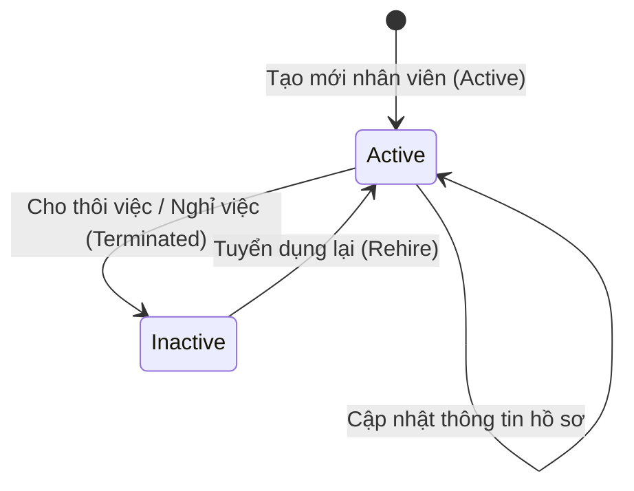

# PRD: Staff & Roles Management

## Mục lục

1. [Thông Tin Hồ Sơ Nhân Viên (Staff Profile Information)](#1-thông-tin-hồ-sơ-nhân-viên-staff-profile-information)
2. [Quy Tắc Nghiệp Vụ &amp; Ràng Buộc (Business Rules &amp; Constraints)](#2-quy-tắc-nghiệp-vụ--ràng-buộc-business-rules--constraints)
3. [Phân Quyền Truy Cập & Vai Trò Công Việc (Access Permissions & Job Roles)](#3-phân-quyền-truy-cập--vai-trò-công-việc-access-permissions-job-roles)
4. [Luồng Trạng Thái Nhân Sự (State Machine)](#4-luồng-trạng-thái-nhân-sự-state-machine)
5. [Quy Tắc Hoạt Động Độc Lập &amp; Tích Hợp (Standalone &amp; Integrated Rules)](#5-quy-tắc-hoạt-động-độc-lập--tích-hợp-standalone--integrated-rules)
6. [Kịch Bản Chức Năng Chi Tiết (Given-When-Then Scenarios)](#6-kịch-bản-chức-năng-chi-tiết-given-when-then-scenarios)
7. [Tiêu Chí Nghiệm Thu (Acceptance Criteria)](#7-tiêu-chí-nghiệm-thu-acceptance-criteria)

---

## 1. Thông Tin Hồ Sơ Nhân Viên (Staff Profile Information)

Khi thêm mới hoặc chỉnh sửa nhân sự, hệ thống ghi nhận các nhóm thông tin nghiệp vụ sau:

* **Thông tin cá nhân:** Họ và tên, Email, Số điện thoại, Ngày sinh, Giới tính, Địa chỉ, Ảnh đại diện.
* **Thông tin công việc:** Vai trò/Vị trí công việc (Job Role - ví dụ: Phục vụ, Bếp, Pha chế...), Quyền truy cập hệ thống (System Access Level - mặc định là Nhân viên, và có thể gán thêm một hoặc nhiều nhóm System Permission để mở rộng chức năng), Chi nhánh làm việc (Stores), Ngày bắt đầu làm việc, Loại hình lao động (Toàn thời gian / Bán thời gian), Trạng thái lao động (Đang hoạt động / Ngừng hoạt động).
* **Thông tin lương & chi trả:** Hình thức tính lương (Theo giờ / Lương cứng cố định theo tháng), Số tiền lương, Loại tiền tệ (EUR), Tần suất chi trả (Hàng tháng), Ngày áp dụng mức lương, Ghi chú lương, và Tuỳ chọn "Bao gồm trong bảng lương".

---

## 2. Quy Tắc Nghiệp Vụ & Ràng Buộc (Business Rules & Constraints)

* Chỉ người dùng có vai trò `Admin` **bắt buộc phải** có quyền xem và chỉnh sửa thông tin lương (`Salary & Pay`) trong hồ sơ nhân viên. Nhân viên thường không được phép xem thông tin lương của người khác.
* Địa chỉ Email của nhân viên **bắt buộc phải** là duy nhất trong toàn hệ thống. Hệ thống không cho phép lưu hai nhân sự có trùng email.
* Khi trạng thái nhân viên chuyển sang ngừng hoạt động (`Inactive`):
  * Hệ thống **bắt buộc phải** vô hiệu hóa tài khoản đăng nhập của nhân viên đó ngay lập tức.
  * Hệ thống **bắt buộc phải** hủy tất cả các ngày nghỉ phép tương lai đang ở trạng thái chờ duyệt (`Pending Leaves`) của nhân viên này.
  * Hệ thống **sẽ tự động** đánh dấu các ca làm việc đã xếp lịch trong tương lai của nhân viên này thành ca trực trống cần bổ sung người (`Gap`).
* Ngày sinh của nhân viên nếu được điền **bắt buộc phải** đảm bảo nhân viên đạt từ 18 tuổi trở lên tại thời điểm tạo hồ sơ.

---

## 3. Phân Quyền Truy Cập & Vai Trò Công Việc (Access Permissions & Job Roles)

Hệ thống hỗ trợ cấp độ quyền mặc định cùng với các vai trò/vị trí công việc thực tế tại cửa hàng:

### 3.1 Vai Trò/Vị Trí Công Việc (Operational Job Roles)
Đây là các vị trí làm việc thực tế tại cửa hàng, được sử dụng làm thông tin phân loại nhân sự trong hồ sơ và phục vụ công tác lập lịch ca trực (Shift Planner). Các vai trò này **không** quyết định quyền hạn truy cập hay quản trị hệ thống.
*   **Cơ chế quản lý động (CRUD Job Roles):** Người dùng có vai trò `Admin` **bắt buộc phải** có toàn quyền tạo mới, xem, chỉnh sửa và xóa (CRUD) các Vai trò/Vị trí công việc trực tiếp trong phần cấu hình của màn hình `Staff & Roles` hoặc cấu hình hệ thống.
*   **Không cứng hóa danh sách:** Hệ thống **không được phép** thiết lập cứng bất kỳ vị trí cố định nào. Tất cả các vị trí (ví dụ như Phục vụ, Bếp, Pha chế, Thu ngân... nếu có) đều hoàn toàn do Admin tự định nghĩa và quản lý linh hoạt tùy theo nhu cầu vận hành thực tế của từng thương hiệu.
*   **Ràng buộc khi xóa:** Hệ thống **không được phép** xóa một Vai trò/Vị trí công việc nếu vị trí đó đang được gán cho ít nhất một nhân sự ở trạng thái hoạt động (`Active`). Admin **bắt buộc phải** chuyển đổi hoặc gỡ vị trí công việc đó khỏi hồ sơ nhân sự liên quan trước khi thực hiện xóa.

### 3.2 Quyền Truy Cập Hệ Thống Mặc Định (Default System Access Level)
Mỗi khi một nhân sự mới (Staff) được thêm vào hệ thống, họ **sẽ tự động** được gán cấp độ quyền truy cập mặc định là **Nhân viên (Employee)**:
*   Ở cấp độ mặc định này, nhân sự có sẵn quyền sử dụng các tính năng tự phục vụ (Self-Service Dashboard) cơ bản.
*   Các chức năng tự phục vụ mặc định bao gồm: thực hiện chấm công (`Check-in` / `Check-out`), xem lịch ca trực tuần cá nhân, gửi yêu cầu đổi ca trực của bản thân, xem số dư phép và nộp đơn xin nghỉ phép/Flextime cá nhân.
*   Các quyền tự phục vụ mặc định này **sẽ tự động** có hiệu lực ngay khi hồ sơ nhân viên được khởi tạo mà không cần thêm bất kỳ cấu hình hay thao tác phân quyền thủ công nào.

### 3.3 Liên Kết Quyền Truy Cập Hệ Thống (System Permission Integration)
Để quản lý quyền truy cập chức năng cho nhân viên, hệ thống tích hợp với Module Quản lý quyền hệ thống được đặc tả chi tiết tại [[PRD-007-System-Permissions]]:
*   **Gán System Permission:** Trong giao diện quản lý chi tiết hồ sơ nhân sự, người dùng có vai trò `Admin` **có thể** chọn gán một hoặc nhiều nhóm System Permission (ví dụ: Store Manager, Kế toán...) đã được thiết lập sẵn ở [[PRD-007-System-Permissions]] cho tài khoản Nhân viên (Employee).
*   **Thừa hưởng quyền hạn và kết xuất Sidebar:**
    *   Khi nhân viên không được gán bất kỳ nhóm System Permission nào, hệ thống **bắt buộc phải** chỉ hiển thị các tính năng tự phục vụ cá nhân (Self-Service) mặc định (xem ca cá nhân, chấm công, nộp đơn phép) và ẩn toàn bộ các công cụ quản trị khác.
    *   Khi nhân viên được gán một hoặc nhiều nhóm System Permission, hệ thống **bắt buộc phải** tự động gộp tất cả các công cụ Sidebar được cấp phép trong các System Permission đó (phép hợp logic) để hiển thị đầy đủ trên thanh điều hướng bên (Sidebar) của họ.
    *   Hành vi chặn truy cập URL bất hợp pháp đối với các công cụ không được cấp phép **bắt buộc phải** tuân thủ nghiêm ngặt quy tắc an toàn bảo mật được đặc tả tại [[PRD-007-System-Permissions]].

---

## 4. Luồng Trạng Thái Nhân Sự (State Machine)

Mối quan hệ trạng thái của hồ sơ nhân viên:

---

## 5. Quy Tắc Hoạt Động Độc Lập & Tích Hợp (Standalone & Integrated Rules)

* **Chế độ Độc lập (Standalone Mode):**
  * Hệ thống hoạt động như một danh bạ quản lý nhân sự đơn thuần. Các thông tin công việc, vị trí công việc, lương được lưu trữ cục bộ và chỉnh sửa thủ công.
  * Không có liên kết đồng bộ thông tin lương sang bảng lương hay đồng bộ phân ca.
* **Chế độ Tích hợp (Integrated Mode):**
  * *Tích hợp với PRD-002 (Shift Planner):* Danh sách nhân viên và vị trí công việc hoạt động (`Active`) được lấy làm nguồn để phân công ca trực tuần.
  * *Tích hợp với PRD-003 (Checkin):* Thông tin chi nhánh làm việc (`Branch`) được đồng bộ để phục vụ quy tắc kiểm tra địa điểm chấm công.
  * *Tích hợp với PRD-005 (Payroll):* Cấu hình số tiền lương, loại lương (giờ/tháng) và trạng thái bật `Include in Payroll` được chuyển tự động làm tham số đầu vào tính lương.

---

## 6. Kịch Bản Chức Năng Chi Tiết (Given-When-Then Scenarios)

### Kịch bản 1: Tạo nhân viên mới thành công (Happy Path)

* **GIVEN** Người dùng đăng nhập hệ thống với quyền `Admin`.
* **WHEN** Người dùng điền đầy đủ các thông tin bắt buộc hợp lệ và gửi yêu cầu tạo nhân viên mới.
* **THEN** Hệ thống **bắt buộc phải** lưu trữ hồ sơ nhân viên ở trạng thái `Active`.
* **AND** Hiển thị thông báo: `"Thêm mới nhân viên thành công"`.

### Kịch bản 2: Tạo nhân viên thất bại do trùng Email (Unhappy Path)

* **GIVEN** Người dùng đăng nhập hệ thống với quyền `Admin`.
* **AND** Email `an.nguyen@johnsbistro.com` đã tồn tại trên hệ thống cho một nhân viên khác.
* **WHEN** Người dùng nhập email trùng này và gửi yêu cầu tạo nhân viên mới.
* **THEN** Hệ thống **bắt buộc phải** ngăn chặn việc lưu hồ sơ.
* **AND** Hiển thị thông báo cảnh báo lỗi trên màn hình: `"Email an.nguyen@johnsbistro.com đã tồn tại trong hệ thống. Vui lòng nhập email khác."`.

### Kịch bản 3: Truy cập thông tin lương trái phép (Permission Check)

* **GIVEN** Người dùng đăng nhập hệ thống với tài khoản `Nhân viên` (Employee).
* **WHEN** Người dùng xem chi tiết hồ sơ của nhân viên khác.
* **THEN** Hệ thống **bắt buộc phải** chặn truy cập và ẩn hoàn toàn thông tin lương (`Salary & Pay`).

### Kịch bản 4: Admin gán nhóm System Permission cho nhân viên thành công (Assign System Permission to Staff - Happy Path)
* **GIVEN** Người dùng đăng nhập hệ thống với quyền `Admin` của Brand.
* **AND** Nhóm System Permission `"Store Manager"` đã được định nghĩa sẵn trong hệ thống (gồm quyền truy cập `Shift Planner`, `Checkin` và `Leave & Flec Calc`).
* **AND** Nhân viên `Nguyen An` hiện chỉ có quyền tự phục vụ mặc định.
* **WHEN** Admin mở hồ sơ chi tiết của nhân viên `Nguyen An`, thực hiện tích chọn gán nhóm System Permission `"Store Manager"` cho nhân viên này và bấm Lưu.
* **THEN** Hệ thống **bắt buộc phải** lưu thông tin thay đổi thành công vào hồ sơ nhân viên.
* **AND** Khi nhân viên `Nguyen An` đăng nhập vào không gian làm việc của Brand, thanh Sidebar của nhân viên đó **bắt buộc phải** hiển thị thêm các công cụ `Shift Planner`, `Checkin` và `Leave & Flec Calc` bên cạnh các tính năng tự phục vụ mặc định.

---

## 7. Tiêu Chỉ Nghiệm Thu (Acceptance Criteria)

* - [ ] Nhân viên mới được tạo thành công hiển thị đầy đủ thông tin trên danh sách nhân viên của chi nhánh tương ứng.
* - [ ] Tài khoản với quyền truy cập `Nhân viên` (Employee) không thể xem được mục thông tin lương của nhân viên khác.
* - [ ] Khi chuyển trạng thái nhân viên sang `Inactive`, nhân viên đó không thể đăng nhập vào ứng dụng và các ca trực trong tương lai của họ được chuyển thành ca trống.
* - [ ] Nhân viên mới được tạo mặc định chỉ có quyền tự phục vụ cơ bản (Check-in, Check-out, xem ca cá nhân, gửi đơn nghỉ phép) mà không cần cấu hình thủ công.
* - [ ] Admin có thể thực hiện đầy đủ các thao tác Thêm, Sửa, Xóa (CRUD) các Vai trò/Vị trí công việc (Operational Job Roles) trong phần cấu hình.
* - [ ] Hệ thống ngăn chặn hành vi xóa Vai trò/Vị trí công việc nếu vị trí đó đang được gán cho ít nhất một nhân sự đang hoạt động (`Active`).
* - [ ] Khi nhân viên được gán thêm một hoặc nhiều nhóm System Permission, thanh Sidebar của họ hiển thị chính xác và đầy đủ các công cụ tương ứng sau khi đăng nhập (thừa hưởng từ cấu hình nhóm quyền tại [[PRD-007-System-Permissions]]).
* - [ ] Hệ thống chặn thành công truy cập qua URL đối với các công cụ không thuộc quyền tự phục vụ mặc định và không được cấp phép qua các System Permission được gán của nhân sự đó.

