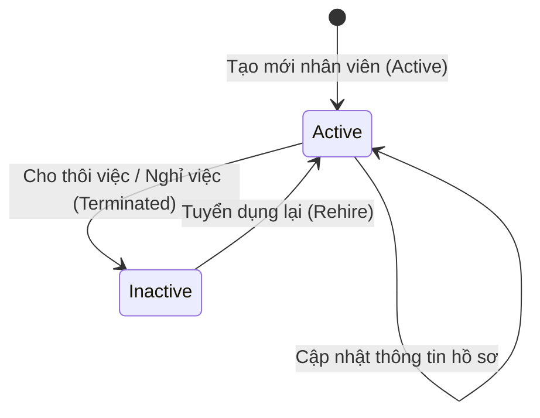

# PRD: Staff & Roles Management

## Mục lục

1. [Thông Tin Hồ Sơ Nhân Viên (Staff Profile Information)](#1-thông-tin-hồ-sơ-nhân-viên-staff-profile-information)
2. [Quy Tắc Nghiệp Vụ &amp; Ràng Buộc (Business Rules &amp; Constraints)](#2-quy-tắc-nghiệp-vụ--ràng-buộc-business-rules--constraints)
3. [Phân Quyền Truy Cập &amp; Vai Trò Công Việc (Access Permissions &amp; Job Roles)](#3-phân-quyền-truy-cập--vai-trò-công-việc-access-permissions-job-roles)
4. [Quyền Hạn Của Nhân Viên Được Cấp Quyền Truy Cập Staff](#4-quyền-hạn-của-nhân-viên-được-cấp-quyền-truy-cập-staff)
5. [Luồng Trạng Thái Nhân Sự (State Machine)](#5-luồng-trạng-thái-nhân-sự-state-machine)
6. [Quy Tắc Hoạt Động Độc Lập &amp; Tích Hợp (Standalone &amp; Integrated Rules)](#6-quy-tắc-hoạt-động-độc-lập--tích-hợp-standalone--integrated-rules)
7. [Kịch Bản Chức Năng Chi Tiết (Given-When-Then Scenarios)](#7-kịch-bản-chức-năng-chi-tiết-given-when-then-scenarios)
8. [Tiêu Chí Nghiệm Thu (Acceptance Criteria)](#8-tiêu-chí-nghiệm-thu-acceptance-criteria)

---

## 1. Thông Tin Hồ Sơ Nhân Viên (Staff Profile Information)

Khi thêm mới hoặc chỉnh sửa nhân sự, hệ thống ghi nhận các nhóm thông tin nghiệp vụ sau:

* **Thông tin cá nhân (Personal Information):** `fullName` (Họ và tên), `email` (Email), `phoneNumber` (Số điện thoại), `dateOfBirth` (Ngày sinh), `gender` (Giới tính), `address` (Địa chỉ), `nationality` (Quốc tịch - ví dụ: Vietnamese, German, Bulgarian...), `avatar` (Ảnh đại diện).
* **Thông tin công việc (Employment Information):** `jobRole` (Vai trò/Vị trí công việc - ví dụ: Phục vụ, Bếp, Pha chế...), `systemPermissions` (Nhóm quyền bổ sung - Admin gán thêm một hoặc nhiều nhóm System Permission để mở rộng quyền truy cập), `assignedStores` (Chi nhánh làm việc), `entryDate` (Ngày bắt đầu vào làm), `probationPeriodMonths` (Thời gian thử việc - Số tháng, ví dụ: `0` nếu không thử việc, hoặc `3` hoặc `6` tháng), `probationEndDate` (Ngày kết thúc thử việc thực tế - Hệ thống tự động gợi ý bằng `entryDate + probationPeriodMonths` và cho phép Admin điều chỉnh thủ công), `exitDate` (Ngày thôi việc thực tế), `employmentType` (Loại hình lao động - `Full-time (40-48h/tuần)` / `Part-time (30h/tuần)` / `Minijob (giới hạn €603/tháng)`), `workingDaysPerWeek` (Số ngày làm việc trong tuần theo hợp đồng - từ 1 đến 6 ngày/tuần), `contractHours` (Số giờ thỏa thuận theo hợp đồng/tuần), `grossAgreement` (Mức lương gộp thỏa thuận trong hợp đồng - dùng để đối soát), `annualLeaveEntitlement` (Hạn mức ngày phép năm - Hệ thống tự động tính toán mức tối thiểu pháp định của Đức bằng công thức `workingDaysPerWeek * 4` ngày/năm. Admin có quyền nhập đè số ngày phép cao hơn thỏa thuận nhưng hệ thống sẽ chặn nếu nhập giá trị thấp hơn mức tối thiểu pháp định này), `contractPreparationStatus` (Trạng thái chuẩn bị hợp đồng - `tbd` / `yes` / `no`), `contractSigningStatus` (Trạng thái ký hợp đồng - `tbd` / `yes` / `no`), `sundayOffCountOfYear` (Số ngày Chủ nhật được nghỉ trong năm dương lịch hiện tại), `status` (Trạng thái lao động - `Active` / `Inactive`).
* **Thông tin lương, Thuế & Bảo hiểm (Compensation, Tax & Social Security Information):** `salaryAmount` (Mức lương thỏa thuận - là Lương giờ hoặc Lương cứng tháng tùy theo cấu hình chung của Thương hiệu), `currency` (Loại tiền tệ - `EUR`), `payFrequency` (Tần suất chi trả - `Monthly`), `effectiveDate` (Ngày áp dụng mức lương), `includeInPayroll` (Tuỳ chọn "Bao gồm trong bảng lương"), `taxClass` (Bậc thuế thu nhập cá nhân - giá trị hợp lệ theo hệ thống thuế của quốc gia hoạt động được chọn tại `brandCountry`, ví dụ: bậc 1 đến 6 đối với Đức), `socialSecurityNumber` (Mã số bảo hiểm xã hội - định dạng theo tiêu chuẩn của quốc gia hoạt động), `personalTaxId` (Mã số thuế cá nhân - định dạng và độ dài theo tiêu chuẩn của quốc gia hoạt động), `healthInsuranceProvider` (Tên nhà cung cấp bảo hiểm y tế), `insuranceSepa` (Ủy quyền SEPA đóng bảo hiểm y tế tự động - `yes` / `no`), `idWithResidencePermit` (Đã kiểm tra và đối chiếu Giấy phép cư trú/Lao động - `yes` / `no`), `residencePermitExpiryDate` (Ngày hết hạn giấy phép cư trú/Lao động - bắt buộc đối với nhân sự không thuộc EU), `dependentAllowance` (Hạn mức giảm trừ người phụ thuộc - ví dụ: 0.5, 1.0, 1.5...), `compensationNotes` (Ghi chú lương).

---

## 2. Quy Tắc Nghiệp Vụ & Ràng Buộc (Business Rules & Constraints)

* Quyền xem và chỉnh sửa thông tin lương & chi trả (`salaryAmount`...) của toàn bộ nhân sự chỉ dành cho người dùng có thẩm quyền quản trị. Nhân viên thông thường chỉ được phép xem thông tin lương của chính mình và tuyệt đối không được phép xem thông tin lương của nhân sự khác.
* Địa chỉ Email của nhân viên **bắt buộc phải** là duy nhất trong toàn hệ thống. Hệ thống không cho phép lưu hai nhân sự có trùng email.
* Khi trạng thái nhân viên chuyển sang ngừng hoạt động (`Inactive`):
  * Hệ thống **bắt buộc phải** vô hiệu hóa tài khoản đăng nhập của nhân viên đó ngay lập tức.
  * Hệ thống **bắt buộc phải** hủy tất cả các ngày nghỉ phép tương lai đang ở trạng thái chờ duyệt (`Pending Leaves`) của nhân viên này.
  * Hệ thống **sẽ tự động** đánh dấu các ca làm việc đã xếp lịch trong tương lai của nhân viên này thành ca trực trống cần bổ sung người (`Gap`).
* Ngày sinh của nhân viên nếu được điền **bắt buộc phải** đảm bảo nhân viên đạt từ 18 tuổi trở lên tại thời điểm tạo hồ sơ.
* Danh sách chi nhánh trong trường `assignedStores` của nhân viên **bắt buộc phải** được chọn từ danh sách Chi nhánh đang hoạt động (`Active`) của Brand (được cấu hình ở `PRD-Tenant-Workspace-Auth`). Mỗi nhân viên **bắt buộc phải** được gán ít nhất một chi nhánh làm việc.
* **Quy định đối với các trường Thuế & Bảo hiểm xã hội:**
  * Mã số thuế cá nhân `personalTaxId` **bắt buộc phải** khớp với định dạng tiêu chuẩn của quốc gia hoạt động được chọn tại `brandCountry` (ví dụ: 11 chữ số đối với Đức; định dạng tương ứng theo tiêu chuẩn của từng quốc gia EU khác).
  * Bậc thuế `taxClass` **bắt buộc phải** thuộc tập hợp giá trị hợp lệ theo hệ thống thuế thu nhập cá nhân của quốc gia hoạt động (ví dụ: bậc 1 đến 6 đối với Đức; các giá trị tương ứng theo luật thuế của từng quốc gia EU khác).
  * Mã số bảo hiểm xã hội `socialSecurityNumber` **bắt buộc phải** khớp với định dạng tiêu chuẩn của quốc gia hoạt động (ví dụ: `12 030480 M 045` theo chuẩn Đức; định dạng tương ứng đối với các quốc gia EU khác).
* **Quản lý tài liệu cư trú và lao động (Residence & Work Permits):**
  * Đối với các nhân viên có quốc tịch bên ngoài Liên minh Châu Âu (Non-EU), các trường `idWithResidencePermit` và `residencePermitExpiryDate` **bắt buộc phải** được cung cấp đầy đủ thông tin khi lưu hồ sơ.
  * Hệ thống **bắt buộc phải** tự động gửi thông báo qua Email và Web Push đến tài khoản Admin và cá nhân nhân sự trước ngày hết hạn của Giấy phép cư trú/Lao động đúng **1 tuần (7 ngày)**.
  * Khi Giấy phép cư trú/Lao động của nhân viên hết hạn (`residencePermitExpiryDate` trong quá khứ):
    * Hệ thống **sẽ tự động** hiển thị trạng thái cảnh báo đỏ nguy hiểm trên Hồ sơ nhân viên, Danh sách nhân viên và lưới Lập lịch ca trực (Shift Planner).
    * Hệ thống **không được phép chặn** quyền chấm công check-in/out thực tế của nhân sự này tại cửa hàng.
* **Theo dõi ngày nghỉ Chủ nhật trong năm:**
  * Hệ thống **bắt buộc phải** tự động tăng số đếm `sundayOffCountOfYear` mỗi khi một ngày Chủ nhật qua đi mà nhân sự không được xếp lịch làm việc (theo `PRD-Shift-Planner`) và không có dữ liệu check-in (theo `PRD-Checkin-Management`).
  * Chỉ số này sẽ tự động reset về `0` vào ngày 1 tháng 1 hàng năm.

---

### 2.5. Quy trình Nhập dữ liệu thông minh (Smart Bulk Onboarding)

Để giảm thiểu ma sát vận hành khi bắt đầu sử dụng hệ thống (onboarding), hệ thống hỗ trợ tính năng import danh sách nhân sự hàng loạt thông qua tệp tin Excel (`.xlsx`, `.xls`) hoặc CSV tự do của khách hàng, thay vì bắt buộc khách hàng nhập thủ công từng hồ sơ hoặc chỉnh sửa tệp tin khớp với một biểu mẫu cố định.

*   **Luồng hoạt động của tính năng:**
    1.  **Tải tệp tin tự do:** Admin kéo thả tệp tin bảng tính Excel/CSV chứa danh sách nhân viên hiện có của doanh nghiệp vào khu vực upload.
    2.  **Đọc tiêu đề cột (Header Parsing):** Hệ thống đọc dòng đầu tiên (Header Row) của tệp tin vừa tải lên để lấy danh sách các tiêu đề cột (ví dụ: "Name", "Hourly Wage", "Tax Class"...).
    3.  **Tự động khớp cột thông minh (Smart Auto-Mapping):** Hệ thống sử dụng một từ điển từ đồng nghĩa (Alias Dictionary) trên Backend để tự động so khớp các cột trong tệp tin của khách hàng với các trường thông tin trong cơ sở dữ liệu `Staff` của hệ thống (ví dụ: tự động khớp cột "Mitarbeiter-Name" hoặc "Name" sang trường `fullName`; cột "Stundenlohn" hoặc "Lương" sang trường `salaryAmount`).
    4.  **Giao diện khớp cột và xử lý cột chưa khớp (Column Mapping UI):** 
        *   Hệ thống hiển thị màn hình đối soát dạng bảng. Cột bên trái hiển thị danh sách các trường dữ liệu của hệ thống Tenohub (các trường bắt buộc như Họ tên, Email, Ngày vào làm... được đánh dấu hoa thị đỏ). Cột bên phải hiển thị các dropdown chứa danh sách các tiêu đề cột đọc được từ tệp tin Excel của khách hàng.
        *   Các trường đã tự động khớp ở bước trước sẽ hiển thị sẵn giá trị khớp. Đối với các trường chưa được tự động khớp, Admin có thể tự tay chọn cột tương ứng từ dropdown, hoặc chọn **"Bỏ qua (Skip)"** đối với các cột thông tin dư thừa không dùng đến.
    5.  **Xác thực và Xem trước dữ liệu (Data Validation & Preview):**
        *   Hệ thống thực hiện phân tích và xác thực toàn bộ dữ liệu của từng dòng theo quy tắc nghiệp vụ (định dạng email, độ dài số thuế cá nhân 11 chữ số, định dạng ngày vào làm YYYY-MM-DD...).
        *   Hiển thị màn hình xem trước (Preview) danh sách nhân viên chuẩn bị import. Các dòng dữ liệu hợp lệ hiển thị màu xanh. Các ô dữ liệu không hợp lệ hiển thị màu đỏ kèm thông tin cảnh báo sửa lỗi rõ ràng (ví dụ: *"Bậc thuế phải từ 1 đến 6"*). Admin có thể chỉnh sửa trực tiếp trên giao diện hoặc sửa tệp tin rồi up lại.
    6.  **Xác nhận nạp dữ liệu (Commit Import):** Admin xác nhận để hệ thống lưu hàng loạt hồ sơ nhân sự vào cơ sở dữ liệu.

---

## 3. Phân Quyền Truy Cập & Vai Trò Công Việc (Access Permissions & Job Roles)

Hệ thống hỗ trợ cấp độ quyền mặc định cùng với các vai trò/vị trí công việc thực tế tại cửa hàng:

### 3.1 Vai Trò/Vị Trí Công Việc (Operational Job Roles)

Đây là các vị trí làm việc thực tế tại cửa hàng, được sử dụng làm thông tin phân loại nhân sự trong hồ sơ và phục vụ công tác lập lịch ca trực (Shift Planner). Các vai trò này **không** quyết định quyền hạn truy cập hay quản trị hệ thống.

* **Cơ chế quản lý động (CRUD Job Roles):** Hệ thống hỗ trợ tính năng cho phép người dùng có thẩm quyền quản trị thực hiện tạo mới, xem, chỉnh sửa và xóa (CRUD) các Vai trò/Vị trí công việc trực tiếp trong phần cấu hình của màn hình `Staff & Roles` hoặc cấu hình hệ thống.
* **Không cứng hóa danh sách:** Hệ thống **không được phép** thiết lập cứng bất kỳ vị trí cố định nào. Tất cả các vị trí (ví dụ như Phục vụ, Bếp, Pha chế, Thu ngân... nếu có) đều hoàn toàn do phía quản trị tự định nghĩa và quản lý linh hoạt tùy theo nhu cầu vận hành thực tế của từng thương hiệu.
* **Ràng buộc khi xóa:** Hệ thống **không được phép** xóa một Vai trò/Vị trí công việc nếu vị trí đó đang được gán cho ít nhất một nhân sự ở trạng thái hoạt động (`Active`). Phía quản lý **bắt buộc phải** chuyển đổi hoặc gỡ vị trí công việc đó khỏi hồ sơ nhân sự liên quan trước khi thực hiện xóa.

### 3.2 Quyền Tự Phục Vụ Mặc Định (Default Self-Service Access)

Mỗi khi một nhân sự mới (Staff) được thêm vào hệ thống, họ **sẽ tự động** có quyền sử dụng các tính năng tự phục vụ mặc định mà không cần bất kỳ cấu hình hay thao tác gán quyền nào:

* Ở cấp độ mặc định này, nhân sự có sẵn quyền sử dụng các tính năng tự phục vụ (Self-Service Dashboard) cơ bản.
* Các chức năng tự phục vụ mặc định bao gồm: thực hiện chấm công (`Check-in` / `Check-out`), xem lịch ca trực cá nhân (trong tuần hiện tại và tối đa 4 tuần kế tiếp), gửi yêu cầu đổi ca trực của bản thân, xem số dư phép và nộp đơn xin nghỉ phép/Flextime cá nhân.
* Các quyền tự phục vụ mặc định này **sẽ tự động** có hiệu lực ngay khi hồ sơ nhân viên được khởi tạo trên hệ thống.

### 3.3 Liên Kết Quyền Hệ Thống (System Permission / Access Integration)

Để quản lý quyền truy cập chức năng nâng cao cho nhân viên, hệ thống tích hợp với Phân quyền hệ thống (System Access) được cấu hình tại Tab System Access của cấu hình thương hiệu ([[PRD-Brand-Settings#24-tab-system-access-phan-quyen-he-thong]]):

* **Gán quyền truy cập hệ thống:** Trong giao diện quản lý chi tiết hồ sơ nhân sự, người dùng có thẩm quyền quản trị **có thể** chọn gán một hoặc nhiều nhóm vai trò/quyền truy cập đã được thiết lập sẵn tại Tab System Access của Brand Settings cho tài khoản của nhân viên để mở rộng quyền hạn của họ.
* **Thừa hưởng quyền hạn và kết xuất Sidebar:**
  * Khi nhân viên không được gán thêm bất kỳ nhóm quyền nào, hệ thống **bắt buộc phải** chỉ hiển thị các tính năng tự phục vụ cá nhân (Self-Service Dashboard) mặc định (xem ca cá nhân, chấm công, nộp đơn phép) và ẩn toàn bộ các công cụ quản trị khác.
  * Khi nhân viên được gán một hoặc nhiều nhóm quyền, hệ thống **bắt buộc phải** tự động gộp tất cả các công cụ Sidebar được cấp phép trong các nhóm quyền đó (phép hợp logic) để hiển thị đầy đủ trên thanh điều hướng bên (Sidebar) của họ.
  * Hành vi chặn truy cập URL bất hợp pháp đối với các công cụ không được cấp phép **bắt buộc phải** tuân thủ nghiêm ngặt quy tắc an toàn bảo mật được đặc tả tại [[PRD-Brand-Settings]].

---

## 4. Quyền Hạn Của Nhân Viên Được Cấp Quyền Truy Cập Staff

Đối với nhân viên được cấp quyền truy cập chức năng Staff & Roles, hệ thống giới hạn quyền hạn theo các chi nhánh được gán của họ như sau:

* **Xem và quản lý hồ sơ:** Chỉ được phép xem, tìm kiếm, tạo mới và chỉnh sửa thông tin hồ sơ của các nhân viên làm việc tại cùng chi nhánh với mình.
* **Chặn dữ liệu ngoài chi nhánh:** Hệ thống ẩn toàn bộ thông tin và chặn mọi hành vi truy cập (qua giao diện hoặc đường dẫn URL) đối với hồ sơ của nhân viên thuộc các chi nhánh khác.
* **Giới hạn khi gán chi nhánh:** Khi tạo hồ sơ nhân viên mới, chỉ được phép chọn gán nhân viên đó vào các chi nhánh mà mình đang làm việc.
* **Quản lý vị trí công việc (Job Roles):** Có quyền quản lý (thêm mới, chỉnh sửa, xóa) các Vai trò/Vị trí công việc (Operational Job Roles) thuộc phạm vi (các) chi nhánh mà mình đang làm việc.

---

## 5. Luồng Trạng Thái Nhân Sự (State Machine)

Mối quan hệ trạng thái của hồ sơ nhân viên:

---

## 6. Quy Tắc Hoạt Động Độc Lập & Tích Hợp (Standalone & Integrated Rules)

Hệ thống Gastro Hub được thiết kế theo kiến trúc Module hóa. Các module (`Staff`, `Shift Planner`, `Checkin`, `Payroll`...) được **tự động Kích hoạt (Enable)** hoặc **Vô hiệu hóa (Disable)** dựa trên gói dịch vụ (Subscription Plan) mà Brand đang đăng ký (ví dụ: gói Free chỉ hỗ trợ `Staff` & `Shift Planner`; gói Gold/Diamond hỗ trợ các module nâng cao).

Để đảm bảo các module có thể chạy độc lập, riêng lẻ mà không bị lỗi hệ thống (Crash/500), cần tuân thủ các quy tắc sau:

### 6.1 Nguyên Tắc Thiết Kế Chịu Lỗi (Fault-Tolerant & Loose Coupling)

* **Không phụ thuộc cứng (No Tight Dependency)**: Module Staff & Roles là module nền tảng. Các module khác hoạt động hay bị khóa (do gói Plan thấp) không được phép ảnh hưởng đến runtime hay gây crash các luồng xử lý cơ bản của module Staff (như thêm mới, sửa, hay đổi trạng thái nhân sự).
* **Giao tiếp bất đồng bộ qua Events (Event-Driven)**: Các hành động liên module (ví dụ: khi nhân viên chuyển sang `Inactive` cần tự động hủy ca trực trong tương lai ở module Shift Planner hay hủy đơn phép ở module Leave) phải được xử lý bất đồng bộ thông qua Event Broker (hoặc Message Queue).
  * Module Staff chỉ thực hiện phát đi (Publish) sự kiện `staff.inactive`.
  * Nếu Brand sử dụng gói Plan cao cấp có kích hoạt module Shift Planner / Leave, các module này sẽ tự động lắng nghe (Subscribe) và xử lý phần việc của mình. Nếu Brand sử dụng gói Free (các module này bị khóa), sự kiện phát đi sẽ bị bỏ qua một cách an sau mà không gây block luồng của module Staff.
* **Tích hợp API Chịu Lỗi (Resilient API Calls)**: Khi một module gọi API của module khác (ví dụ: Module Payroll gọi API Staff để lấy thông tin lương của những nhân viên bật `includeInPayroll`):
  * Hệ thống phải kiểm tra quyền hạn gói Plan của Tenant hoặc thiết lập cơ chế bắt lỗi ngoại lệ (Try-catch/Circuit Breaker).
  * Nếu module đích hoặc module nguồn bị khóa do gói Plan thấp, hệ thống phải xử lý trả về kết quả trống/mặc định một cách êm đẹp (Graceful Degradation) thay vì ném lỗi hệ thống hoặc làm gián đoạn trải nghiệm người dùng.

### 6.2 Đặc Tả Tích Hợp Chi Tiết (Khi Module Tương Ứng Được Kích Hoạt Theo Plan)

* **Tích hợp với Shift Planner (PRD-Shift-Planner - Lập lịch ca trực):**
  * Module Staff cung cấp API endpoint `GET /api/v1/staff?status=Active` trả về danh sách nhân viên đang hoạt động kèm theo trường `jobRole` (Vị trí công việc) của họ làm dữ liệu nguồn để phân ca.
  * Khi trạng thái nhân viên chuyển sang `Inactive`, module Staff phát sự kiện `staff.inactive` để module Shift Planner (nếu active) tự động hủy các ca trực tương lai của nhân viên đó.
* **Tích hợp với Leave & Flextime (PRD-Leave-Flextime - Nghỉ phép & Giờ linh hoạt):**
  * Khi trạng thái nhân viên chuyển sang `Inactive`, module Staff phát sự kiện `staff.inactive` để module Leave (nếu active) tự động hủy tất cả các đơn xin nghỉ phép tương lai đang ở trạng thái chờ duyệt (`Pending`) của nhân viên đó.
* **Tích hợp với Checkin Management (PRD-Checkin-Management - Chấm công):**
  * Module Staff cung cấp API endpoint `GET /api/v1/staff/{staff_id}/assigned-stores` trả về danh sách cửa hàng được gán của nhân sự (`assignedStores`).
  * Module Checkin (nếu active) gọi API này để đối chiếu vị trí check-in thực tế của nhân viên.
* **Tích hợp với Payroll (PRD-Payroll - Tính lương):**
  * Module Staff cung cấp API endpoint `GET /api/v1/payroll-eligible-staff` lọc ra toàn bộ nhân sự thỏa mãn đồng thời hai điều kiện: `status = Active` và `includeInPayroll = true`, kèm theo thông tin lương của họ (`salaryType`, `salaryAmount`, `currency`).
  * Định kỳ hàng tháng, module Payroll (nếu active) gọi API này làm danh sách nhân viên gốc để tính bảng lương.

---

## 7. Kịch Bản Chức Năng Chi Tiết (Given-When-Then Scenarios)

### Kịch bản 1: Tạo nhân viên mới thành công (Happy Path)

* **GIVEN** Người dùng đăng nhập hệ thống với quyền quản trị.
* **WHEN** Người dùng điền đầy đủ các thông tin bắt buộc hợp lệ và gửi yêu cầu tạo nhân viên mới.
* **THEN** Hệ thống **bắt buộc phải** lưu trữ hồ sơ nhân viên ở trạng thái `Active`.
* **AND** Hiển thị thông báo: `"Thêm mới nhân viên thành công"`.

### Kịch bản 2: Tạo nhân viên thất bại do trùng Email (Unhappy Path)

* **GIVEN** Người dùng đăng nhập hệ thống với quyền quản trị.
* **AND** Email `an.nguyen@johnsbistro.com` đã tồn tại trên hệ thống cho một nhân viên khác.
* **WHEN** Người dùng nhập email trùng này và gửi yêu cầu tạo nhân viên mới.
* **THEN** Hệ thống **bắt buộc phải** ngăn chặn việc lưu hồ sơ.
* **AND** Hiển thị thông báo cảnh báo lỗi trên màn hình: `"Email an.nguyen@johnsbistro.com đã tồn tại trong hệ thống. Vui lòng nhập email khác."`.

### Kịch bản 3: Truy cập thông tin lương trái phép (Permission Check)

* **GIVEN** Người dùng đăng nhập hệ thống với tài khoản `Nhân viên` (Employee).
* **WHEN** Người dùng xem chi tiết hồ sơ của nhân viên khác.
* **THEN** Hệ thống **bắt buộc phải** chặn truy cập và ẩn hoàn toàn thông tin lương (`Salary & Pay`).

### Kịch bản 4: Gán nhóm System Permission cho nhân viên thành công (Assign System Permission to Staff - Happy Path)

* **GIVEN** Người dùng đăng nhập hệ thống với quyền quản trị của Brand.
* **AND** Nhóm System Permission `"Store Manager"` đã được định nghĩa sẵn trong hệ thống (gồm quyền truy cập `Shift Planner`, `Checkin` và `Leave & Flec Calc`).
* **AND** Nhân viên `Nguyen An` hiện chỉ có quyền tự phục vụ mặc định.
* **WHEN** Người dùng quản trị mở hồ sơ chi tiết của nhân viên `Nguyen An`, thực hiện tích chọn gán nhóm System Permission `"Store Manager"` cho nhân viên này và bấm Lưu.
* **THEN** Hệ thống **bắt buộc phải** lưu thông tin thay đổi thành công vào hồ sơ nhân viên.
* **AND** Khi nhân viên `Nguyen An` đăng nhập vào không gian làm việc của Brand, thanh Sidebar của nhân viên đó **bắt buộc phải** hiển thị thêm các công cụ `Shift Planner`, `Checkin` và `Leave & Flec Calc` bên cạnh các tính năng tự phục vụ mặc định.

---

## 8. Tiêu Chí Nghiệm Thu (Acceptance Criteria)

* - [ ] Nhân viên mới được tạo thành công hiển thị đầy đủ thông tin trên danh sách nhân viên của chi nhánh tương ứng.
* - [ ] Tài khoản với quyền truy cập `Nhân viên` (Employee) không thể xem được mục thông tin lương của nhân viên khác.
* - [ ] Khi chuyển trạng thái nhân viên sang `Inactive`, nhân viên đó không thể đăng nhập vào ứng dụng và các ca trực trong tương lai của họ được chuyển thành ca trống.
* - [ ] Nhân viên mới được tạo mặc định chỉ có quyền tự phục vụ cơ bản (Check-in, Check-out, xem ca cá nhân, gửi đơn nghỉ phép) mà không cần cấu hình thủ công.
* - [ ] Người dùng có quyền quản trị có thể thực hiện đầy đủ các thao tác Thêm, Sửa, Xóa (CRUD) các Vai trò/Vị trí công việc (Operational Job Roles) trong phần cấu hình.
* - [ ] Hệ thống ngăn chặn hành vi xóa Vai trò/Vị trí công việc nếu vị trí đó đang được gán cho ít nhất một nhân sự đang hoạt động (`Active`).
* - [ ] Khi nhân viên được gán thêm một hoặc nhiều nhóm quyền/vai trò, thanh Sidebar của họ hiển thị chính xác và đầy đủ các công cụ tương ứng sau khi đăng nhập (thừa hưởng từ cấu hình nhóm quyền tại [[PRD-Brand-Settings]]).
* - [ ] Hệ thống chặn thành công truy cập qua URL đối với các công cụ không thuộc quyền tự phục vụ mặc định và không được cấp phép qua các nhóm quyền được gán của nhân sự đó.
* - [ ] Trường `assignedStores` của nhân viên bắt buộc phải chọn từ các chi nhánh đang hoạt động của Brand, không cho phép lưu nếu để trống.
* - [ ] Nhân viên được cấp quyền truy cập Staff chỉ được quyền xem, tìm kiếm, tạo mới và sửa đổi hồ sơ nhân viên thuộc các chi nhánh mà mình được gán; hệ thống chặn truy cập và ẩn danh sách nhân viên thuộc các chi nhánh khác.
