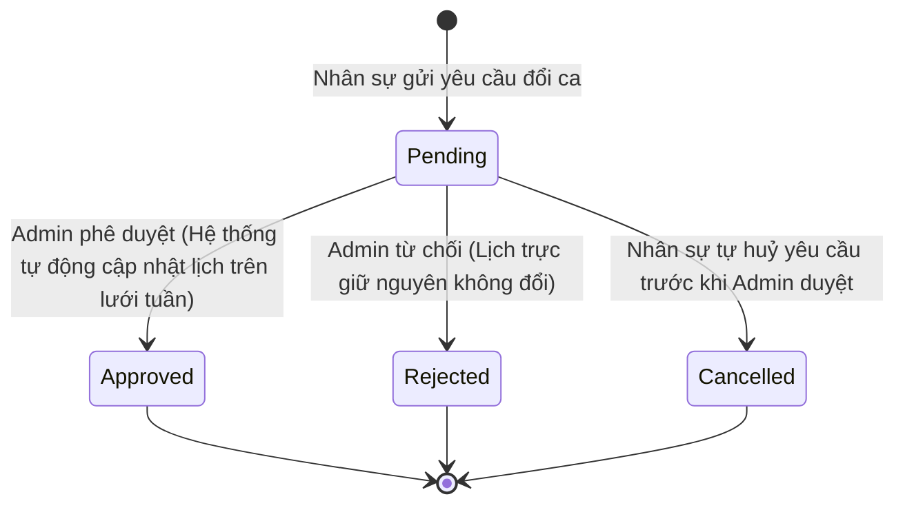

# PRD: Shift Planner

## Mục lục
1. [Các Thiết Lập Ca Trực & Ngày Nghỉ (Shift & Days Off Configuration)](#1-các-thiết-lập-ca-trực--ngày-nghỉ-shift--days-off-configuration)
2. [Quy Tắc Nghiệp Vụ & Ràng Buộc (Business Rules & Constraints)](#2-quy-tắc-nghiệp-vụ--ràng-buộc-business-rules--constraints)
3. [Luồng Trạng Thái & Chuyển Đổi (State Machine)](#3-luồng-trạng-thái--chuyển-đổi-state-machine)
4. [Quy Tắc Hoạt Động Độc Lập & Tích Hợp (Standalone & Integrated Rules)](#4-quy-tắc-hoạt-động-độc-lập--tích-hợp-standalone--integrated-rules)
5. [Kịch Bản Chức Năng Chi Tiết (Given-When-Then Scenarios)](#5-kịch-bản-chức-năng-chi-tiết-given-when-then-scenarios)
6. [Tiêu Chí Nghiệm Thu (Acceptance Criteria)](#6-tiêu-chí-nghiệm-thu-acceptance-criteria)

---

## 1. Các Thiết Lập Ca Trực & Ngày Nghỉ (Shift & Days Off Configuration)

Hệ thống cho phép Admin thiết lập các thông tin vận hành ca trực bao gồm:

*   **Cấu hình loại ca trực (Shift Types):** Tên ca trực (ví dụ: Ca Sáng, Ca Chiều, Ca Tối, Ca Đêm), Giờ bắt đầu, Giờ kết thúc, Định biên nhân sự tối thiểu bắt buộc, Định biên nhân sự tối đa cho phép.
*   **Lịch gán ca tuần (Assign Staff):** Lựa chọn chi nhánh gán lịch, Khoảng thời gian tuần gán lịch, Lựa chọn loại ca trực, và Danh sách nhân sự được gán vào ca.
*   **Ngày nghỉ định kỳ (Days Off Recurring):** Đặt trạng thái ngày làm việc hoặc ngày nghỉ cố định cho từng thứ trong tuần (từ Thứ Hai đến Chủ Nhật) áp dụng chung cho toàn chi nhánh.
*   **Ngày nghỉ đặc biệt (Days Off Flexible/One-off):** Chọn ngày cụ thể nghỉ một lần, Lý do nghỉ (ví dụ: Teambuilding, Nghỉ lễ Tết, Giáng sinh).

---

## 2. Quy Tắc Nghiệp Vụ & Ràng Buộc (Business Rules & Constraints)

*   Đối với mỗi ô ca trực ngày trên lưới lịch trực tuần, hệ thống **bắt buộc phải** tự động kiểm tra định biên: nếu số lượng nhân sự được gán nhỏ hơn số định biên tối thiểu bắt buộc của ca đó, hệ thống **bắt buộc phải** hiển thị cảnh báo thiếu người (`Gap: X`) và **sẽ tự động** đưa cảnh báo tương ứng vào danh sách cảnh báo vận hành (`Warnings`) ở cột bên phải.
*   Nếu một nhân viên đã được gán vào ca trực nhưng sau đó có đơn xin nghỉ phép được duyệt (`Approved`) trùng khoảng thời gian ca trực đó:
    *   Hệ thống **bắt buộc phải** hiển thị nhãn `(Leave)` bên cạnh tên nhân sự trên lưới lịch trực tuần.
    *   Hệ thống **bắt buộc phải** tăng chỉ số cảnh báo xung đột nghỉ phép (`Leave conflicts`) ở bảng tổng quan.
    *   Hệ thống **sẽ tự động** chuyển trạng thái khả dụng của nhân sự này sang `Unavailable` (Không khả dụng) trong modal xếp ca trực tiếp theo.
*   Hệ thống **sẽ tự động** tính toán tổng số giờ làm việc theo ca xếp lịch của từng nhân viên trong tuần. Nếu tổng số giờ xếp lịch vượt quá 40 giờ/tuần, hệ thống **bắt buộc phải** đánh dấu là giờ làm thêm (Overtime - OT) và hiển thị cảnh báo giờ phụ trội tại KPI `OT hours (this week)`.
*   Do nhân sự đã tự trao đổi trực tiếp và đồng ý ngoại tuyến trước khi tạo yêu cầu, khi một yêu cầu đổi ca (`Swap shift`) được gửi lên, hệ thống **sẽ tự động** chuyển thẳng yêu cầu đó đến danh sách chờ duyệt của Admin (`Pending Requests`) mà không cần bước xác nhận trung gian. Lịch trực tuần **bắt buộc phải** giữ nguyên trạng thái cũ cho đến khi Admin bấm phê duyệt.
*   Khi lưu ngày nghỉ đặc biệt của chi nhánh (`Days Off Flexible/One-off`), hệ thống **bắt buộc phải** tự động giải phóng (clear) toàn bộ các ca trực đã xếp trong ngày đó trên Grid lịch trực tuần và thông báo cho các nhân sự liên quan. Hệ thống **bắt buộc phải** chặn không cho phép xếp bất kỳ ca làm việc mới nào vào các ngày này.

---

## 3. Luồng Trạng Thái & Chuyển Đổi (State Machine)

Luồng phê duyệt yêu cầu đổi ca trực của nhân viên:

---

## 4. Quy Tắc Hoạt Động Độc Lập & Tích Hợp (Standalone & Integrated Rules)

*   **Chế độ Độc lập (Standalone Mode):**
    *   Tính năng hoạt động độc lập để thiết lập và gán lịch ca làm việc thủ công cho nhân sự.
    *   Không tự động kiểm tra xung đột nghỉ phép (mọi nhân viên luôn ở trạng thái `Available` khi gán ca).
    *   Lịch xếp ca sau khi chốt chỉ mang tính chất thông báo lịch làm việc, không liên kết đối chiếu với dữ liệu chấm công.
*   **Chế độ Tích hợp (Integrated Mode):**
    *   *Tích hợp với PRD-004 (Leave & Flextime):* Hệ thống tự động kiểm tra chéo và báo đỏ `Leave conflict` trên lưới trực tuần, đồng thời khóa gán nhân sự (`Unavailable`) vào ngày nghỉ đã duyệt.
    *   *Tích hợp với PRD-003 (Checkin):* Lịch trực ca được dùng làm khung giờ chuẩn để đối soát và tự động xác định trạng thái đi muộn hoặc vắng mặt của nhân sự.

---

## 5. Kịch Bản Chức Năng Chi Tiết (Given-When-Then Scenarios)

### Kịch bản 1: Cảnh báo thiếu định biên ca trực (Open Gap Warning)
*   **GIVEN** Lịch trực tuần của chi nhánh `HCM 1` có ca sáng (Morning: Yêu cầu tối thiểu 3 nhân viên).
*   **AND** Ca trực ngày Thứ Hai hiện mới chỉ gán cho 2 nhân viên: `James Smith` và `Michael Brown`.
*   **WHEN** Admin mở màn hình Shift Planner của tuần này.
*   **THEN** Hệ thống **bắt buộc phải** hiển thị chỉ số thiếu người là `Gap: 1` màu đỏ ở cột Thứ Hai của ca sáng.
*   **AND** Hệ thống **bắt buộc phải** tự động hiển thị dòng cảnh báo: `"Mon morning shift needs 1 more staff."` tại bảng Warnings bên phải.

### Kịch bản 2: Duyệt yêu cầu đổi ca trực thành công (Direct Swap Approval)
*   **GIVEN** Nhân viên A gán ca tối Thứ Tư, nhân viên B gán ca tối Thứ Năm.
*   **AND** Yêu cầu đổi ca giữa hai nhân viên đang ở trạng thái `Pending` trong mục Pending Requests.
*   **WHEN** Admin thực hiện bấm Duyệt (`Approve`) yêu cầu đổi ca này.
*   **THEN** Hệ thống **bắt buộc phải** chuyển trạng thái yêu cầu sang `Approved`.
*   **AND** Tự động hoán đổi gán ca trên lưới lịch trực tuần: Nhân viên A chuyển sang ca tối Thứ Năm, nhân viên B chuyển sang ca tối Thứ Tư.

---

## 6. Tiêu Chí Nghiệm Thu (Acceptance Criteria)

*   - [ ] Thay đổi cấu hình ca trực (Shift Types) thành công, các giá trị tối thiểu/tối đa được đồng bộ ngay lập tức sang lưới xếp lịch trực.
*   - [ ] Khi xếp lịch trực tuần của nhân sự trùng ngày phép đã được duyệt, hệ thống hiển thị cảnh báo `Leave conflict` và chuyển trạng thái nhân sự sang `Unavailable` để ngăn Admin gán nhầm.
*   - [ ] Yêu cầu đổi ca sau khi được Admin `Approve` thì sự hoán đổi gán ca trên lưới trực tuần được cập nhật chính xác.
*   - [ ] Hệ thống chặn và cảnh báo nếu người dùng cố xếp lịch vào ngày nghỉ lễ đặc biệt đã được thiết lập.
