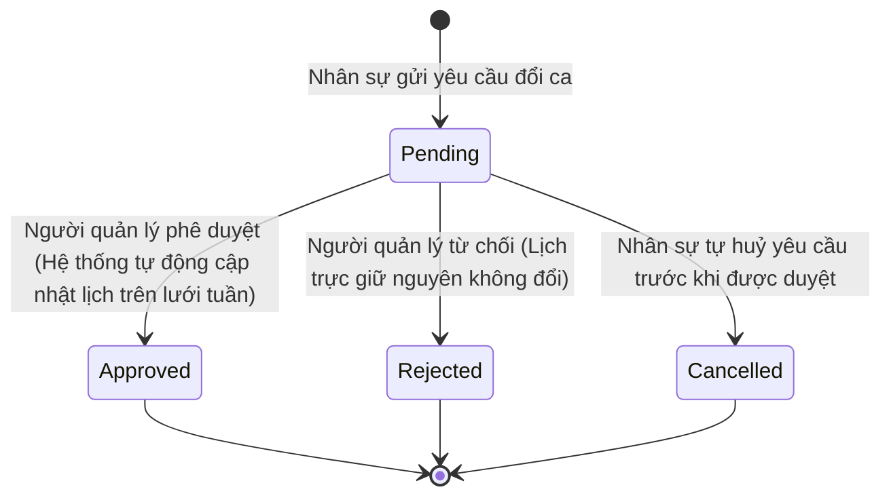

# PRD: Shift Planner

## Mục lục

1. [Cấu Hình Vận Hành Ca Trực &amp; Ngày Nghỉ (Shift &amp; Days Off Configuration)](#1-cấu-hình-vận-hành-ca-trực--ngày-nghỉ-shift--days-off-configuration)
2. [Nghiệp Vụ Phân Công Ca Trực Tuần (Weekly Shift Assignment)](#2-nghiệp-vụ-phân-công-ca-trực-tuần-weekly-shift-assignment)
3. [Quy Tắc Nghiệp Vụ &amp; Ràng Buộc (Business Rules &amp; Constraints)](#3-quy-tắc-nghiệp-vụ--ràng-buộc-business-rules--constraints)
4. [Quyền Hạn Của Nhân Viên Được Cấp Quyền Truy Cập Shift Planner](#4-quyền-hạn-của-nhân-viên-được-cấp-quyền-truy-cập-shift-planner)
5. [Luồng Trạng Thái &amp; Chuyển Đổi (State Machine)](#5-luồng-trạng-thái--chuyển-đổi-state-machine)
6. [Quy Tắc Hoạt Động Độc Lập &amp; Tích Hợp (Standalone &amp; Integrated Rules)](#6-quy-tắc-hoạt-động-độc-lập--tích-hợp-standalone--integrated-rules)
7. [Kịch Bản Chức Năng Chi Tiết (Given-When-Then Scenarios)](#7-kịch-bản-chức-năng-chi-tiết-given-when-then-scenarios)
8. [Tiêu Chí Nghiệm Thu (Acceptance Criteria)](#8-tiêu-chí-nghiệm-thu-acceptance-criteria)

---

## 1. Cấu Hình Vận Hành Ca Trực & Ngày Nghỉ (Shift & Days Off Configuration)

Hệ thống cho phép người dùng có thẩm quyền quản trị thiết lập các thông tin cấu hình tĩnh vận hành ca trực bao gồm:

* **Cấu hình loại ca trực (Shift Types):** Tên ca trực (ví dụ: Ca Sáng, Ca Chiều, Ca Tối, Ca Đêm), Giờ bắt đầu, Giờ kết thúc, Định biên nhân sự tối thiểu bắt buộc, Định biên nhân sự tối đa cho phép.
* **Ngày nghỉ định kỳ (Days Off Recurring):** Đặt trạng thái ngày làm việc hoặc ngày nghỉ cố định cho từng thứ trong tuần (từ Thứ Hai đến Chủ Nhật) áp dụng chung cho toàn chi nhánh. Hỗ trợ cấu hình nghỉ theo **khung giờ (timeframes)** cụ thể (ví dụ: Thứ Hai nghỉ từ `14:00` đến `17:00`). Nếu không điền khung giờ, mặc định coi là nghỉ cả ngày (Whole Day).
* **Ngày nghỉ đặc biệt (Days Off Flexible/One-off):** Chọn ngày cụ thể nghỉ một lần, Lý do nghỉ (ví dụ: Teambuilding, Nghỉ lễ Tết, Giáng sinh). Hỗ trợ cấu hình nghỉ theo **khung giờ (timeframes)** cụ thể trong ngày đó (ví dụ: nghỉ từ `09:00` đến `12:00`). Nếu không điền khung giờ, mặc định coi là nghỉ cả ngày (Whole Day).

---

## 2. Nghiệp Vụ Phân Công Ca Trực Tuần (Weekly Shift Assignment)

Hoạt động lập lịch trực được thực hiện hàng tuần cho từng chi nhánh để gán nhân sự vào các ca trực cụ thể. Mỗi bản ghi phân công ca làm việc (Shift Assignment) ghi nhận các thông tin nghiệp vụ bao gồm:

* `storeId` (Chi nhánh được gán lịch)
* `shiftDate` (Ngày trực cụ thể trong tuần)
* `shiftTypeId` (Ca trực được liên kết)
* `staffId` (Nhân sự được gán vào ca trực)

---

## 3. Quy Tắc Nghiệp Vụ & Ràng Buộc (Business Rules & Constraints)

* Đối với mỗi ô ca trực ngày trên lưới lịch trực tuần, hệ thống **bắt buộc phải** tự động kiểm tra định biên: nếu số lượng nhân sự được gán nhỏ hơn số định biên tối thiểu bắt buộc của ca đó, hệ thống **bắt buộc phải** hiển thị cảnh báo thiếu người (`Gap: X`) và **sẽ tự động** đưa cảnh báo tương ứng vào danh sách cảnh báo vận hành (`Warnings`) ở cột bên phải.
* Nếu một nhân viên đã được gán vào ca trực nhưng sau đó có đơn xin nghỉ phép được duyệt (`Approved`) trùng khoảng thời gian ca trực đó:
  * Hệ thống **bắt buộc phải** hiển thị nhãn `(Leave)` bên cạnh tên nhân sự trên lưới lịch trực tuần.
  * Hệ thống **bắt buộc phải** tăng chỉ số cảnh báo xung đột nghỉ phép (`Leave conflicts`) ở bảng tổng quan.
  * Hệ thống **sẽ tự động** chuyển trạng thái khả dụng của nhân sự này sang `Unavailable` (Không khả dụng) trong modal xếp ca trực tiếp theo.
* Hệ thống **sẽ tự động** tính toán tổng số giờ làm việc theo ca xếp lịch của từng nhân viên. Hệ thống hiển thị số dư **Tài khoản giờ làm việc linh hoạt (Flexible Working Hours Account - FWHA)** của từng nhân viên.
  * Người xếp lịch dựa vào tài khoản này để ra quyết định: Nếu thiếu giờ thì ưu tiên xếp làm thêm bù giờ; nếu thừa giờ (và đang đủ định biên) thì xếp cho nghỉ bớt ngày hoặc cho về sớm.
  * Số giờ làm thêm (OT) không được thanh toán ngay hàng tháng mà được tích lũy vào tài khoản FWHA để quyết toán định kỳ (hàng quý, hàng năm, hoặc khi nghỉ việc).
* Khi một yêu cầu đổi ca (`Swap shift`) được gửi lên, hệ thống **sẽ tự động** chuyển thẳng yêu cầu đó đến danh sách chờ duyệt của người quản lý (`Pending Requests`) mà không cần bước xác nhận trung gian.
  * **Điều kiện Swap:** Yêu cầu đổi ca chỉ hợp lệ khi cả hai nhân viên tham gia đổi ca đều thuộc cùng một chi nhánh.
  * Lịch trực tuần **bắt buộc phải** giữ nguyên trạng thái cũ cho đến khi người dùng có quyền quản trị bấm phê duyệt.
* Khi lưu cấu hình ngày nghỉ của chi nhánh (Days Off):
  * **Đối với ngày nghỉ cả ngày (Whole Day):** Hệ thống **bắt buộc phải** tự động giải phóng (clear) toàn bộ các ca trực đã xếp trong ngày đó trên Grid lịch trực tuần và thông báo cho các nhân sự liên quan. Hệ thống **bắt buộc phải** chặn không cho phép xếp bất kỳ ca làm việc mới nào vào ngày này.
  * **Đối với ngày nghỉ theo khung giờ (Hourly/Timeframe Day Off):** Hệ thống **bắt buộc phải** tự động giải phóng (clear) các ca trực đã xếp có khoảng thời gian làm việc trùng hoặc giao nhau (overlap) với khung giờ nghỉ đó và thông báo cho nhân sự liên quan. Hệ thống **bắt buộc phải** chặn không cho phép xếp bất kỳ ca làm việc mới nào giao nhau với khung giờ nghỉ này.
  * *Định nghĩa giao nhau (overlap):* Một ca trực bị coi là giao nhau (overlap) với khung giờ nghỉ nếu ca trực đó có bất kỳ phần thời gian nào trùng với khung giờ nghỉ (ví dụ: ca trực 13:00 - 18:00 giao với khung giờ nghỉ 14:00 - 17:00).
* Khi xếp lịch trực tuần (Shift Planner Grid), hệ thống **bắt buộc phải** đối chiếu chéo với Ngày nghỉ định kỳ (Days Off Recurring) của chi nhánh. Nếu ca trực dự kiến gán trùng hoặc giao nhau với khung giờ nghỉ định kỳ đã cấu hình, hệ thống **bắt buộc phải** chặn và hiển thị cảnh báo lỗi.
* **Quy tắc sửa ca trực hồi tố (Retroactive Shift Edits):**
  * Hệ thống **cho phép** chỉnh sửa lịch trực của tuần hiện tại (bao gồm cả các ngày đã qua trong quá khứ của tuần này) và các tuần tương lai.
  * Nếu người quản lý thay đổi hoặc gán ca trực của một ngày trong quá khứ, hệ thống **bắt buộc phải tự động chạy lại** thuật toán đối soát chấm công (đi muộn, về sớm, vắng mặt - đặc tả tại `PRD-003`) cho nhân sự đó vào ngày bị thay đổi dựa trên dữ liệu check-in/out thực tế của ngày hôm đó.

---

## 4. Quyền Hạn Của Nhân Viên Được Cấp Quyền Truy Cập Shift Planner

Đối với nhân viên được cấp quyền truy cập Shift Planner, hệ thống giới hạn quyền hạn theo các chi nhánh được gán của họ như sau:

* **Lập và quản lý lịch trực:** Chỉ được phép lập lịch làm việc và quản lý thông tin ca trực của các nhân sự thuộc (các) chi nhánh mà mình đang làm việc.
* **Giới hạn chọn chi nhánh:**
  * Nếu chỉ làm việc tại 1 chi nhánh: Hệ thống tự động chọn chi nhánh đó trên màn hình xếp lịch và khóa lại (không cho phép chọn chi nhánh khác).
  * Nếu làm việc tại nhiều chi nhánh: Chỉ được hiển thị và chọn chuyển đổi qua lại giữa các chi nhánh mà mình được gán để xếp lịch.
* **Danh sách nhân viên khả dụng:** Khi chọn nhân sự để gán vào ca trực, hệ thống chỉ hiển thị những nhân viên có cùng chi nhánh làm việc với chi nhánh đang được xếp lịch.
* **Duyệt yêu cầu đổi ca:** Chỉ được quyền xem, phê duyệt hoặc từ chối các yêu cầu đổi ca (`Swap shift`) của các nhân viên thuộc chi nhánh làm việc của mình.

---

## 5. Luồng Trạng Thái & Chuyển Đổi (State Machine)

Luồng phê duyệt yêu cầu đổi ca trực của nhân viên:

---

## 6. Quy Tắc Hoạt Động Độc Lập & Tích Hợp (Standalone & Integrated Rules)

Hệ thống Gastro Hub được thiết kế theo kiến trúc Module hóa. Các module (`Staff`, `Shift Planner`, `Checkin`, `Payroll`, `Leave & Flextime`...) được **tự động Kích hoạt (Enable)** hoặc **Vô hiệu hóa (Disable)** dựa trên gói dịch vụ (Subscription Plan) mà Brand đang đăng ký (ví dụ: gói Basic mặc định kích hoạt song hành hai module cốt lõi `Staff` & `Shift Planner`; các module nâng cao như `Checkin`, `Payroll`, `Leave & Flextime` chỉ được kích hoạt ở các gói cao hơn).

Để đảm bảo các module có thể chạy độc lập, riêng lẻ mà không bị lỗi hệ thống (Crash/500), cần tuân thủ các quy tắc sau:

### 6.1 Nguyên Tắc Thiết Kế Chịu Lỗi (Fault-Tolerant & Loose Coupling)

* **Không phụ thuộc cứng (No Tight Dependency)**: Module Shift Planner (luôn đi kèm với module nền tảng Staff & Roles trong gói Basic) hoạt động độc lập với các module nâng cao. Việc các module nâng cao như `Leave & Flextime` (PRD-004), `Checkin` (PRD-003) hay `Payroll` (PRD-005) bị vô hiệu hóa không được phép ảnh hưởng đến runtime hay gây lỗi các luồng xếp ca và cấu hình ngày nghỉ cơ bản của module Shift Planner.
* **Giao tiếp bất đồng bộ qua Events (Event-Driven)**: Các hành động liên module (ví dụ: tự động đánh dấu nhân viên không khả dụng khi phép được duyệt) phải được xử lý bất đồng bộ thông qua Event Broker.
  * Module Shift Planner chỉ thực hiện lắng nghe (Subscribe) các sự kiện có liên quan như thay đổi trạng thái nhân sự hoặc đơn xin nghỉ phép được duyệt.
* **Tích hợp API Chịu Lỗi (Resilient API Calls)**: Khi Shift Planner gọi API của các module khác (ví dụ: lấy dữ liệu đơn phép từ module Leave):
  * Nếu các module đó bị khóa do gói dịch vụ thấp, Shift Planner phải bỏ qua hoặc xử lý trả về kết quả trống/mặc định (ví dụ: coi như không có ngày nghỉ phép nào được duyệt) một cách êm đẹp (Graceful Degradation) thay vì ném lỗi hệ thống hoặc gây lỗi hiển thị lịch trực.

### 6.2 Đặc Tả Tích Hợp Chi Tiết (Khi Module Tương Ứng Được Kích Hoạt Theo Plan)

* **Tích hợp với Staff & Roles (PRD-001 - Quản lý nhân sự):**
  * Module Shift Planner gọi API `GET /api/v1/staff?status=Active` từ module Staff để lấy danh sách nhân viên hoạt động làm dữ liệu nguồn gán ca.
  * Module Shift Planner lắng nghe sự kiện `staff.inactive` phát ra từ module Staff để tự động hủy và giải phóng toàn bộ các ca trực trong tương lai đã gán cho nhân viên bị chuyển sang trạng thái `Inactive`.
* **Tích hợp với Checkin Management (PRD-003 - Chấm công):**
  * Module Shift Planner cung cấp API endpoint `GET /api/v1/shift-assignments?storeId={store_id}&date={date}` trả về danh sách phân công ca trực của chi nhánh trong ngày.
  * Module Checkin (nếu active) gọi API này để lấy khung giờ ca làm việc chuẩn, từ đó đối soát và tự động xác định trạng thái đi muộn hoặc vắng mặt (`Absent`) của nhân sự.
* **Tích hợp với Leave & Flextime (PRD-004 - Nghỉ phép & Giờ linh hoạt):**
  * Module Shift Planner lắng nghe sự kiện `leave.approved` từ module Leave để tự động cập nhật nhãn `(Leave)` bên cạnh tên nhân sự trên lưới trực tuần, đồng thời tự động cập nhật trạng thái khả dụng của nhân sự sang `Unavailable` trong khoảng thời gian nghỉ phép đó.
  * Hệ thống tự động kiểm tra chéo và báo đỏ cảnh báo xung đột lịch trực (`Leave conflict`) nếu Admin cố tình xếp ca trực đè lên ngày phép đã duyệt.

---

## 7. Kịch Bản Chức Năng Chi Tiết (Given-When-Then Scenarios)

### Kịch bản 1: Cảnh báo thiếu định biên ca trực (Open Gap Warning)

* **GIVEN** Lịch trực tuần của chi nhánh `HCM 1` có ca sáng (Morning: Yêu cầu tối thiểu 3 nhân viên).
* **AND** Ca trực ngày Thứ Hai hiện mới chỉ gán cho 2 nhân viên: `James Smith` và `Michael Brown`.
* **WHEN** Người dùng quản trị mở màn hình Shift Planner của tuần này.
* **THEN** Hệ thống **bắt buộc phải** hiển thị chỉ số thiếu người là `Gap: 1` màu đỏ ở cột Thứ Hai của ca sáng.
* **AND** Hệ thống **bắt buộc phải** tự động hiển thị dòng cảnh báo: `"Mon morning shift needs 1 more staff."` tại bảng Warnings bên phải.

### Kịch bản 2: Duyệt yêu cầu đổi ca trực thành công (Direct Swap Approval)

* **GIVEN** Nhân viên A gán ca tối Thứ Tư, nhân viên B gán ca tối Thứ Năm.
* **AND** Yêu cầu đổi ca giữa hai nhân viên đang ở trạng thái `Pending` trong mục Pending Requests.
* **WHEN** Người dùng có quyền quản trị thực hiện bấm Duyệt (`Approve`) yêu cầu đổi ca này.
* **THEN** Hệ thống **bắt buộc phải** chuyển trạng thái yêu cầu sang `Approved`.
* **AND** Tự động hoán đổi gán ca trên lưới lịch trực tuần: Nhân viên A chuyển sang ca tối Thứ Năm, nhân viên B chuyển sang ca tối Thứ Tư.

### Kịch bản 3: Xếp ca trực trùng khung giờ nghỉ đặc biệt của chi nhánh (Unhappy Path)

* **GIVEN** Chi nhánh `HCM 1` đã được thiết lập ngày nghỉ đặc biệt vào ngày `2026-07-01` trong khung giờ từ `14:00` đến `17:00` (để tổ chức Townhall).
* **WHEN** Admin cố gắng xếp một ca làm việc từ `13:00` đến `18:00` cho nhân viên `James Smith` vào ngày `2026-07-01`.
* **THEN** Hệ thống **bắt buộc phải** chặn không cho phép gán ca.
* **AND** Hiển thị cảnh báo lỗi: `"Không thể xếp ca trực. Thời gian ca trực (13:00 - 18:00) trùng với khung giờ nghỉ của chi nhánh (14:00 - 17:00)."`.

### Kịch bản 4: Yêu cầu đổi ca trực bị Quản lý từ chối (Unhappy Path)

* **GIVEN** Nhân viên A gán ca tối Thứ Tư, nhân viên B gán ca tối Thứ Năm.
* **AND** Yêu cầu đổi ca giữa hai nhân viên đang ở trạng thái `Pending` trong mục Pending Requests.
* **WHEN** Người dùng có quyền quản trị thực hiện bấm Từ chối (`Reject`) yêu cầu đổi ca này.
* **THEN** Hệ thống **bắt buộc phải** chuyển trạng thái yêu cầu sang `Rejected`.
* **AND** Lịch trực tuần của hai nhân viên giữ nguyên trạng thái cũ (Nhân viên A vẫn gán ca tối Thứ Tư, nhân viên B vẫn gán ca tối Thứ Năm).

### Kịch bản 5: Yêu cầu đổi ca trực bị Nhân viên tự hủy trước khi duyệt (Alternative Path)

* **GIVEN** Nhân viên A gửi yêu cầu đổi ca trực với nhân viên B và yêu cầu đang ở trạng thái `Pending`.
* **WHEN** Nhân viên A thực hiện bấm Hủy yêu cầu (`Cancel`) từ màn hình cá nhân trước khi quản lý phê duyệt.
* **THEN** Hệ thống **bắt buộc phải** chuyển trạng thái yêu cầu sang `Cancelled`.
* **AND** Lịch trực tuần của cả hai nhân viên giữ nguyên trạng thái cũ, không thay đổi.

---

## 8. Tiêu Chí Nghiệm Thu (Acceptance Criteria)

* - [ ] Thay đổi cấu hình ca trực (Shift Types) thành công, các giá trị tối thiểu/tối đa được đồng bộ ngay lập tức sang lưới xếp lịch trực.
* - [ ] Khi xếp lịch trực tuần của nhân sự trùng ngày phép đã được duyệt, hệ thống hiển thị cảnh báo `Leave conflict` và chuyển trạng thái nhân sự sang `Unavailable` để ngăn người quản lý gán nhầm.
* - [ ] Yêu cầu đổi ca sau khi được người dùng có quyền quản trị `Approve` thì sự hoán đổi gán ca trên lưới trực tuần được cập nhật chính xác.
* - [ ] Nhân viên được cấp quyền truy cập Shift Planner chỉ có thể lập lịch trực cho các chi nhánh trong danh sách chi nhánh làm việc của họ.
* - [ ] Hệ thống chặn không cho phép xếp ca cho nhân sự không thuộc chi nhánh đó, và chỉ cho phép phê duyệt yêu cầu đổi ca thuộc chi nhánh gán.
* - [ ] Hỗ trợ cấu hình khung giờ nghỉ (timeframes) cho cả Ngày nghỉ định kỳ (Days Off Recurring) và Ngày nghỉ đặc biệt (Days Off Flexible/One-off). Nếu không điền khung giờ, mặc định là nghỉ cả ngày (Whole Day).
* - [ ] Hệ thống tự động phát hiện và giải phóng (clear) các ca trực trùng hoặc giao nhau với khung giờ nghỉ khi lưu cấu hình ngày nghỉ đặc biệt theo giờ.
* - [ ] Hệ thống chặn và cảnh báo nếu người dùng cố xếp ca trực mới trùng/giao nhau với khung giờ nghỉ đã được cấu hình (cả định kỳ và đặc biệt).
