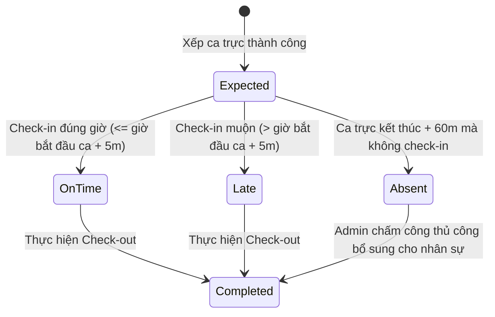

# PRD: Checkin Management

## Mục lục

1. [Thông Tin Chấm Công Ghi Nhận (Checkin Records Information)](#1-thông-tin-chấm-công-ghi-nhận-checkin-records-information)
2. [Quy Tắc Nghiệp Vụ &amp; Ràng Buộc (Business Rules &amp; Constraints)](#2-quy-tắc-nghiệp-vụ--ràng-buộc-business-rules--constraints)
3. [Luồng Trạng Thái Chấm Công (State Machine)](#3-luồng-trạng-thái-chấm-công-state-machine)
4. [Quyền Hạn Của Nhân Viên Được Cấp Quyền Truy Cập Checkin](#4-quyền-hạn-của-nhân-viên-được-cấp-quyền-truy-cập-checkin)
5. [Quy Tắc Hoạt Động Độc Lập &amp; Tích Hợp (Standalone &amp; Integrated Rules)](#5-quy-tắc-hoạt-động-độc-lập--tích-hợp-standalone--integrated-rules)
6. [Kịch Bản Chức Năng Chi Tiết (Given-When-Then Scenarios)](#6-kịch-bản-chức-năng-chi-tiết-given-when-then-scenarios)
7. [Tiêu Chí Nghiệm Thu (Acceptance Criteria)](#7-tiêu-chí-nghiệm-thu-acceptance-criteria)

---

## 1. Thông Tin Chấm Công Ghi Nhận (Checkin Records Information)

Hệ thống chấm công ghi nhận các nhóm thông tin nghiệp vụ sau:

* **Chấm công thường nhật (Check-in/Check-out):** Thông tin nhân viên, Thời gian chấm công (Ngày, Giờ, Phút), Loại chấm công (Check-in / Check-out), Vị trí/Chi nhánh chấm công, và Thiết bị thực hiện (Web Browser / Mobile App).
* **Chấm công thủ công (Manual Check-in):** Chọn nhân viên cần chấm công hộ, Ngày chấm công, Giờ chấm công, Ca trực liên kết, Chi nhánh chấm công, Ghi chú lý do chấm công hộ, Giờ làm việc dự kiến (nếu có), Thời gian nghỉ giữa ca (nếu có), và Tệp tài liệu đính kèm minh chứng (ảnh chụp, đơn xác nhận).

---

## 2. Quy Tắc Nghiệp Vụ & Ràng Buộc (Business Rules & Constraints)

* Khi nhân sự thực hiện chấm công, hệ thống **bắt buộc phải** xác thực rằng địa chỉ chi nhánh nơi thực hiện chấm công trùng khớp với chi nhánh được gán của ca làm việc đó trong Shift Planner. Nếu không trùng khớp (ví dụ gán làm việc tại HCM 1 nhưng check-in tại HCM 2), hệ thống **bắt buộc phải** chặn không cho phép check-in và hiển thị cảnh báo lỗi.
* Hệ thống **sẽ tự động** xác định trạng thái chấm công dựa trên ca trực được gán:
  * `On Time`: Nhân sự check-in trước hoặc bằng giờ bắt đầu ca trực cộng với thời gian ân hạn (Grace period = 5 phút).
  * `Late`: Nhân sự check-in sau giờ bắt đầu ca trực + 5 phút. Số phút đi muộn **bắt buộc phải** hiển thị trên trạng thái chấm công của ngày làm việc đó: `actual_checkin_time - shift_start_time`. Đối với trường hợp có đơn nghỉ bù theo giờ đi muộn có phép, giờ đối chiếu trễ bắt đầu tính từ: `shift_start_time + compensatory_hours`.
  * `Absent`: Hệ thống tự động kích hoạt trạng thái này nếu sau khi ca làm việc kết thúc 60 phút mà nhân viên không có dữ liệu Check-in (trừ khi có phép nghỉ đã được duyệt, ngày nghỉ Flextime hợp lệ, hoặc đơn nghỉ bù `Compensatory Leave` trọn ngày đã được phê duyệt).
  * `Completed`: Đã có đủ cặp bản ghi Check-in và Check-out hợp lệ trong ngày.
* Đối với nhân viên về sớm được hỗ trợ bởi đơn nghỉ bù (`Compensatory Leave` theo giờ):
  * Hệ thống **bắt buộc phải** chấp nhận check-out trước giờ tan ca mà không đánh dấu lỗi hoặc cảnh báo vi phạm về sớm, miễn là thời gian check-out thỏa mãn: `actual_checkout_time >= shift_end_time - compensatory_hours`. Số giờ làm việc thiếu hụt thực tế này sẽ được đối soát 1-1 và bù đắp bởi số giờ nghỉ bù đã duyệt.
* Đối với các ca trực làm việc qua đêm kết thúc vào ngày hôm sau (Ví dụ: ca trực `19:00 - 03:00 (+1)`):
  * Hệ thống **bắt buộc phải** tính toán toàn bộ số giờ làm việc thực tế và ghi nhận toàn bộ thông tin chấm công của ca trực này vào **Ngày kết thúc ca trực** (ngày hôm sau).
* **Quy định trừ giờ nghỉ giải lao tự động (kế thừa từ cấu hình `autoBreakDeduction` tại `PRD-Brand-Settings`):**
  * Số giờ làm việc thực tế **bắt buộc phải** được tính bằng công thức: `Giờ Check-out - Giờ Check-in - Thời gian nghỉ giữa ca`.
  * Nếu không có thông tin nghỉ giữa ca được ghi nhận, hệ thống đối chiếu cấu hình `autoBreakDeduction` tại `PRD-Brand-Settings`:
    * **Nếu cấu hình là Enabled (Bật):** Hệ thống **sẽ tự động** thực hiện khấu trừ thời gian nghỉ giải lao theo các mốc ngưỡng giờ và thời lượng nghỉ được cấu hình tại `autoBreakDeduction` trong `PRD-Brand-Settings` (ví dụ theo luật của quốc gia hoạt động).
    * **Nếu cấu hình là Disabled (Tắt):** Hệ thống tính giờ công thực tế dựa trên đúng số giờ Check-in/Check-out của nhân sự, không tự động áp dụng khấu trừ bắt buộc.
* **Xử lý quên Check-in / Check-out:** Hệ thống áp dụng chính sách xử lý ca trực quên check-in hoặc check-out theo cấu hình `forgetCheckinBehavior` ở cấp Chi nhánh (Store Settings) tại `PRD-Brand-Settings`:
    * **Snap to Shift:** Hệ thống tự động điền giờ công bằng đúng số giờ của ca trực kế hoạch khi thực hiện duyệt sửa giờ.
    * **Snap to Actual:** Hệ thống yêu cầu người có thẩm quyền điền thủ công hoặc xác nhận thời gian làm việc thực tế của nhân viên.

---

## 3. Luồng Trạng Thái Chấm Công (State Machine)

Vòng đời trạng thái chấm công của nhân sự cho một ca trực được xếp lịch:

---

## 4. Quyền Hạn Của Nhân Viên Được Cấp Quyền Truy Cập Checkin

Đối với nhân viên được cấp quyền truy cập Checkin, hệ thống giới hạn quyền hạn theo các chi nhánh được gán của họ như sau:

* **Xem lịch sử chấm công:** Chỉ được xem, tìm kiếm và xuất danh sách lịch sử chấm công (Check-in Logs) của các nhân viên thuộc các chi nhánh mà mình đang làm việc. Hệ thống ẩn toàn bộ dữ liệu chấm công của các chi nhánh khác.
* **Chấm công hộ (Manual Check-in):** Chỉ được phép thực hiện chấm công hộ cho nhân viên thuộc chi nhánh làm việc của mình. Hệ thống tự động lọc danh sách nhân viên khả dụng và chặn việc chọn hoặc chấm công hộ cho nhân viên của chi nhánh khác.

---

## 5. Quy Tắc Hoạt Động Độc Lập & Tích Hợp (Standalone & Integrated Rules)

* **Chế độ Độc lập (Standalone Mode):**
  * Chỉ hoạt động như một máy thu thập lịch sử giờ vào / giờ ra của nhân viên tại các chi nhánh.
  * Tính toán tổng thời gian làm việc thực tế trong ngày bằng công thức: `Giờ Check-out - Giờ Check-in - Thời gian nghỉ`.
  * Trạng thái chấm công chỉ hiển thị đơn giản thay thế cho toàn bộ State Machine ở mục 3: `Checked-in` (đã vào ca) và `Completed` (đã ra ca).
  * **Không** kiểm tra ca trực gán ➔ Không tính trạng thái đi muộn (`Late`) hay tự động báo vắng mặt (`Absent`).
* **Chế độ Tích hợp (Integrated Mode):**
  * *Tích hợp với PRD-Staff-Roles (Staff):* Lọc danh sách nhân viên hợp lệ để chấm công và đối chiếu chi nhánh mặc định của nhân viên khi check-in.
  * *Tích hợp với PRD-Shift-Planner (Shift Planner):* Lấy giờ ca trực được gán làm cơ sở đối chiếu chấm công để tính số phút đi muộn (`Late (Xm)`) hoặc tự động chuyển trạng thái `Absent` sau khi ca trực kết thúc 60 phút.
  * *Tích hợp với PRD-Leave-Flextime (Leave & Flextime):* Tự động loại trừ, không báo vắng mặt (`Absent`) vào các ngày nghỉ phép, nghỉ Flextime hoặc nghỉ bù (`Compensatory Leave`) trọn ngày đã được duyệt. Đồng thời tự động áp dụng khoảng thời gian miễn trừ đi muộn / về sớm tương ứng với số giờ ghi nhận trên đơn nghỉ bù theo giờ đã duyệt.

---

## 6. Kịch Bản Chức Năng Chi Tiết (Given-When-Then Scenarios)

### Kịch bản 1: Chặn chấm công do sai chi nhánh (Q-01 - Unhappy Path)

* **GIVEN** Nhân sự `Nguyen An` được xếp ca trực tại chi nhánh `HCM 1`.
* **WHEN** Nhân sự `Nguyen An` thực hiện Check-in tại chi nhánh `HCM 2`.
* **THEN** Hệ thống **bắt buộc phải** chặn không cho phép check-in.
* **AND** Hiển thị thông báo trên màn hình: `"Bạn đang ở sai chi nhánh làm việc được phân công. Không thể thực hiện chấm công."`.

### Kịch bản 2: Tự động ghi nhận đi muộn kèm số phút (Happy Path)

* **GIVEN** Nhân sự `Tran Binh` được xếp ca trực bắt đầu lúc `09:00 AM`.
* **WHEN** Nhân sự `Tran Binh` thực hiện Check-in lúc `09:12 AM` tại đúng chi nhánh.
* **THEN** Hệ thống **bắt buộc phải** ghi nhận bản ghi check-in thành công.
* **AND** Tự động tính toán số phút đi muộn là `12 phút`.
* **AND** Chuyển trạng thái chấm công của ca trực này thành `Late (12m)`.

### Kịch bản 3: Ghi nhận ca trực qua đêm vào ngày kết thúc ca (Q-03 - Happy Path)

* **GIVEN** Nhân sự `Doan Minh` được xếp ca trực từ `05:00 PM` ngày `2026-06-23` đến ca tối kết thúc lúc `01:00 AM` ngày `2026-06-24`.
* **WHEN** Nhân sự thực hiện Check-out lúc `01:00 AM` ngày `2026-06-24`.
* **THEN** Hệ thống **bắt buộc phải** ghi nhận toàn bộ số giờ công của ca làm việc này và gán thông tin chấm công vào danh sách ngày `2026-06-24` (Ngày kết thúc ca trực).

### Kịch bản 4: Về sớm có đơn nghỉ bù theo giờ đã được phê duyệt (Happy Path)
* **GIVEN** Nhân sự `Le Chi` có ca trực được gán từ `08:00 AM` đến `05:00 PM` (nghỉ ca 1 tiếng, tổng ca 8.0 giờ).
* **AND** Nhân sự có đơn nghỉ bù (`Compensatory Leave`) 2.0 giờ được duyệt để về sớm từ `03:00 PM`.
* **WHEN** Nhân sự thực hiện Check-out lúc `03:00 PM` tại chi nhánh.
* **THEN** Hệ thống **bắt buộc phải** cho phép check-out thành công.
* **AND** Không đánh dấu lỗi vi phạm về sớm hoặc báo thiếu giờ công trên ca làm việc.
* **AND** Tổng số giờ làm việc thực tế ghi nhận của ca là `6.0 giờ` (sẽ được Payroll cộng 2.0 giờ từ đơn nghỉ bù để tính đủ 8.0 giờ công).

### Kịch bản 5: Chấm công thủ công (Manual Check-in) bởi người được cấp quyền (Happy Path)
* **GIVEN** Nhân sự `Nguyen An` quên check-in ca làm việc ngày hôm qua và trạng thái ca trực hiện là `Absent`.
* **AND** Người quản trị có quyền truy cập Checkin đăng nhập vào hệ thống.
* **WHEN** Người quản trị mở giao diện Chấm công thủ công, chọn nhân viên `Nguyen An`, ca trực tương ứng, điền giờ vào `09:00 AM`, giờ ra `05:00 PM`, thời gian nghỉ giữa ca là `1.0 giờ`, điền lý do `"Nhân viên quên mang điện thoại"` và bấm Lưu.
* **THEN** Hệ thống **bắt buộc phải** ghi nhận bản ghi chấm công thủ công thành công.
* **AND** Chuyển trạng thái chấm công của ca trực từ `Absent` sang `Completed`.
* **AND** Ghi nhận tổng thời gian làm việc thực tế là `7.0 giờ` và cập nhật thông số này sang phân hệ tính lương.

---

## 7. Tiêu Chí Nghiệm Thu (Acceptance Criteria)

* - [ ] Khi thực hiện chấm công ngoài chi nhánh được phân ca, hệ thống hiển thị thông báo lỗi và không tạo bản ghi chấm công.
* - [ ] Đối với ca qua đêm kết ca lúc 3:00 AM ngày hôm sau, bản ghi chấm công hiển thị chính xác trên dashboard chấm công của ngày kết thúc.
* - [ ] Trạng thái đi muộn hiển thị đúng số phút đi muộn thực tế của nhân viên (ví dụ: Late (12m)).
* - [ ] Nếu nhân viên quên check-in, sau khi ca trực kết thúc 60 phút hệ thống tự động đổi trạng thái sang Absent trên dashboard.
* - [ ] Hệ thống tự động khấu trừ giờ nghỉ giải lao đúng theo các mốc ngưỡng và thời lượng được cấu hình tại `autoBreakDeduction` của `PRD-Brand-Settings` khi không ghi nhận thời gian nghỉ giữa ca.
* - [ ] Hỗ trợ chuyển đổi cách tính giờ công của ca quên check-in/out theo đúng 2 tùy chọn cấu hình của Brand Settings tại `PRD-Brand-Settings` (Snap to Shift vs Snap to Actual).
* - [ ] Nhân viên được cấp quyền truy cập Checkin chỉ hiển thị lịch sử chấm công của các chi nhánh và nhân viên tương ứng trong danh sách chi nhánh làm việc của họ.
* - [ ] Hệ thống chặn không cho phép nhân viên được cấp quyền truy cập Checkin chấm công hộ hoặc thao tác dữ liệu chấm công của nhân sự thuộc chi nhánh khác.
* - [ ] Người được cấp quyền truy cập Checkin có thể thực hiện chấm công thủ công (Manual Check-in) thành công cho nhân viên cùng chi nhánh bằng cách điền đầy đủ các thông tin bắt buộc và ghi chú lý do.
