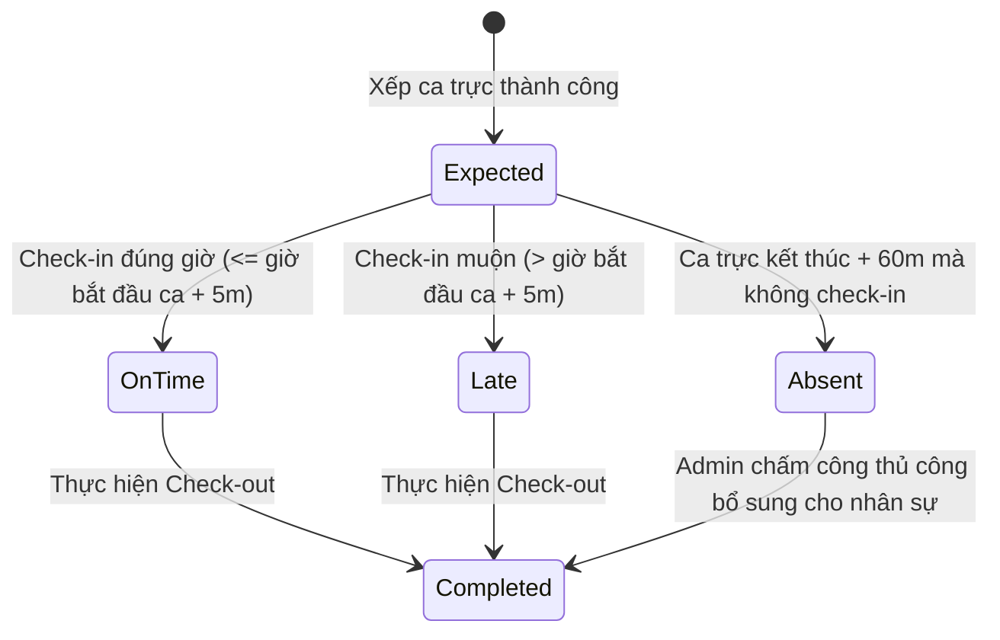

# PRD: Checkin Management

## Mục lục
1. [Thông Tin Chấm Công Ghi Nhận (Checkin Records Information)](#1-thông-tin-chấm-công-ghi-nhận-checkin-records-information)
2. [Quy Tắc Nghiệp Vụ & Ràng Buộc (Business Rules & Constraints)](#2-quy-tắc-nghiệp-vụ--ràng-buộc-business-rules--constraints)
3. [Luồng Trạng Thái Chấm Công (State Machine)](#3-luồng-trạng-thái-chấm-công-state-machine)
4. [Quy Tắc Hoạt Động Độc Lập & Tích Hợp (Standalone & Integrated Rules)](#4-quy-tắc-hoạt-động-độc-lập--tích-hợp-standalone--integrated-rules)
5. [Kịch Bản Chức Năng Chi Tiết (Given-When-Then Scenarios)](#5-kịch-bản-chức-năng-chi-tiết-given-when-then-scenarios)
6. [Tiêu Chí Nghiệm Thu (Acceptance Criteria)](#6-tiêu-chí-nghiệm-thu-acceptance-criteria)

---

## 1. Thông Tin Chấm Công Ghi Nhận (Checkin Records Information)

Hệ thống chấm công ghi nhận các nhóm thông tin nghiệp vụ sau:

*   **Chấm công thường nhật (Check-in/Check-out):** Thông tin nhân viên, Thời gian chấm công (Ngày, Giờ, Phút), Loại chấm công (Vào ca / Ra ca), Vị trí/Chi nhánh chấm công, và Thiết bị thực hiện (Trình duyệt web / Ứng dụng di động).
*   **Chấm công thủ công (Manual Check-in):** Chọn nhân viên cần chấm công hộ, Ngày chấm công, Giờ chấm công, Ca trực liên kết, Chi nhánh chấm công, Ghi chú lý do chấm công hộ, Giờ làm việc dự kiến (nếu có), Thời gian nghỉ giữa ca (nếu có), và Tệp tài liệu đính kèm minh chứng (ảnh chụp, đơn xác nhận).

---

## 2. Quy Tắc Nghiệp Vụ & Ràng Buộc (Business Rules & Constraints)

*   Khi nhân sự thực hiện chấm công, hệ thống **bắt buộc phải** xác thực rằng địa chỉ chi nhánh nơi thực hiện chấm công trùng khớp với chi nhánh được gán của ca làm việc đó trong Shift Planner. Nếu không trùng khớp (ví dụ gán làm việc tại HCM 1 nhưng check-in tại HCM 2), hệ thống **bắt buộc phải** chặn không cho phép check-in và hiển thị cảnh báo lỗi.
*   Hệ thống **sẽ tự động** xác định trạng thái chấm công dựa trên ca trực được gán:
    *   `On Time`: Nhân sự check-in trước hoặc bằng giờ bắt đầu ca trực cộng với thời gian ân hạn (Grace period = 5 phút).
    *   `Late`: Nhân sự check-in sau giờ bắt đầu ca trực + 5 phút. Số phút đi muộn **bắt buộc phải** hiển thị trên trạng thái chấm công của ngày làm việc đó: `actual_checkin_time - shift_start_time`.
    *   `Absent`: Hệ thống tự động kích hoạt trạng thái này nếu sau khi ca làm việc kết thúc 60 phút mà nhân viên không có dữ liệu Check-in (trừ khi có phép nghỉ đã được duyệt trước đó).
    *   `Completed`: Đã có đủ cặp bản ghi Check-in và Check-out hợp lệ trong ngày.
*   Đối với các ca trực làm việc qua đêm kết thúc vào ngày hôm sau (Ví dụ: ca trực `19:00 - 03:00 (+1)`):
    *   Hệ thống **bắt buộc phải** tính toán toàn bộ số giờ làm việc thực tế và ghi nhận toàn bộ thông tin chấm công của ca trực này vào **Ngày kết thúc ca trực** (ngày hôm sau).
*   Số giờ làm việc thực tế **bắt buộc phải** được tính bằng công thức: `Giờ Check-out - Giờ Check-in - Thời gian nghỉ giữa ca`. Nếu không nhập thời gian nghỉ giữa ca, hệ thống **sẽ tự động** trừ mặc định 1.0 giờ nghỉ đối với các ca trực có tổng thời gian làm việc từ 5 giờ trở lên.

---

## 3. Luồng Trạng Thái Chấm Công (State Machine)

Vòng đời trạng thái chấm công của nhân sự cho một ca trực được xếp lịch:

---

## 4. Quy Tắc Hoạt Động Độc Lập & Tích Hợp (Standalone & Integrated Rules)

*   **Chế độ Độc lập (Standalone Mode):**
    *   Chỉ hoạt động như một máy thu thập lịch sử giờ vào / giờ ra của nhân viên tại các chi nhánh.
    *   Tính toán tổng thời gian làm việc thực tế trong ngày bằng công thức: `Giờ Check-out - Giờ Check-in - Thời gian nghỉ`.
    *   Trạng thái chấm công chỉ hiển thị đơn giản: `Active` (sau khi check-in) và `Completed` (sau khi check-out).
    *   **Không** kiểm tra ca trực gán ➔ Không tính trạng thái đi muộn (`Late`) hay tự động báo vắng mặt (`Absent`).
*   **Chế độ Tích hợp (Integrated Mode):**
    *   *Tích hợp với PRD-001 (Staff):* Lọc danh sách nhân viên hợp lệ để chấm công và đối chiếu chi nhánh mặc định của nhân viên khi check-in.
    *   *Tích hợp với PRD-002 (Shift Planner):* Lấy giờ ca trực được gán làm cơ sở đối chiếu chấm công để tính số phút đi muộn (`Late (Xm)`) hoặc tự động chuyển trạng thái `Absent` sau khi ca trực kết thúc 60 phút.
    *   *Tích hợp với PRD-004 (Leave & Flextime):* Tự động loại trừ, không báo vắng mặt (`Absent`) vào các ngày nghỉ phép hoặc nghỉ Flextime đã được duyệt.

---

## 5. Kịch Bản Chức Năng Chi Tiết (Given-When-Then Scenarios)

### Kịch bản 1: Chặn chấm công do sai chi nhánh (Q-01 - Unhappy Path)
*   **GIVEN** Nhân sự `Nguyen An` được xếp ca trực tại chi nhánh `HCM 1`.
*   **WHEN** Nhân sự `Nguyen An` thực hiện Check-in tại chi nhánh `HCM 2`.
*   **THEN** Hệ thống **bắt buộc phải** chặn không cho phép check-in.
*   **AND** Hiển thị thông báo trên màn hình: `"Bạn đang ở sai chi nhánh làm việc được phân công. Không thể thực hiện chấm công."`.

### Kịch bản 2: Tự động ghi nhận đi muộn kèm số phút (Happy Path)
*   **GIVEN** Nhân sự `Tran Binh` được xếp ca trực bắt đầu lúc `09:00 AM`.
*   **WHEN** Nhân sự `Tran Binh` thực hiện Check-in lúc `09:12 AM` tại đúng chi nhánh.
*   **THEN** Hệ thống **bắt buộc phải** ghi nhận bản ghi check-in thành công.
*   **AND** Tự động tính toán số phút đi muộn là `12 phút`.
*   **AND** Chuyển trạng thái chấm công của ca trực này thành `Late (12m)`.

### Kịch bản 3: Ghi nhận ca trực qua đêm vào ngày kết thúc ca (Q-03 - Happy Path)
*   **GIVEN** Nhân sự `Doan Minh` được xếp ca trực từ `05:00 PM` ngày `2026-06-23` đến ca tối kết thúc lúc `01:00 AM` ngày `2026-06-24`.
*   **WHEN** Nhân sự thực hiện Check-out lúc `01:00 AM` ngày `2026-06-24`.
*   **THEN** Hệ thống **bắt buộc phải** ghi nhận toàn bộ số giờ công của ca làm việc này và gán thông tin chấm công vào danh sách ngày `2026-06-24` (Ngày kết thúc ca trực).

---

## 6. Tiêu Chí Nghiệm Thu (Acceptance Criteria)

*   - [ ] Khi thực hiện chấm công ngoài chi nhánh được phân ca, hệ thống hiển thị thông báo lỗi và không tạo bản ghi chấm công.
*   - [ ] Đối với ca qua đêm kết ca lúc 3:00 AM ngày hôm sau, bản ghi chấm công hiển thị chính xác trên dashboard chấm công của ngày kết thúc.
*   - [ ] Trạng thái đi muộn hiển thị đúng số phút đi muộn thực tế của nhân viên (ví dụ: Late (12m)).
*   - [ ] Nếu nhân viên quên check-in, sau khi ca trực kết thúc 60 phút hệ thống tự động đổi trạng thái sang Absent trên dashboard.
