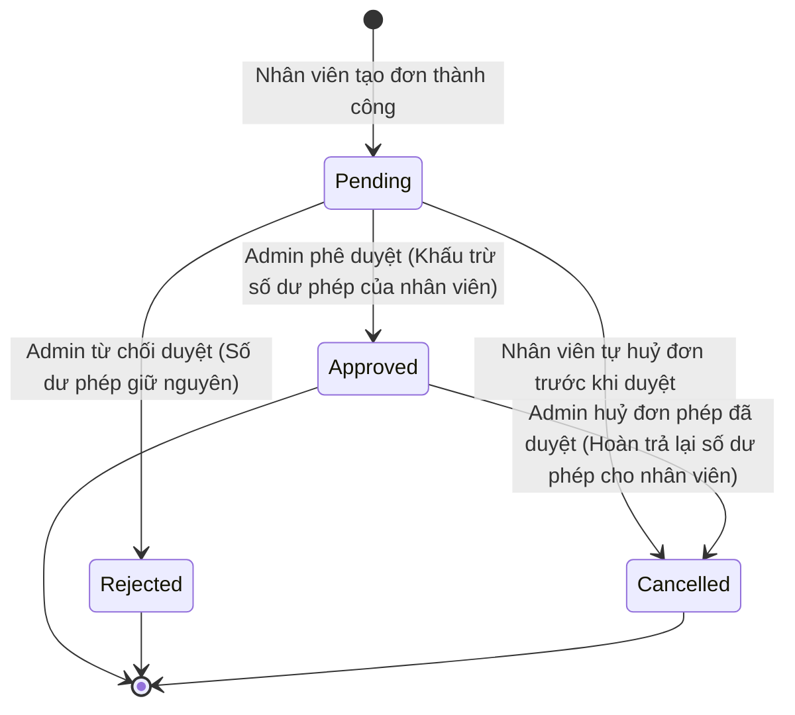

# PRD: Leave & Flextime

## Mục lục
1. [Thông Tin Đăng Ký Nghỉ Phép & Lịch Linh Hoạt (Leave & Flextime Registration)](#1-thông-tin-đăng-ký-nghỉ-phép--lịch-linh-hoạt-leave--flextime-registration)
2. [Quy Tắc Nghiệp Vụ & Ràng Buộc (Business Rules & Constraints)](#2-quy-tắc-nghiệp-vụ--ràng-buộc-business-rules--constraints)
3. [Luồng Trạng Thái & Chuyển Đổi (State Machine)](#3-luồng-trạng-thái--chuyển-đổi-state-machine)
4. [Quyền Hạn Của Nhân Viên Được Cấp Quyền Truy Cập Leave](#4-quyền-hạn-của-nhân-viên-được-cấp-quyền-truy-cập-leave)
5. [Quy Tắc Hoạt Động Độc Lập & Tích Hợp (Standalone & Integrated Rules)](#5-quy-tắc-hoạt-động-độc-lập--tích-hợp-standalone--integrated-rules)
6. [Kịch Bản Chức Năng Chi Tiết (Given-When-Then Scenarios)](#6-kịch-bản-chức-năng-chi-tiết-given-when-then-scenarios)
7. [Tiêu Chí Nghiệm Thu (Acceptance Criteria)](#7-tiêu-chí-nghiệm-thu-acceptance-criteria)

---

## 1. Thông Tin Đăng Ký Nghỉ Phép & Lịch Linh Hoạt (Leave & Flextime Registration)

Hệ thống ghi nhận các thông tin nghiệp vụ đăng ký sau:

*   **Đơn xin nghỉ phép (Leave Request):** Họ tên nhân viên, Loại phép xin nghỉ (`Annual Leave` / `Sick Leave` / `Personal Leave` / `Unpaid Leave` / `Compensatory Leave`), Ngày bắt đầu nghỉ, Ngày kết thúc nghỉ, Lý do xin nghỉ (ví dụ: Đi du lịch gia đình, Bị sốt cao). Đối với `Compensatory Leave` (Nghỉ bù), đơn hỗ trợ đăng ký nghỉ trọn ngày (quy đổi 8.0 giờ) hoặc nghỉ theo số giờ cụ thể (ví dụ: về sớm 2.0 giờ).
*   **Đăng ký Giờ làm việc linh hoạt (Flextime):** Họ tên nhân viên, Loại hình Flextime áp dụng (`Flextime` / `Compressed Workweek` / `Flexible Workday`), Mô tả chi tiết lịch trình thoả thuận (ví dụ: Core Hours từ 10:00 AM - 3:00 PM), Ngày bắt đầu áp dụng, Ngày kết thúc áp dụng, Các ngày áp dụng trong tuần (ví dụ: Từ Thứ Hai đến Thứ Năm).

---

## 2. Quy Tắc Nghiệp Vụ & Ràng Buộc (Business Rules & Constraints)

*   **Hạn mức phép năm (Yearly Entitlement & Vacation Balances):**
    *   Hạn mức phép năm (`Annual Leave`) của nhân viên **bắt buộc phải** được tính toán tự động dựa trên số ngày làm việc trong tuần (`workingDaysPerWeek` tại `PRD-Staff-Roles`) theo công thức tỷ lệ luật tối thiểu của Đức: `workingDaysPerWeek * 4` ngày phép/năm (ví dụ: làm 5 ngày/tuần có tối thiểu 20 ngày phép). Hệ thống cho phép Admin nhập đè con số phép này cao hơn theo thỏa thuận hợp đồng riêng (ví dụ: gán 24, 28, 30 ngày), nhưng **bắt buộc phải chặn** không cho lưu nếu giá trị nhập thấp hơn hạn mức tối thiểu pháp định vừa được tính toán.
    *   Nếu nhân sự bắt đầu làm việc giữa năm dương lịch (dựa trên `entryDate` tại `PRD-Staff-Roles`), hệ thống **sẽ tự động gợi ý** số ngày phép năm nay tính theo tỷ lệ: `(annualLeaveEntitlement / 12) * Số tháng làm việc thực tế còn lại trong năm` (Admin vẫn có quyền sửa đổi thủ công con số gợi ý này khi tạo hồ sơ).
    *   **Quy tắc Thử việc (Probezeit):** Trong suốt thời gian thử việc (được xác định bởi trường `probationPeriodMonths` hoặc ngày kết thúc `probationEndDate` tại `PRD-Staff-Roles`), nhân viên vẫn tích lũy số ngày phép bình thường. Tuy nhiên, hệ thống **bắt buộc phải** chặn không cho nhân viên tự nộp đơn xin nghỉ phép năm (`Annual Leave`) trên Staff Portal, trừ khi được Admin tạo và phê duyệt thủ công trên trang quản trị.
    *   **Phân nhóm đối chiếu số dư phép kép (Dual Vacation Ledgers):** Để hỗ trợ các thỏa thuận lao động đặc thù (nhất là đối với nhóm nhân sự bếp thường hoạt động theo thỏa thuận thực tế khác với hợp đồng khai thuế):
        *   Hệ thống hỗ trợ quản lý song song hai số dư phép: Số dư phép theo hợp đồng khai thuế (`contractVacationBalance`) và Số dư phép thực tế theo thỏa thuận (`actualVacationBalance`).
        *   Mặc định đối với nhân viên chạy bàn/phục vụ (Service), hai số dư này luôn trùng khớp. Đối với nhân sự bếp, Admin có quyền điều chỉnh độc lập từng số dư. Khi đơn phép được duyệt, hệ thống sẽ tự động trừ vào cả hai bảng số dư trừ khi Admin cấu hình chỉ trừ vào một trong hai bảng.
    *   **Phương pháp tính toán khấu trừ số ngày phép (Leave Deduction Methods):** Hệ thống hỗ trợ Brand cấu hình một trong hai phương pháp tính toán số ngày phép bị khấu trừ khi duyệt đơn nghỉ phép:
        *   *Cách 1: Khấu trừ theo ngày trực thực tế (Shift-based Deduction):* Hệ thống đối chiếu với lịch ca trực của nhân viên trong module `Shift Planner` trong khoảng thời gian nghỉ phép. Chỉ trừ ngày phép đối với những ngày thực tế có ca trực được gán.
        *   *Cách 2: Khấu trừ theo ngày làm việc lịch chuẩn (Calendar-based Deduction):* Hệ thống trừ ngày phép dựa theo số ngày làm việc tiêu chuẩn trong tuần của hợp đồng (ví dụ: làm 5 ngày/tuần thì nghỉ từ Thứ 2 đến Thứ 6 sẽ trừ đúng 5 ngày phép, không phụ thuộc vào lịch trực thực tế tuần đó trong Shift Planner).
    *   Hệ thống **bắt buộc phải** hỗ trợ trường số dư **`VJ Url. üb.` (Urlaubsübertrag - Ngày phép cũ năm trước chuyển sang)** nếu cấu hình `allowVacationRollover` của Brand được thiết lập là `Yes`. Nếu cấu hình này là `No`, toàn bộ phép năm dư sẽ tự động bị xóa về `0` vào ngày 31 tháng 12 cuối năm.
    *   *Quy tắc hết hạn phép năm cũ:* Số phép cũ chuyển sang (`VJ Url. üb.`) **bắt buộc phải** được ưu tiên khấu trừ trước khi tính sang hạn mức phép mới của năm nay. Hạn chót sử dụng số phép cũ này được xác định bởi cấu hình `vacationRolloverExpiryDate` (mặc định là ngày 31 tháng 3 của năm mới hoặc không bao giờ hết hạn). 
    *   *Hành động khi hết hạn:* Khi đến thời hạn hết hạn, hệ thống **sẽ tự động** thực hiện hành động cấu hình tại `vacationRolloverRemainderAction`: xóa bỏ (trừ về `0`) toàn bộ số ngày phép cũ chưa dùng còn dư (hành động `Expire`), hoặc tự động quy đổi số ngày phép thừa này sang giờ tích lũy (hành động `Convert to Flextime` với tỷ lệ 1 ngày phép = 8.0 giờ công) và cộng dồn vào tài khoản FWHA / Gleitzeitkonto.
    *   **Quy tắc xử lý số dư giờ linh hoạt khi thôi việc (Exit Settlement):** Khi hồ sơ nhân viên ghi nhận ngày thôi việc (`exitDate` tại `PRD-Staff-Roles`), hệ thống **sẽ tự động** hiển thị cảnh báo đỏ và bảng tổng hợp số dư giờ linh hoạt hiện tại (thừa hoặc thiếu giờ) của nhân sự đó trên màn hình Bảng lương cuối cùng. Việc chi trả tiền mặt cho số giờ thừa hay khấu trừ lương cho số giờ thiếu sẽ do Brand và nhân viên **tự thỏa thuận** ngoài đời thực. Hệ thống chỉ hỗ trợ ghi nhận số liệu đối soát, không tự động thực hiện bất kỳ hành động cộng/trừ tiền lương cứng hay tiền mặt tự động nào.
*   Khi đơn xin nghỉ phép chuyển sang trạng thái được duyệt (`Approved`), hệ thống **bắt buộc phải** tự động trừ số ngày nghỉ tương ứng vào số dư của loại phép đó. Đối với các loại phép giới hạn số dư (`Annual`, `Sick`, `Personal`), hệ thống **bắt buộc phải** chặn không cho Admin phê duyệt nếu số ngày nghỉ trong đơn vượt quá tổng số dư ngày phép khả dụng (gồm phép năm nay và phép cũ chuyển sang chưa hết hạn) của nhân sự đó. Quy tắc này không áp dụng đối với `Unpaid Leave` (Nghỉ không lương - không giới hạn số dư).
*   **Quy tắc báo ốm trong 4 tuần đầu làm việc (First 4-Weeks Sick Leave):** Nếu nhân viên báo ốm (`Sick Leave`) trong vòng 4 tuần đầu kể từ ngày bắt đầu làm việc (`entryDate` tại `PRD-Staff-Roles`), hệ thống **bắt buộc phải** ghi nhận trạng thái nghỉ ốm không hưởng lương từ doanh nghiệp (Unpaid Sick Leave - do bảo hiểm y tế chi trả) trên bảng tính lương của module `PRD-Payroll`, trừ trường hợp Admin cấu hình ghi nhận hưởng lương thủ công.
*   Đối với loại phép `Compensatory Leave` (Nghỉ bù):
    *   Hệ thống **bắt buộc phải** liên kết và kiểm tra số dư giờ thực tế (quy đổi tỷ lệ 1-1) trong **Tài khoản giờ tích lũy (FWHA / Gleitzeitkonto)** (`PRD-Payroll`).
    *   Hệ thống **bắt buộc phải** chặn không cho Admin phê duyệt nếu số giờ xin nghỉ bù vượt quá số dư tích lũy giờ làm thêm (OT) khả dụng hiện tại của nhân sự đó.
    *   Khi đơn nghỉ bù chuyển sang trạng thái `Approved`, hệ thống **bắt buộc phải** trừ số giờ tương ứng vào **FWHA / Gleitzeitkonto** của nhân viên với tỷ lệ quy đổi 1-1 thực tế.
    *   Khi đơn nghỉ bù đã duyệt bị hủy (`Cancelled`), hệ thống **bắt buộc phải** hoàn lại số giờ nghỉ tương ứng vào **FWHA / Gleitzeitkonto** của nhân viên (quy tắc M-001 không cho phép hủy nếu đã nằm trong kỳ lương đã thanh toán vẫn áp dụng).
*   **Quy đổi phép năm thừa sang giờ tích lũy (Leave Conversion):**
    *   Hệ thống **bắt buộc phải** hỗ trợ tính năng cho phép Admin quy đổi số ngày nghỉ phép năm (`Annual Leave`) còn dư vào cuối chu kỳ (năm dương lịch) sang giờ tích lũy và chuyển trực tiếp vào **Tài khoản giờ tích lũy (FWHA / Gleitzeitkonto)** của nhân viên.
    *   Tỷ lệ quy đổi: `1 ngày phép dư = 8.0 giờ công`. Sau khi chuyển đổi thành công, số ngày phép dư được trừ về `0` và số dư FWHA / Gleitzeitkonto được cộng tương ứng.
*   Đối với nhân viên đang áp dụng chế độ `Compressed Workweek` (Ví dụ: làm việc 4 ngày từ Thứ Hai đến Thứ Năm, nghỉ Thứ Sáu):
    *   Thứ Sáu **bắt buộc phải** được ghi nhận là ngày nghỉ linh hoạt hợp lệ của nhân sự đó.
    *   Hệ thống **không được phép** đánh dấu nhân sự này là vắng mặt (`Absent`) vào ngày Thứ Sáu trên Checkin Dashboard.
*   Người dùng có quyền quản trị (`Admin`) hoặc nhân viên được cấp quyền truy cập module `Leave` **mới có quyền** Phê duyệt (`Approve`) hoặc Từ chối (`Reject`) các đơn xin nghỉ phép và đăng ký Flextime của nhân viên.
*   Khi nộp đơn xin nghỉ phép, nhân viên **bắt buộc phải** chọn cụ thể chi nhánh muốn xin nghỉ.
*   Khi đơn nghỉ phép được duyệt (`Approved`), hệ thống **bắt buộc phải** phát sự kiện `leave.approved` lên Event Broker để module Shift Planner (nếu active) tự động lắng nghe và cập nhật trạng thái khả dụng của nhân viên thành `Unavailable` (Không khả dụng) trong khoảng thời gian nghỉ phép đó.

---

## 3. Luồng Trạng Thái & Chuyển Đổi (State Machine)

Vòng đời trạng thái của một Đơn xin nghỉ phép:

---

## 4. Quyền Hạn Của Nhân Viên Được Cấp Quyền Truy Cập Leave

Đối với nhân viên được cấp quyền truy cập Leave, hệ thống giới hạn quyền hạn theo các chi nhánh được gán của họ như sau:
* **Xem và duyệt đơn phép:** Chỉ hiển thị, gửi thông báo và cho phép phê duyệt (`Approve`) hoặc từ chối (`Reject`) đơn xin nghỉ phép của những nhân viên thuộc các chi nhánh mà mình đang làm việc.
* **Chặn dữ liệu ngoài chi nhánh:** Hệ thống tự động ẩn toàn bộ đơn xin nghỉ phép của các chi nhánh khác để đảm bảo tính riêng tư của từng cửa hàng.

---

## 5. Quy Tắc Hoạt Động Độc Lập & Tích Hợp (Standalone & Integrated Rules)

*   **Chế độ Độc lập (Standalone Mode):**
    *   Tính năng hoạt động độc lập để quản lý việc nộp đơn xin nghỉ phép, phê duyệt/từ chối của Admin và theo dõi số dư quỹ phép (`Leave Balance Summary`).
    *   Lịch linh hoạt (Flextime) được lưu trữ dưới dạng thông tin ghi chú chế độ làm việc của nhân sự.
    *   Việc nghỉ phép/áp dụng Flextime không ảnh hưởng đến xếp ca trực hay điểm danh chấm công hàng ngày.
*   **Chế độ Tích hợp (Integrated Mode):**
    *   *Tích hợp với PRD-Staff-Roles (Staff):* Lắng nghe sự kiện `staff.inactive` để tự động hủy toàn bộ đơn xin nghỉ phép đang ở trạng thái chờ duyệt (`Pending`) của nhân viên đó.
    *   *Tích hợp với PRD-Shift-Planner (Shift Planner):* Tự động khóa xếp ca (`Unavailable`) và gắn nhãn `(Leave)` trên lưới lịch ca trực tuần của nhân sự khi đơn nghỉ được duyệt.
    *   *Tích hợp với PRD-Checkin-Management (Checkin):* Miễn trừ điểm danh (không báo vắng mặt `Absent` trên dashboard chấm công) vào các ngày nghỉ phép, ngày nghỉ Flextime, hoặc ngày nghỉ bù (`Compensatory Leave`) cả ngày. Đối với đơn nghỉ bù theo giờ, hệ thống miễn trừ tính lỗi đi muộn hoặc về sớm trong khoảng thời gian được duyệt của ca trực.
    *   *Tích hợp với PRD-Payroll (Payroll):* Khi phê duyệt hoặc hủy đơn nghỉ bù (`Compensatory Leave`), hệ thống tự động đồng bộ gửi yêu cầu khấu trừ hoặc hoàn trả số giờ tương ứng vào **Tài khoản giờ tích lũy (FWHA)** của nhân sự.

---

## 6. Kịch Bản Chức Năng Chi Tiết (Given-When-Then Scenarios)

### Kịch bản 1: Xin nghỉ phép năm thành công (Happy Path)
*   **GIVEN** Nhân sự `Le Chi` có số dư phép năm khả dụng là `18.5 ngày`.
*   **AND** Nhân sự tạo đơn xin nghỉ phép năm từ Thứ Hai đến Thứ Sáu của tuần (tổng thời gian 5 ngày làm việc).
*   **WHEN** Admin thực hiện phê duyệt đơn xin nghỉ phép này (`Approve`).
*   **THEN** Hệ thống **bắt buộc phải** chuyển trạng thái đơn sang `Approved`.
*   **AND** Tự động khấu trừ `5 ngày` khỏi số dư phép năm của `Le Chi`.
*   **AND** Số dư phép năm còn lại hiển thị của `Le Chi` **bắt buộc phải** là `13.5 ngày`.

### Kịch bản 2: Chặn phê duyệt do vượt quá số dư phép khả dụng (Unhappy Path)
*   **GIVEN** Nhân sự `Doan Minh` có số dư phép năm khả dụng là `3.0 ngày`.
*   **AND** Nhân sự tạo đơn xin nghỉ phép năm 5 ngày làm việc.
*   **WHEN** Admin thực hiện phê duyệt đơn xin nghỉ phép này.
*   **THEN** Hệ thống **bắt buộc phải** chặn hành động phê duyệt.
*   **AND** Hiển thị cảnh báo lỗi: `"Không thể phê duyệt đơn nghỉ phép. Số dư ngày phép khả dụng của nhân viên (3.0 ngày) không đủ để thực hiện yêu cầu (5.0 ngày)."`.
*   **AND** Giữ nguyên trạng thái đơn là `Pending`.

### Kịch bản 3: Miễn trừ chấm công điểm danh cho ngày nghỉ Flextime (Happy Path)
*   **GIVEN** Nhân sự `Doan Minh` được áp dụng chế độ `Compressed Workweek` làm việc 4 ngày từ Thứ Hai đến Thứ Năm, nghỉ Thứ Sáu.
*   **WHEN** Đến ngày Thứ Sáu hệ thống quét dữ liệu chấm công để tính toán đi muộn/vắng mặt.
*   **THEN** Hệ thống **bắt buộc phải** nhận diện Thứ Sáu là ngày nghỉ Flextime hợp lệ của `Doan Minh`.
*   **AND** Không đánh dấu vắng mặt (`Absent`) trên bảng chấm công.

### Kịch bản 4: Phê duyệt đơn nghỉ bù theo giờ thành công (Happy Path)
*   **GIVEN** Nhân sự `Le Chi` có số dư **Tài khoản giờ tích lũy (FWHA)** là `5.0 giờ`.
*   **AND** Nhân sự tạo đơn xin nghỉ bù (`Compensatory Leave`) 2.0 giờ vào ngày Thứ Tư để về sớm từ 3:00 PM đến 5:00 PM.
*   **WHEN** Admin phê duyệt đơn xin nghỉ bù này.
*   **THEN** Hệ thống **bắt buộc phải** chuyển trạng thái đơn sang `Approved`.
*   **AND** Khấu trừ tỷ lệ 1-1 thực tế `2.0 giờ` vào **FWHA** của `Le Chi`.
*   **AND** Số dư tài khoản giờ còn lại hiển thị của `Le Chi` là `3.0 giờ`.

### Kịch bản 5: Chặn phê duyệt đơn nghỉ bù do thiếu số dư giờ tích lũy (Unhappy Path)
*   **GIVEN** Nhân sự `Nguyen An` có số dư **Tài khoản giờ tích lũy (FWHA)** là `1.5 giờ`.
*   **AND** Nhân sự tạo đơn xin nghỉ bù (`Compensatory Leave`) cả ngày (8.0 giờ).
*   **WHEN** Admin thực hiện phê duyệt đơn xin nghỉ bù này.
*   **THEN** Hệ thống **bắt buộc phải** chặn hành động phê duyệt.
*   **AND** Hiển thị cảnh báo lỗi: `"Không thể phê duyệt đơn nghỉ bù. Số giờ tích lũy khả dụng (1.5 giờ) không đủ để thực hiện yêu cầu (8.0 giờ)."`.

### Kịch bản 6: Admin hủy đơn xin nghỉ phép đã được phê duyệt thành công (Happy Path / Refund)
*   **GIVEN** Đơn xin nghỉ phép năm `5 ngày` của nhân viên `Le Chi` đang ở trạng thái `Approved` (số dư phép đã bị trừ 5 ngày).
*   **AND** Ngày nghỉ trong đơn thuộc kỳ lương chưa thanh toán (ở trạng thái `Draft`).
*   **WHEN** Admin thực hiện bấm Hủy đơn phép đã duyệt (`Cancel`).
*   **THEN** Hệ thống **bắt buộc phải** chuyển trạng thái đơn sang `Cancelled`.
*   **AND** Tự động hoàn lại `5 ngày` phép năm vào số dư phép năm khả dụng của `Le Chi`.

---

## 7. Tiêu Chí Nghiệm Thu (Acceptance Criteria)

*   - [ ] Số ngày phép của nhân viên tự động trừ đúng tỷ lệ 1-1 với số ngày xin nghỉ thực tế ngay khi đơn chuyển sang `Approved`.
*   - [ ] Tạo đơn nghỉ không lương (`Unpaid Leave`), hệ thống cho phép duyệt bình thường ngay cả khi các số dư phép khác của nhân viên bằng 0.
*   - [ ] Trạng thái của nhân sự trong lưới Shift Planner tự động chuyển sang `Unavailable` ngay sau khi đơn nghỉ trùng lịch được phê duyệt thành công.
*   - [ ] Nhân viên nghỉ theo chế độ Flextime (ví dụ Compressed Workweek) không bị đánh dấu Absent vào các ngày được miễn trừ gán.
*   - [ ] Dashboard duyệt đơn phép của Quản lý có phạm vi `Assigned Stores` chỉ hiển thị các đơn phép từ nhân viên thuộc các chi nhánh mà quản lý được gán.
*   - [ ] Hệ thống chặn không cho quản lý phê duyệt hoặc thao tác đơn xin nghỉ phép của nhân sự thuộc chi nhánh khác.
*   - [ ] Khi Admin thực hiện hủy đơn phép hoặc đơn nghỉ bù đã duyệt (trong kỳ lương chưa chốt), hệ thống tự động hoàn trả số dư phép hoặc số giờ tương ứng vào quỹ phép hoặc tài khoản FWHA của nhân viên đó.
