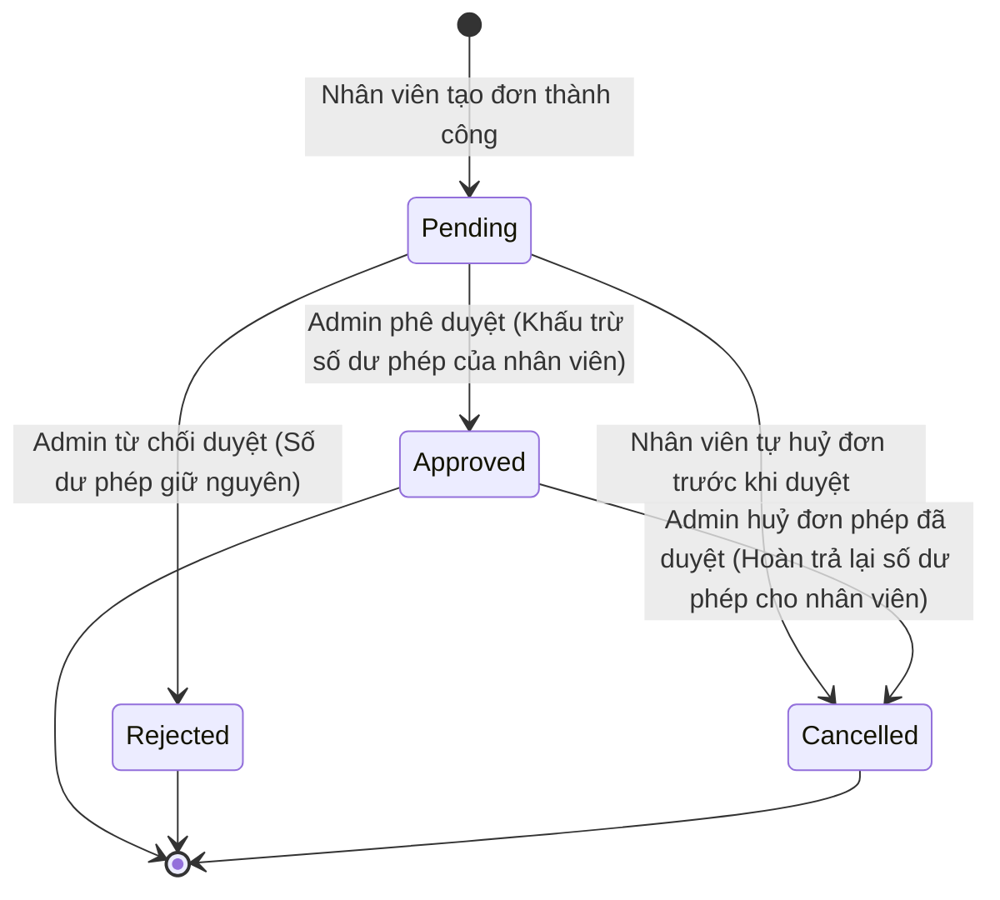

# PRD: Leave & Flextime

## Mục lục
1. [Thông Tin Đăng Ký Nghỉ Phép & Lịch Linh Hoạt (Leave & Flextime Registration)](#1-thông-tin-đăng-ký-nghỉ-phép--lịch-linh-hoạt-leave--flextime-registration)
2. [Quy Tắc Nghiệp Vụ & Ràng Buộc (Business Rules & Constraints)](#2-quy-tắc-nghiệp-vụ--ràng-buộc-business-rules--constraints)
3. [Luồng Trạng Thái & Chuyển Đổi (State Machine)](#3-luồng-trạng-thái--chuyển-đổi-state-machine)
4. [Quy Tắc Hoạt Động Độc Lập & Tích Hợp (Standalone & Integrated Rules)](#4-quy-tắc-hoạt-động-độc-lập--tích-hợp-standalone--integrated-rules)
5. [Kịch Bản Chức Năng Chi Tiết (Given-When-Then Scenarios)](#5-kịch-bản-chức-năng-chi-tiết-given-when-then-scenarios)
6. [Tiêu Chí Nghiệm Thu (Acceptance Criteria)](#6-tiêu-chí-nghiệm-thu-acceptance-criteria)

---

## 1. Thông Tin Đăng Ký Nghỉ Phép & Lịch Linh Hoạt (Leave & Flextime Registration)

Hệ thống ghi nhận các thông tin nghiệp vụ đăng ký sau:

*   **Đơn xin nghỉ phép (Leave Request):** Họ tên nhân viên, Loại phép xin nghỉ (Phép năm / Nghỉ ốm / Việc riêng / Nghỉ không lương), Ngày bắt đầu nghỉ, Ngày kết thúc nghỉ, Lý do xin nghỉ (ví dụ: Đi du lịch gia đình, Bị sốt cao).
*   **Đăng ký Giờ làm việc linh hoạt (Flextime):** Họ tên nhân viên, Loại hình Flextime áp dụng (Giờ linh hoạt / Tuần làm việc nén / Ngày làm việc linh hoạt), Mô tả chi tiết lịch trình thoả thuận (ví dụ: Core Hours từ 10:00 AM - 3:00 PM), Ngày bắt đầu áp dụng, Ngày kết thúc áp dụng, Các ngày áp dụng trong tuần (ví dụ: Từ Thứ Hai đến Thứ Năm).

---

## 2. Quy Tắc Nghiệp Vụ & Ràng Buộc (Business Rules & Constraints)

*   Số ngày phép năm khả dụng (`Annual Leave`) của nhân viên **bắt buộc phải** được tích lũy tự động: cộng thêm `1.0` ngày phép sau mỗi tháng làm việc dương lịch trọn vẹn tính từ ngày bắt đầu hợp đồng lao động.
*   Khi đơn xin nghỉ phép chuyển sang trạng thái được duyệt (`Approved`), hệ thống **bắt buộc phải** tự động trừ số ngày nghỉ tương ứng vào số dư của loại phép đó. Đối với các loại phép giới hạn số dư (`Annual`, `Sick`, `Personal`), hệ thống **bắt buộc phải** chặn không cho Admin phê duyệt nếu số ngày nghỉ trong đơn vượt quá số dư ngày phép khả dụng hiện tại của nhân sự đó. Quy tắc này không áp dụng đối với `Unpaid Leave` (Nghỉ không lương - không giới hạn số dư).
*   Đối với nhân viên đang áp dụng chế độ `Compressed Workweek` (Ví dụ: làm việc 4 ngày từ Thứ Hai đến Thứ Năm, nghỉ Thứ Sáu):
    *   Thứ Sáu **bắt buộc phải** được ghi nhận là ngày nghỉ linh hoạt hợp lệ của nhân sự đó.
    *   Hệ thống **không được phép** đánh dấu nhân sự này là vắng mặt (`Absent`) vào ngày Thứ Sáu trên Checkin Dashboard.
*   Chỉ người dùng có quyền truy cập `Admin` **bắt buộc phải** có quyền Phê duyệt (`Approve`) hoặc Từ chối (`Reject`) các đơn xin nghỉ phép và đăng ký Flextime của nhân viên.
*   Khi đơn nghỉ phép được duyệt (`Approved`), hệ thống **bắt buộc phải** tự động thông báo sang tính năng Shift Planner để tự động cập nhật trạng thái khả dụng của nhân viên thành `Unavailable` (Không khả dụng) trong khoảng thời gian nghỉ phép đó.
*   Hệ thống **bắt buộc phải** chặn không cho phép hủy đơn nghỉ phép đã duyệt (`Approved ➔ Cancelled`) nếu khoảng thời gian nghỉ trong đơn nằm trong kỳ lương đã được chuyển sang trạng thái đang thanh toán hoặc đã thanh toán thành công (`Processing` hoặc `Paid` ở `PRD-005`).

---

## 3. Luồng Trạng Thái & Chuyển Đổi (State Machine)

Vòng đời trạng thái của một Đơn xin nghỉ phép:

---

## 4. Quy Tắc Hoạt Động Độc Lập & Tích Hợp (Standalone & Integrated Rules)

*   **Chế độ Độc lập (Standalone Mode):**
    *   Tính năng hoạt động độc lập để quản lý việc nộp đơn xin nghỉ phép, phê duyệt/từ chối của Admin và theo dõi số dư quỹ phép (`Leave Balance Summary`).
    *   Lịch linh hoạt (Flextime) được lưu trữ dưới dạng thông tin ghi chú chế độ làm việc của nhân sự.
    *   Việc nghỉ phép/áp dụng Flextime không ảnh hưởng đến xếp ca trực hay điểm danh chấm công hàng ngày.
*   **Chế độ Tích hợp (Integrated Mode):**
    *   *Tích hợp với PRD-002 (Shift Planner):* Tự động khóa xếp ca (`Unavailable`) và gắn nhãn `(Leave)` trên lưới lịch ca trực tuần của nhân sự khi đơn nghỉ được duyệt.
    *   *Tích hợp với PRD-003 (Checkin):* Miễn trừ điểm danh (không báo vắng mặt `Absent` trên dashboard chấm công) vào các ngày nghỉ phép hoặc ngày nghỉ Flextime của nhân sự.

---

## 5. Kịch Bản Chức Năng Chi Tiết (Given-When-Then Scenarios)

### Kịch bản 1: Xin nghỉ phép năm thành công (Happy Path)
*   **GIVEN** Nhân sự `Le Chi` có số dư phép năm khả dụng là `18.5 ngày`.
*   **AND** Nhân sự tạo đơn xin nghỉ phép năm từ Thứ Hai đến Thứ Sáu của tuần (tổng thời gian 5 ngày làm việc).
*   **WHEN** Admin thực hiện phê duyệt đơn xin nghỉ phép này (`Approve`).
*   **THEN** Hệ thống **bắt buộc phải** chuyển trạng thái đơn sang `Approved`.
*   **AND** Tự động khấu trừ `5 ngày` khỏi số dư phép năm của `Le Chi`.
*   **AND** Số dư phép năm còn lại hiển thị của `Le Chi` **bắt buộc phải** là `13.5 ngày`.

### Kịch bản 2: Chặn phê duyệt do vượt quá số dư phép khả dụng (Unhappy Path)
*   **GIVEN** Nhân sự `Doan Minh` có số dư phép năm khả dụng là `3.0 ngày`.
*   **AND** Nhân sự tạo đơn xin nghỉ phép năm 5 ngày làm việc.
*   **WHEN** Admin thực hiện phê duyệt đơn xin nghỉ phép này.
*   **THEN** Hệ thống **bắt buộc phải** chặn hành động phê duyệt.
*   **AND** Hiển thị cảnh báo lỗi: `"Không thể phê duyệt đơn nghỉ phép. Số dư ngày phép khả dụng của nhân viên (3.0 ngày) không đủ để thực hiện yêu cầu (5.0 ngày)."`.
*   **AND** Giữ nguyên trạng thái đơn là `Pending`.

### Kịch bản 3: Miễn trừ chấm công điểm danh cho ngày nghỉ Flextime (Happy Path)
*   **GIVEN** Nhân sự `Doan Minh` được áp dụng chế độ `Compressed Workweek` làm việc 4 ngày từ Thứ Hai đến Thứ Năm, nghỉ Thứ Sáu.
*   **WHEN** Đến ngày Thứ Sáu hệ thống quét dữ liệu chấm công để tính toán đi muộn/vắng mặt.
*   **THEN** Hệ thống **bắt buộc phải** nhận diện Thứ Sáu là ngày nghỉ Flextime hợp lệ của `Doan Minh`.
*   **AND** Không đánh dấu vắng mặt (`Absent`) trên bảng chấm công.

---

## 6. Tiêu Chí Nghiệm Thu (Acceptance Criteria)

*   - [ ] Số ngày phép của nhân viên tự động trừ đúng tỷ lệ 1-1 với số ngày xin nghỉ thực tế ngay khi đơn chuyển sang `Approved`.
*   - [ ] Tạo đơn nghỉ không lương (`Unpaid Leave`), hệ thống cho phép duyệt bình thường ngay cả khi các số dư phép khác của nhân viên bằng 0.
*   - [ ] Trạng thái của nhân sự trong lưới Shift Planner tự động chuyển sang `Unavailable` ngay sau khi đơn nghỉ trùng lịch được phê duyệt thành công.
*   - [ ] Nhân viên nghỉ theo chế độ Flextime (ví dụ Compressed Workweek) không bị đánh dấu Absent vào các ngày được miễn trừ gán.
