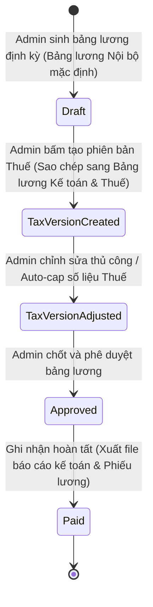

# PRD: Payroll Management

## Mục lục
1. [Thông Tin Tính Toán Bảng Lương (Payroll Calculation Information)](#1-thông-tin-tính-toán-bảng-lương-payroll-calculation-information)
2. [Quy Tắc Nghiệp Vụ & Ràng Buộc (Business Rules & Constraints)](#2-quy-tắc-nghiệp-vụ--ràng-buộc-business-rules--constraints)
3. [Mô Hình Bảng Lương Kép (Dual-Ledger Payroll Model)](#3-mô-hình-bảng-lương-kép-dual-ledger-payroll-model)
4. [Luồng Trạng Thái & Chuyển Đổi (State Machine)](#4-luồng-trạng-thái--chuyển-đổi-state-machine)
5. [Quyền Hạn Của Nhân Viên Được Cấp Quyền Truy Cập Payroll](#5-quyền-hạn-của-nhân-viên-được-cấp-quyền-truy-cập-payroll)
6. [Quy Tắc Hoạt Động Độc Lập & Tích Hợp (Standalone & Integrated Rules)](#6-quy-tắc-hoạt-động-độc-lập--tích-hợp-standalone--integrated-rules)
7. [Kịch Bản Chức Năng Chi Tiết (Given-When-Then Scenarios)](#7-kịch-bản-chức-năng-chi-tiết-given-when-then-scenarios)
8. [Tiêu Chí Nghiệm Thu (Acceptance Criteria)](#8-tiêu-chí-nghiệm-thu-acceptance-criteria)

---

## 1. Thông Tin Tính Toán Bảng Lương (Payroll Calculation Information)

Mỗi bản ghi chi tiết lương của một nhân viên trong bảng lương bao gồm các trường thông tin nghiệp vụ:

*   **Thông tin gốc:** Họ tên nhân viên, Vai trò/Vị trí công việc (Job Role), Bộ phận, Hình thức tính lương của Thương hiệu (Theo giờ / Theo tháng - kế thừa từ cấu hình chung), Bậc thuế thu nhập cá nhân (`taxClass` - theo hệ thống thuế của quốc gia hoạt động), Tên nhà cung cấp bảo hiểm y tế (`healthInsuranceProvider`), Mã số bảo hiểm xã hội (`socialSecurityNumber` - định dạng theo tiêu chuẩn quốc gia), Mã số thuế cá nhân (`personalTaxId` - định dạng theo tiêu chuẩn quốc gia), Hạn mức giảm trừ người phụ thuộc (`dependentAllowance`).
*   **Cơ sở tính toán:** Số ngày công chuẩn của tháng, Số ngày công làm việc thực tế, Số ngày nghỉ ốm có giấy chứng nhận hợp lệ (Sick Leave Certificate), Số giờ làm việc bình thường (quy định theo hợp đồng tính theo hệ số 4.33 tuần), Số giờ làm việc thực tế chấm công, Số giờ chênh lệch đưa vào Tài khoản giờ tích lũy (FWHA).
*   **Chi tiết thu nhập:** Lương cơ bản hợp đồng (chuyển khoản), Phụ cấp đặc biệt được miễn thuế/bảo hiểm xã hội (làm đêm sau 20h, Chủ nhật, ngày Lễ), Lương làm thêm giờ quyết toán (OT Payout).
*   **Chi tiết khấu trừ:** Khấu trừ nghỉ không lương (Unpaid Leaves), Khấu trừ Thuế lương (Income Tax / Lohnsteuer), Khấu trừ bảo hiểm bắt buộc của người lao động (BH y tế, hưu trí, thất nghiệp, chăm sóc - theo quy định của quốc gia hoạt động).
*   **Thực lĩnh (Net Pay):** Tổng thu nhập sau khi đã trừ toàn bộ các khoản khấu trừ thuế và bảo hiểm xã hội.

---

## 2. Quy Tắc Nghiệp Vụ & Ràng Buộc (Business Rules & Constraints)

*   Chỉ những nhân viên đang có trạng thái `Active` (đang hoạt động) và được bật tùy chọn `Include in Payroll` (Bao gồm trong bảng lương) trong Hồ sơ nhân viên (`PRD-Staff-Roles`) mới **bắt buộc phải** được đưa vào danh sách tính lương của kỳ lương đó.
*   **Cấu hình hình thức tính lương chung của Thương hiệu (kế thừa từ `PRD-Brand-Settings`):**
    *   Hệ thống **bắt buộc phải** mặc định áp dụng hình thức **Tính lương theo giờ (Hourly Rate)**: Tính toán lương thực nhận của tất cả nhân sự dựa trên số giờ làm việc thực tế chấm công nhân với mức lương thỏa thuận theo giờ (`salaryAmount`).
    *   **Đối với các trường hợp thỏa thuận lương cứng theo tháng (Monthly Salaried):**
        *   Số giờ làm việc thỏa thuận hàng tháng (Soll-Arbeitszeit) được quy đổi theo công thức: `Số giờ hợp đồng/tuần * 4.33 tuần`.
        *   Số tiền lương cơ bản trả qua tài khoản của nhân viên **bắt buộc phải** giữ cố định hàng tháng theo đúng thỏa thuận hợp đồng (`salaryAmount`).
        *   Mọi chênh lệch số giờ làm việc thực tế so với giờ chuẩn tháng quy đổi (thừa hoặc thiếu) sẽ tự động nạp/trừ vào **Tài khoản giờ tích lũy (FWHA)** để quyết toán, không thay đổi số lương cứng thực nhận trong tháng.
    *   **Đối với tính lương theo giờ mặc định (Hourly Rate):**
        *   Lương cơ bản của nhân viên được tính bằng: `Tổng số giờ làm việc thực tế trong tháng (sau khi trừ giờ nghỉ giải lao tự động) * salaryAmount`.
        *   Giờ thừa/thiếu không được đẩy vào FWHA mà chi trả trực tiếp theo giờ công chấm thực tế của kỳ lương.
*   **Quản lý Tài khoản giờ tích lũy (FWHA - Flexible Working Hours Account):**
    *   Số giờ làm thêm (OT) hoặc thiếu giờ (Undertime) của nhân viên hàng tháng không thanh toán ngay mà được tích lũy vào **Tài khoản giờ tích lũy (FWHA)**.
    *   Giới hạn tích lũy của FWHA: Tối đa **+40.0 giờ** (thừa) và tối thiểu **-20.0 giờ** (thiếu) - theo cấu hình tại `PRD-Brand-Settings`.
    *   Nếu tài khoản giờ ở trạng thái âm (thiếu giờ): Nhân viên **bắt buộc phải** làm việc bù giờ ở các ca trực tiếp theo.
    *   Nếu tài khoản giờ ở trạng thái dương (thừa giờ): Nhân viên **được phép** đăng ký nghỉ bù (Compensatory Leave) hoặc về sớm có phép để giảm trừ số giờ thừa.
    *   Nếu số giờ tích lũy vượt quá hạn mức tối đa quy định (+40.0 giờ) mà nhà hàng vẫn yêu cầu nhân sự tiếp tục làm việc, phần vượt trần **bắt buộc phải** được tự động quy đổi thành tiền mặt để thanh toán vào kỳ lương gần nhất.
*   **Áp dụng phụ cấp đặc biệt theo cấu hình Thương hiệu (kế thừa từ `PRD-Brand-Settings`):**
    *   Hệ thống **bắt buộc phải** sử dụng các tỷ lệ cấu hình phụ cấp đặc biệt tại cài đặt thương hiệu (đặc tả tại `PRD-Brand-Settings`):
        *   **Phụ cấp làm ca tối (Evening Shift Premium):** Áp dụng tỷ lệ thưởng và khoảng giờ bắt đầu tính phụ cấp tối được cấu hình (ví dụ: từ 18:00 đến trước giờ tính ca đêm).
        *   **Phụ cấp làm ca đêm (Night Shift Premium):** Áp dụng tỷ lệ thưởng và giờ bắt đầu tính phụ cấp đêm được cấu hình (ví dụ: mặc định từ 22:00 hoặc 23:00 - 06:00 ngày hôm sau thưởng +25% gross lương giờ). Khoản phụ cấp này bắt buộc phải được bóc tách riêng, miễn thuế thu nhập và miễn đóng bảo hiểm xã hội theo quy định của quốc gia hoạt động.
        *   **Phụ cấp làm Chủ nhật (Sunday Premium):** Áp dụng tỷ lệ thưởng được cấu hình (mặc định +50% lương giờ).
        *   **Phụ cấp làm ngày Lễ (Holiday Premium):** Áp dụng tỷ lệ thưởng được cấu hình (mặc định +125% lương giờ).
    *   Khi tính lương, hệ thống đối soát dữ liệu chấm công thực tế để bóc tách chính xác số giờ làm việc rơi vào các khung giờ đặc biệt này để nhân hệ số phụ cấp và hạch toán đúng mã kế toán tương ứng.
*   **Hệ thống phân bổ tiền Tips động (Dynamic Tip Distribution):**
    *   Hệ thống **bắt buộc phải** tự động tính toán và phân phối tổng quỹ tiền tips thu được trong kỳ lương dựa trên số giờ làm việc thực tế và cấu hình trọng số bộ phận thiết lập tại `PRD-Brand-Settings`.
    *   *Phân loại tiền Tips:*
        *   **Tiền mặt (Cash Tips):** Nhân viên tự giữ hoặc tự chia trực tiếp sau ca, hệ thống chỉ hỗ trợ ghi nhận số liệu thống kê (nếu doanh nghiệp yêu cầu), không thực hiện tính toán phân bổ.
        *   **Tiền thẻ (Card Tips):** Tiền tips trả qua thẻ thanh toán chuyển vào tài khoản ngân hàng của Brand. Hệ thống hỗ trợ phân bổ quỹ này theo 2 hình thức: chia đều/theo tỷ lệ cuối ngày (khấu trừ trực tiếp vào két tiền mặt của chi nhánh) hoặc tích lũy chia cuối tuần/cuối tháng qua bảng lương.
    *   *Quy tắc tính toán:*
        *   Thu thập tổng số giờ làm việc thực tế của nhân viên trong kỳ, phân loại theo bộ phận làm việc ghi nhận trong ca trực: Bếp (Kitchen - K), Phục vụ (Service - S), Quầy bar (Bar - B).
        *   Nhân số giờ làm việc của từng nhân viên với trọng số bộ phận (ví dụ: Phục vụ 1.0, Bếp 0.8, Bar 0.9) để tính ra **Hệ số chia tips cá nhân**.
        *   Phân phối tổng quỹ tips cho từng nhân viên theo tỷ lệ: `Tiền tips nhân viên = (Hệ số chia tips cá nhân / Tổng hệ số chia tips toàn chi nhánh) * Tổng quỹ tips thu được`.
        *   Số tiền tips được phân bổ **bắt buộc phải** được bóc tách thành một khoản thu nhập riêng biệt trên bảng lương nội bộ và bảng lương kế toán theo quy định thuế của quốc gia hoạt động.
        *   *Quy tắc khóa thủ công (Manual Override Locking):* Nếu Admin thực hiện chỉnh sửa thủ công số tiền tips của một nhân viên trên giao diện Bảng lương, hệ thống **bắt buộc phải** tự động khóa cứng (Lock) ô số liệu của nhân viên đó. Khi Admin bấm nút tính toán lại (Recalculate Tips) cho chi nhánh, hệ thống **không được phép ghi đè** lên các dòng tiền tips đã được chỉnh sửa thủ công, và chỉ tính toán phân bổ phần quỹ tips còn lại cho các nhân viên chưa chỉnh sửa.
        *   **Bản ký nhận tiền Tips (Tips Signing Sheet):** Nhằm phục vụ công tác đối soát thuế của cơ quan thuế Đức (Finanzamt) để chứng minh tiền tips thẻ đã được chuyển trả hoàn toàn cho nhân sự (để được miễn thuế), hệ thống **bắt buộc phải** hỗ trợ xuất biểu mẫu danh sách nhận tiền tips có chữ ký xác nhận của nhân viên (Tips Signing Sheet) tương thích với số liệu báo cáo thuế (Tax Ledger).
*   **Cơ chế trừ giờ nghỉ bù (Compensatory Off Deduction):** Hệ thống hỗ trợ khấu trừ số dư giờ làm thêm tích lũy khi có đơn nghỉ bù (`Compensatory Leave` được duyệt tại `PRD-Leave-Flextime`).
    *   Tỷ lệ quy đổi: Khấu trừ theo tỷ lệ **1-1 thực tế** (ví dụ: nghỉ bù 2.0 giờ sẽ trừ đúng 2.0 giờ làm việc tích lũy trong tài khoản, không quan tâm hệ số nhân lương của giờ OT đó).
    *   Khi tính toán lương cuối kỳ, các ngày nghỉ bù/về sớm có phép đã được bù đắp từ tài khoản FWHA **không được phép** tính vào cột khấu trừ nghỉ không lương (`Unpaid Leaves`) và lương cơ bản của nhân viên vẫn được giữ nguyên.
*   **Tính toán Lương ngày ốm trong 4 tuần đầu làm việc (First 4-Weeks Sick Leave Calculation):**
    *   Nếu nhân sự xin nghỉ ốm (`Sick Leave`) trong vòng 4 tuần đầu kể từ ngày bắt đầu làm việc (`entryDate` tại `PRD-Staff-Roles`), hệ thống tính lương **bắt buộc phải** mặc định hạch toán các ngày nghỉ này là **Nghỉ ốm không hưởng lương từ doanh nghiệp** (Unpaid Sick Leave - do bảo hiểm y tế chi trả), không tính vào tiền lương tiếp tục chi trả của doanh nghiệp (Entgeltfortzahlung), trừ trường hợp Admin chọn ghi nhận trả lương thủ công.
*   Bảng lương định kỳ sau khi sinh ra **vẫn cho phép** Admin chỉnh sửa điều chỉnh thủ công các chỉ số lương, phụ cấp, hoặc khấu trừ (kèm ghi chú bắt buộc lý do chỉnh sửa). Nếu bảng lương ở trạng thái đã phê duyệt (`Approved`) được chỉnh sửa, hệ thống **bắt buộc phải** tự động chuyển trạng thái bảng lương quay về `Draft` (chờ chốt lại).
*   Thông tin chi tiết bảng lương nội bộ **bắt buộc phải** chỉ hiển thị duy nhất cho tài khoản `Admin`. Tài khoản `Nhân viên` (Employee) **không được phép** xem bảng lương này dưới bất kỳ hình thức nào.

---

## 3. Mô Hình Bảng Lương Kép (Dual-Ledger Payroll Model)

Hệ thống lưu giữ song song hai sổ cái lương (Two Ledgers) cho mỗi kỳ tính lương:

### 3.1 Bảng lương Nội bộ (Internal / Actual Ledger)
*   **Mục đích:** Phản ánh đúng chi phí nhân sự thực tế (True Labor Cost) của nhà hàng phục vụ báo cáo quản trị.
*   **Cơ chế:** Tự động tính toán dựa trên dữ liệu Chấm công thực tế và cấu hình lương thỏa thuận thực tế. Bao gồm toàn bộ các khoản trả thêm ngoài hợp đồng (thưởng mặt, tips chia sẻ).

### 3.2 Bảng lương Kế toán & Thuế (Official / Tax Ledger)
*   **Mục đích:** Cung cấp báo cáo sạch, đúng luật lao động và thuế của quốc gia hoạt động gửi cho đơn vị Thuế/Kế toán.
*   **Cơ chế tạo:** Được nhân bản (clone) từ Bảng lương Nội bộ theo yêu cầu của Admin.
*   **Cơ chế Tự động khống chế (Auto-capping Filters):**
    *   *Minijob Cap:* Tự động giảm số giờ hiển thị trên giấy tờ của lao động Minijob để tổng lương tháng không vượt quá trần quy định cấu hình tại `lowIncomeThreshold` của `PRD-Brand-Settings` (ví dụ: `€603` với hợp đồng Minijob tại Đức). Phần chênh lệch lương thực tế của nhân sự được tự động chuyển sang cột `Cash Pay` (Chi trả ngoài) hiển thị trong Bảng lương Nội bộ.
    *   *Giờ làm tối đa & Khoảng nghỉ:* Dựa trên dữ liệu giờ chấm công thực tế (từ PRD-Checkin-Management), hệ thống tự động co ngắn giờ ca làm việc hiển thị trên Bảng Thuế theo giới hạn giờ làm tối đa và thời gian nghỉ tối thiểu giữa các ca theo luật lao động của quốc gia hoạt động (theo EU Working Time Directive: tối đa 10 tiếng/ngày và khoảng nghỉ tối thiểu 11 tiếng giữa các ca làm việc).
*   **Xuất dữ liệu:** Hỗ trợ kết xuất định dạng tệp tin tương thích với hệ thống kế toán theo quốc gia (ví dụ: **DATEV** cho Đức, **BMD** cho Áo, hoặc CSV chuẩn hóa quốc tế) theo cấu hình Export Template tại `PRD-Brand-Settings`.

### 3.3 Ví dụ minh họa Đối chiếu Số liệu (Reconciliation Data Example)

Để hỗ trợ đội ngũ lập trình hiểu rõ thuật toán xử lý dữ liệu kép, dưới đây là bảng đối chiếu số liệu mẫu cho 3 nhân viên đại diện kỳ lương **Tháng 06/2026**:

#### Bảng lương Nội bộ (Internal Ledger):
| Mã NV | Họ và Tên | Vị trí | Loại HĐ | Lương giờ | Giờ thực tế | Lương cơ bản thực tế | Phụ cấp làm đêm | Phụ cấp CN / Lễ | Tiền Tips phân bổ | Tổng thu nhập thực tế | Khấu trừ ăn uống (Sachbezug) | Tiền mặt chi trả ngoài (Cash Pay) | Thực lĩnh chuyển khoản |
| :--- | :--- | :--- | :--- | :---: | :---: | :---: | :---: | :---: | :---: | :---: | :---: | :---: | :---: |
| **10** | Hoang Phat Nguyen | Service | Lương giờ | 22,27 € | 168,00h | 3.741,00 € | 123,39 € | 456,75 € | 580,14 € | **4.901,28 €** | 123,39 € | 0,00 € | **4.777,89 €** |
| **9** | Xuan Binh Tran | Chef | Lương cứng | 15,00 € | 180,00h | 2.152,00 € | 55,00 € | 120,00 € | 340,00 € | **2.667,00 €** | 100,00 € | 0,00 € | **2.567,00 €** |
| **12** | Mai Anh Tran Thi | Office | Minijob | 15,00 € | 48,00h | 720,00 € | 0,00 € | 0,00 € | 80,00 € | **800,00 €** | 0,00 € | **197,00 €** | **603,00 €** |

#### Bảng lương Kế toán & Thuế (Official / Tax Ledger):
| Mã NV | Họ và Tên | Loại HĐ | Giờ báo cáo Thuế | Lương cơ bản tính thuế | Phụ cấp đêm (Miễn thuế) | Phụ cấp CN/Lễ (Miễn thuế) | Tiền Tips (Miễn thuế) | Khấu trừ ăn uống (Sachbezug) | Tổng thu nhập báo cáo Thuế | Khấu trừ Thuế & Bảo hiểm (Ước tính) | Thực nhận chính thức (Auszahlung) |
| :--- | :--- | :--- | :---: | :---: | :---: | :---: | :---: | :---: | :---: | :---: | :---: |
| **10** | Hoang Phat Nguyen | Lương giờ | 168,00h | 3.741,00 € | 123,39 € | 456,75 € | 580,14 € | -123,39 € | **4.777,89 €** | -1.237,86 € (Thuế & BH) | **3.540,03 €** |
| **9** | Xuan Binh Tran | Lương cứng | 160,00h | 2.152,00 € | 55,00 € | 120,00 € | 340,00 € | -100,00 € | **2.567,00 €** | -513,40 € (Bảo hiểm) | **2.053,60 €** |
| **12** | Mai Anh Tran Thi | Minijob | **40,20h** | **603,00 €** | 0,00 € | 0,00 € | 0,00 € | 0,00 € | **603,00 €** | 0,00 € (Miễn hoàn toàn) | **603,00 €** |

#### Quy tắc xử lý và làm sạch dữ liệu của hệ thống:
1. **Khống chế trần Minijob (Nhân viên 12):** Hệ thống kiểm tra thấy tổng thu nhập thực tế của nhân sự vượt trần Minijob (`€603,00` tại Đức). Thuật toán tự động giảm lương gộp báo cáo thuế về đúng trần `603,00 €`, quy đổi ngược ra số giờ làm việc hiển thị trên tờ khai thuế là `40,20 giờ` (603 € / 15 €). Phần chênh lệch `197,00 €` được chuyển sang trường `Cash Pay` trên sổ cái nội bộ để chi trả ngoài.
2. **Theo dõi giờ phụ trội lương cứng (Nhân viên 9):** Nhân viên hưởng lương cứng cố định tháng, 20 giờ làm thêm vượt trội sẽ được tích lũy thẳng vào Tài khoản giờ tích lũy (FWHA) thay vì trả tiền trực tiếp.
3. **Bóc tách phụ cấp miễn thuế (Nhân viên 10):** Tự động bóc tách các dòng ca đêm, ngày lễ/Chủ nhật dựa trên chấm công và đánh mã miễn thuế **F (Frei)** khi xuất dữ liệu sang phần mềm DATEV.

---

## 4. Luồng Trạng Thái & Chuyển Đổi (State Machine)

Vòng đời xử lý bảng lương định kỳ của chi nhánh/nhà hàng:

---

## 5. Quyền Hạn Của Nhân Viên Được Cấp Quyền Truy Cập Payroll

Đối với nhân viên được cấp quyền truy cập Payroll, hệ thống giới hạn quyền hạn theo các chi nhánh được gán của họ như sau:
* **Xem và tính lương:** Chỉ được phép xem, tính toán, điều chỉnh và xuất bảng lương cho phần công việc và giờ làm của nhân viên phát sinh tại các chi nhánh mà mình đang làm việc.
* **Chặn dữ liệu ngoài chi nhánh:** Hệ thống tự động ẩn toàn bộ thông tin bảng lương của các chi nhánh khác để tránh lộ dữ liệu giờ làm và chi phí giữa các cửa hàng.

---

## 6. Quy Tắc Hoạt Động Độc Lập & Tích Hợp (Standalone & Integrated Rules)

*   **Chế độ Độc lập (Standalone Mode):**
    *   Tính năng hoạt động độc lập như một máy tính lương bán thủ công.
    *   Hệ thống không tự động tổng hợp giờ chấm công hay ngày phép.
    *   Hàng tháng, Admin **bắt buộc phải** nhập thủ công bằng tay các thông số (Số giờ làm việc thực tế, Số ngày nghỉ không lương, Số giờ OT) cho từng nhân viên để hệ thống tính lương Thực lĩnh (Net Pay).
*   **Chế độ Tích hợp (Integrated Mode):**
    *   *Tích hợp với PRD-Staff-Roles (Staff):* Tự động lấy cấu hình tiền lương cơ bản, bậc thuế thu nhập cá nhân (`taxClass`), mã số bảo hiểm xã hội (`socialSecurityNumber`), mã số thuế cá nhân (`personalTaxId`), nhà cung cấp bảo hiểm y tế (`healthInsuranceProvider`), hạn mức giảm trừ người phụ thuộc (`dependentAllowance`), và lọc những nhân viên bật `Include in Payroll`.
    *   *Tích hợp với PRD-Checkin-Management (Checkin):* Tự động lấy tổng số giờ làm việc thực tế và số giờ làm thêm thực tế trong kỳ, đối soát phân loại số giờ làm việc rơi vào khung giờ đêm (>20:00), Chủ nhật, ngày Lễ để nhân hệ số phụ cấp tương ứng theo cài đặt của Thương hiệu.
    *   *Tích hợp với PRD-Leave-Flextime (Leave & Flextime):* Tự động lấy số ngày nghỉ không lương (`Unpaid Leaves`), số ngày nghỉ ốm có giấy chứng nhận hợp lệ (Sick Leave Certificate) để kế toán báo cáo bảo hiểm, đồng thời nhận dữ liệu đơn nghỉ bù (`Compensatory Leave`) để tự động khấu trừ số giờ tương ứng từ Tài khoản giờ tích lũy (FWHA) của nhân viên với tỷ lệ 1-1 thực tế.

---

## 7. Kịch Bản Chức Năng Chi Tiết (Given-When-Then Scenarios)

### Kịch bản 1: Tự động khống chế thu nhập lao động Minijob (Tax Capping - Happy Path)
*   **GIVEN** Nhân viên A ký hợp đồng Minijob mức trần `€603/tháng` tại nhà hàng.
*   **AND** Dữ liệu chấm công thực tế tháng ghi nhận Nhân viên A làm việc mang lại thu nhập thực tế là `€750` (Bảng lương Nội bộ).
*   **WHEN** Admin bấm nút "Tạo Phiên bản Thuế/Kế toán".
*   **THEN** Hệ thống **bắt buộc phải** tự động điều chỉnh thu nhập hiển thị của Nhân viên A trên Bảng lương Kế toán & Thuế thành đúng `€603`.
*   **AND** Hệ thống **bắt buộc phải** ghi nhận khoản chênh lệch `€147` vào cột chi trả ngoài (`Cash Pay`) trong Bảng lương Nội bộ để Admin thanh toán tiền mặt.

### Kịch bản 2: Khấu trừ giờ nghỉ bù từ Tài khoản giờ tích lũy (Happy Path)
*   **GIVEN** Nhân viên B có số dư Tài khoản giờ tích lũy (FWHA) là `10.0 giờ` tích lũy.
*   **AND** Nhân viên B được phê duyệt đơn nghỉ bù `2.0 giờ` vào ngày `2026-06-24`.
*   **WHEN** Hệ thống chốt bảng lương cuối kỳ.
*   **THEN** Hệ thống **bắt buộc phải** ghi nhận lương cơ bản của Nhân viên B được giữ nguyên (không bị khấu trừ).
*   **AND** Khấu trừ tỷ lệ 1-1 thực tế `2.0 giờ` khỏi FWHA của Nhân viên B.
*   **AND** Số dư tài khoản giờ còn lại sau kỳ là `8.0 giờ`.
 
### Kịch bản 3: Admin sửa bảng lương đã duyệt và tự động Reset trạng thái (Happy Path)
*   **GIVEN** Bảng lương của chi nhánh đang ở trạng thái `Approved` chờ chi trả.
*   **WHEN** Admin thực hiện chỉnh sửa thủ công số tiền thưởng của nhân viên B.
*   **THEN** Hệ thống **bắt buộc phải** tự động chuyển trạng thái của bảng lương quay về `Draft`.
*   **AND** Ghi nhật ký lý do sửa đổi và yêu cầu Admin chốt phê duyệt lại khi hoàn tất.

### Kịch bản 4: Tính toán lương theo giờ (Hourly Rate Salary Calculation - Happy Path)
*   **GIVEN** Thương hiệu được cấu hình hình thức tính lương là `Hourly Rate` (Theo giờ).
*   **AND** Nhân viên C có mức lương hợp đồng là `€15/giờ` và được cấu hình `Include in Payroll`.
*   **AND** Dữ liệu chấm công thực tế trong tháng ghi nhận Nhân viên C làm việc `120.0 giờ` (sau khi đã áp dụng luật tự động trừ giờ nghỉ giải lao).
*   **WHEN** Hệ thống tự động tính toán bảng lương cho Nhân viên C.
*   **THEN** Hệ thống **bắt buộc phải** tính lương cơ bản gross của Nhân viên C là `120.0 giờ * €15 = €1,800`.
*   **AND** Không thực hiện đối chiếu và không ghi nhận số dư giờ thừa/thiếu vào tài khoản FWHA của nhân viên này.

### Kịch bản 5: Tính phụ cấp làm ca đêm, Chủ nhật và ngày Lễ (Special Premiums Calculation - Happy Path)
*   **GIVEN** Cấu hình Thương hiệu có phụ cấp ca đêm từ `22:00` là `25%`, phụ cấp Chủ nhật là `50%` và phụ cấp ngày Lễ là `125%`.
*   **AND** Nhân viên D có mức lương hợp đồng là `€20/giờ` (cấu hình tính lương theo giờ).
*   **AND** Nhân viên D làm việc ca trực ngày Chủ nhật từ `06:00 PM` đến `11:00 PM` (5.0 giờ, trong đó có 1.0 giờ làm đêm từ `10:00 PM` đến `11:00 PM` theo giờ bắt đầu tính phụ cấp ca đêm).
*   **WHEN** Hệ thống chốt dữ liệu bảng lương.
*   **THEN** Hệ thống **bắt buộc phải** tính toán:
    *   Lương giờ cơ bản: `5.0 giờ * €20 = €100`.
    *   Phụ cấp Chủ nhật: `5.0 giờ * (€20 * 50%) = €50`.
    *   Phụ cấp ca đêm: `1.0 giờ * (€20 * 25%) = €5`.
    *   Tổng gross cho ca làm việc này là `€155`.
*   **AND** Bóc tách phần phụ cấp Chủ nhật (`€50`) và phụ cấp ca đêm (`€5`) hiển thị riêng trên bảng lương để miễn thuế và bảo hiểm xã hội theo quy định của quốc gia hoạt động.

---

## 8. Tiêu Chí Nghiệm Thu (Acceptance Criteria)

*   - [ ] Bảng lương tự động lọc và chỉ đưa vào các nhân sự có tick chọn `Include in Payroll` trong thông tin hồ sơ gốc.
*   - [ ] Khấu trừ giờ nghỉ bù tự động cập nhật và trừ đúng tỷ lệ 1-1 thực tế vào Tài khoản giờ tích lũy (FWHA) khi đơn nghỉ bù được phê duyệt.
*   - [ ] Báo cáo lương tích hợp đầy đủ thông tin thuế cá nhân và tình trạng nghỉ ốm có giấy chứng nhận hợp lệ (Sick Leave Certificate) để tương thích khai báo theo yêu cầu pháp lý của quốc gia hoạt động (ví dụ: Elster và DATEV đối với Đức).
*   - [ ] Tính toán chính xác các khoản phụ cấp làm đêm (sau 20:00), Chủ nhật, ngày Lễ và tự động bóc tách thành phần miễn thuế theo cấu hình Thương hiệu.
*   - [ ] Áp dụng công thức tính giờ làm việc tiêu chuẩn hàng tháng cố định theo hệ số 4.33 tuần/tháng.
*   - [ ] Khi nhân bản từ Bảng Nội bộ sang Bảng Thuế, hệ thống tự động tính toán khống chế trần Minijob chính xác và tách biệt đúng phần chênh lệch sang cột chi ngoài.
*   - [ ] Tài khoản với quyền truy cập `Nhân viên` (Employee) mặc định không thể nhìn thấy hoặc truy cập bảng lương.
*   - [ ] Tệp tin xuất ra ở định dạng tương thích với hệ thống kế toán của quốc gia hoạt động (ví dụ: DATEV cho Đức, BMD cho Áo, hoặc CSV chuẩn hóa quốc tế) chứa đầy đủ các trường thông tin kế toán theo quy định.
*   - [ ] Quản lý thuộc phạm vi `Assigned Stores` chỉ hiển thị, tính toán và xuất được bảng lương cho nhân viên thuộc các chi nhánh mà quản lý đó được gán.
*   - [ ] Hệ thống chặn không cho quản lý xem bảng lương tổng của thương hiệu hoặc bảng lương của chi nhánh khác ngoài phạm vi được gán.
