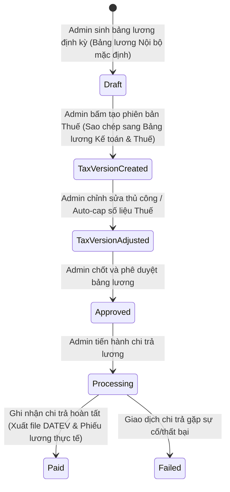

# PRD: Payroll Management

## Mục lục
1. [Thông Tin Tính Toán Bảng Lương (Payroll Calculation Information)](#1-thông-tin-tính-toán-bảng-lương-payroll-calculation-information)
2. [Quy Tắc Nghiệp Vụ & Ràng Buộc (Business Rules & Constraints)](#2-quy-tắc-nghiệp-vụ--ràng-buộc-business-rules--constraints)
3. [Mô Hình Bảng Lương Kép (Dual-Ledger Payroll Model)](#3-mô-hình-bảng-lương-kép-dual-ledger-payroll-model)
4. [Luồng Trạng Thái & Chuyển Đổi (State Machine)](#4-luồng-trạng-thái--chuyển-đổi-state-machine)
5. [Quy Tắc Hoạt Động Độc Lập & Tích Hợp (Standalone & Integrated Rules)](#5-quy-tắc-hoạt-động-độc-lập--tích-hợp-standalone--integrated-rules)
6. [Kịch Bản Chức Năng Chi Tiết (Given-When-Then Scenarios)](#6-kịch-bản-chức-năng-chi-tiết-given-when-then-scenarios)
7. [Tiêu Chí Nghiệm Thu (Acceptance Criteria)](#7-tiêu-chí-nghiệm-thu-acceptance-criteria)

---

## 1. Thông Tin Tính Toán Bảng Lương (Payroll Calculation Information)

Mỗi bản ghi chi tiết lương của một nhân viên trong bảng lương bao gồm các trường thông tin nghiệp vụ:

*   **Thông tin gốc:** Họ tên nhân viên, Vai trò/Vị trí công việc (Job Role), Bộ phận, Hình thức lương (Theo giờ / Theo tháng).
*   **Cơ sở tính toán:** Số ngày công chuẩn của tháng, Số ngày công làm việc thực tế, Số giờ làm việc bình thường, Số giờ làm thêm (Overtime).
*   **Chi tiết thu nhập:** Lương cơ bản, Lương làm thêm giờ (OT Pay), Các khoản phụ cấp (nếu có).
*   **Chi tiết khấu trừ:** Khấu trừ nghỉ không lương (Unpaid Leaves), Khấu trừ bảo hiểm bắt buộc.
*   **Thực lĩnh (Net Pay):** Tổng thu nhập sau khi đã trừ toàn bộ các khoản khấu trừ.

---

## 2. Quy Tắc Nghiệp Vụ & Ràng Buộc (Business Rules & Constraints)

*   Chỉ những nhân viên đang có trạng thái `Active` (đang hoạt động) và được bật tùy chọn `Include in Payroll` (Bao gồm trong bảng lương) trong Hồ sơ nhân viên (`PRD-001`) mới **bắt buộc phải** được đưa vào danh sách tính lương của kỳ lương đó.
*   Đối với nhân viên tính lương theo giờ, thu nhập lương cơ bản **bắt buộc phải** được tính bằng công thức: `Tổng số giờ làm việc thực tế trong kỳ (lấy từ PRD-003) * Mức lương giờ (gán trong PRD-001)`.
*   Đối với nhân viên nhận lương cứng theo tháng, số tiền khấu trừ cho mỗi ngày nghỉ không lương (`Unpaid Leave` lấy từ `PRD-004`) **bắt buộc phải** được tính theo công thức: `Mức lương cứng tháng / Số ngày công chuẩn của tháng đó * Số ngày nghỉ không lương thực tế`.
*   Hệ thống **bắt buộc phải** cho phép cấu hình động hệ số lương làm thêm giờ (OT Multiplier) theo từng loại ca trực hoặc ngày nghỉ đặc biệt (ví dụ: ngày thường hệ số 1.5, ngày lễ đặc biệt hệ số 3.0). Tiền lương làm thêm giờ (OT Pay) **bắt buộc phải** được tính bằng công thức: `Số giờ làm thêm thực tế * Mức lương giờ cơ bản * Hệ số OT tương ứng của ngày đó`.
*   Bảng lương định kỳ sau khi sinh ra **vẫn cho phép** Admin chỉnh sửa điều chỉnh thủ công các chỉ số lương, phụ cấp, hoặc khấu trừ (kèm ghi chú bắt buộc lý do chỉnh sửa). Nếu bảng lương ở trạng thái đã phê duyệt (`Approved`) được chỉnh sửa, hệ thống **bắt buộc phải** tự động chuyển trạng thái bảng lương quay về `Draft` (chờ chốt lại).
*   Thông tin chi tiết bảng lương nội bộ **bắt buộc phải** chỉ hiển thị duy nhất cho tài khoản `Admin`. Tài khoản `Nhân viên` (Employee) **không được phép** xem bảng lương này dưới bất kỳ hình thức nào.

---

## 3. Mô Hình Bảng Lương Kép (Dual-Ledger Payroll Model)

Hệ thống lưu giữ song song hai sổ cái lương (Two Ledgers) cho mỗi kỳ tính lương:

### 3.1 Bảng lương Nội bộ (Internal / Actual Ledger)
*   **Mục đích:** Phản ánh đúng chi phí nhân sự thực tế (True Labor Cost) của nhà hàng phục vụ báo cáo quản trị.
*   **Cơ chế:** Tự động tính toán dựa trên dữ liệu Chấm công thực tế và cấu hình lương thỏa thuận thực tế. Bao gồm toàn bộ các khoản trả thêm ngoài hợp đồng (thưởng mặt, tips chia sẻ).

### 3.2 Bảng lương Kế toán & Thuế (Official / Tax Ledger)
*   **Mục đích:** Cung cấp báo cáo sạch, đúng luật lao động Đức gửi cho đơn vị Thuế/Kế toán.
*   **Cơ chế tạo:** Được nhân bản (clone) từ Bảng lương Nội bộ theo yêu cầu của Admin.
*   **Cơ chế Tự động khống chế (Auto-capping Filters):**
    *   *Minijob Cap:* Tự động giảm số giờ hiển thị trên giấy tờ của lao động Minijob để tổng lương tháng không vượt quá trần quy định (ví dụ €538). Phần chênh lệch lương thực tế của nhân sự được tự động chuyển sang cột `Cash Pay` (Chi trả ngoài) hiển thị trong Bảng lương Nội bộ.
    *   *Giờ làm tối đa & Khoảng nghỉ:* Tự động co ngắn giờ ca làm việc hiển thị về tối đa 10 tiếng/ngày và đảm bảo khoảng nghỉ Ruhezeit 11 tiếng theo luật lao động Đức.
*   **Xuất dữ liệu:** Hỗ trợ kết xuất định dạng tệp tin **DATEV** (Chuẩn kế toán Đức) hoặc CSV để chuyển cho đơn vị thuế.

---

## 4. Luồng Trạng Thái & Chuyển Đổi (State Machine)

Vòng đời xử lý bảng lương định kỳ của chi nhánh/nhà hàng:

---

## 5. Quy Tắc Hoạt Động Độc Lập & Tích Hợp (Standalone & Integrated Rules)

*   **Chế độ Độc lập (Standalone Mode):**
    *   Tính năng hoạt động độc lập như một máy tính lương bán thủ công.
    *   Hệ thống không tự động tổng hợp giờ chấm công hay ngày phép.
    *   Hàng tháng, Admin **bắt buộc phải** nhập thủ công bằng tay các thông số (Số giờ làm việc thực tế, Số ngày nghỉ không lương, Số giờ OT) cho từng nhân viên để hệ thống tính lương Thực lĩnh (Net Pay).
*   **Chế độ Tích hợp (Integrated Mode):**
    *   *Tích hợp với PRD-001 (Staff):* Tự động lấy cấu hình tiền lương cơ bản, loại hình lương (giờ/tháng), tần suất trả, và chỉ lọc những nhân viên bật `Include in Payroll`.
    *   *Tích hợp với PRD-003 (Checkin):* Tự động lấy tổng số giờ làm việc thực tế và số giờ làm thêm thực tế trong kỳ của nhân viên để nhân hệ số lương.
    *   *Tích hợp với PRD-004 (Leave & Flextime):* Tự động lấy số ngày nghỉ không lương (`Unpaid Leaves`) để tính toán khấu trừ vào mức lương cứng tháng.

---

## 6. Kịch Bản Chức Năng Chi Tiết (Given-When-Then Scenarios)

### Kịch bản 1: Tự động khống chế thu nhập lao động Minijob (Tax Capping - Happy Path)
*   **GIVEN** Nhân viên A ký hợp đồng Minijob mức trần `€538/tháng` tại nhà hàng.
*   **AND** Dữ liệu chấm công thực tế tháng ghi nhận Nhân viên A làm việc mang lại thu nhập thực tế là `€700` (Bảng lương Nội bộ).
*   **WHEN** Admin bấm nút "Tạo Phiên bản Thuế/Kế toán".
*   **THEN** Hệ thống **bắt buộc phải** tự động điều chỉnh thu nhập hiển thị của Nhân viên A trên Bảng lương Kế toán & Thuế thành đúng `€538`.
*   **AND** Hệ thống **bắt buộc phải** ghi nhận khoản chênh lệch `€162` vào cột chi trả ngoài (`Cash Pay`) trong Bảng lương Nội bộ để Admin thanh toán tiền mặt.
 
### Kịch bản 2: Admin sửa bảng lương đã duyệt và tự động Reset trạng thái (Happy Path)
*   **GIVEN** Bảng lương của chi nhánh đang ở trạng thái `Approved` chờ chi trả.
*   **WHEN** Admin thực hiện chỉnh sửa thủ công số tiền thưởng của nhân viên B.
*   **THEN** Hệ thống **bắt buộc phải** tự động chuyển trạng thái của bảng lương quay về `Draft`.
*   **AND** Ghi nhật ký lý do sửa đổi và yêu cầu Admin chốt phê duyệt lại khi hoàn tất.

---

## 7. Tiêu Chí Nghiệm Thu (Acceptance Criteria)

*   - [ ] Bảng lương tự động lọc và chỉ đưa vào các nhân sự có tick chọn `Include in Payroll` trong thông tin hồ sơ gốc.
*   - [ ] Khi nhân bản từ Bảng Nội bộ sang Bảng Thuế, hệ thống tự động tính toán khống chế trần Minijob chính xác và tách biệt đúng phần chênh lệch sang cột chi ngoài.
*   - [ ] Tài khoản với quyền truy cập `Nhân viên` (Employee) mặc định không thể nhìn thấy hoặc truy cập bảng lương.
*   - [ ] Tệp tin xuất ra ở định dạng DATEV chứa đầy đủ các trường thông tin kế toán chuẩn quy định của Đức.
