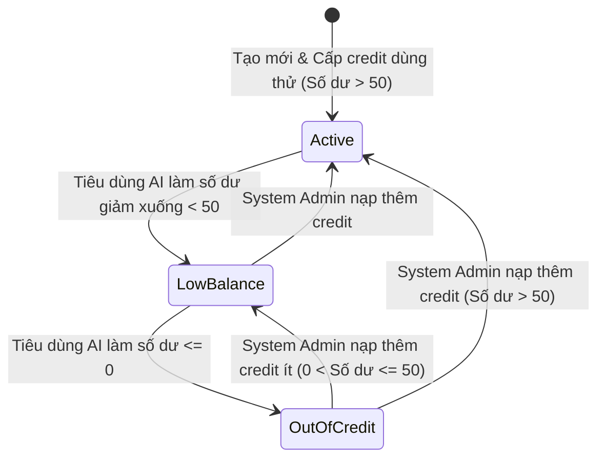
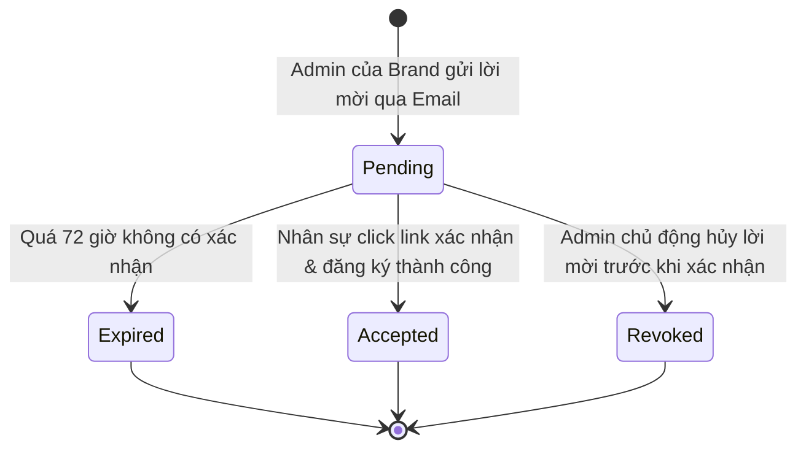

# PRD: Brand Workspaces, Unified Authentication & AI Credits

## Mục lục
1. [Thông Tin Nghiệp Vụ (Functional Information)](#1-thông-tin-nghiệp-vụ-functional-information)
2. [Quy Tắc Nghiệp Vụ & Ràng Buộc (Business Rules & Constraints)](#2-quy-tắc-nghiệp-vụ--ràng-buộc-business-rules--constraints)
3. [Cơ Chế Ví Tín Dụng AI (AI Credit Wallet Mechanism)](#3-cơ-chế-ví-tín-dụng-ai-ai-credit-wallet-mechanism)
4. [Luồng Trạng Thái & Chuyển Đổi (State Machine)](#4-luồng-trạng-thái--chuyển-đổi-state-machine)
5. [Quy Tắc Hoạt Động Độc Lập & Tích Hợp (Standalone & Integrated Rules)](#5-quy-tắc-hoạt-động-độc-lập--tích-hợp-standalone--integrated-rules)
6. [Kịch Bản Chức Năng Chi Tiết (Given-When-Then Scenarios)](#6-kịch-bản-chức-năng-chi-tiết-given-when-then-scenarios)
7. [Tiêu Chí Nghiệm Thu (Acceptance Criteria)](#7-tiêu-chí-nghiệm-thu-acceptance-criteria)

---

## 1. Thông Tin Nghiệp Vụ (Functional Information)

Khi đăng ký sử dụng hoặc quản lý hệ thống, các luồng thông tin nghiệp vụ sau được ghi nhận:

*   **Thông tin Đăng ký & Thương hiệu:** Họ và tên chủ tài khoản, Email, Số điện thoại, Tên thương hiệu (Brand Name), Đường dẫn định danh thương hiệu mong muốn (Brand Slug - ví dụ: `phuclong`, `highlands`), Ngày khởi tạo, Trạng thái hoạt động.
*   **Thông tin Lời mời Thành viên:** Email nhân sự được mời, Quyền truy cập hệ thống gán trước (Admin hoặc Nhân viên), Mã lời mời độc nhất, Thời gian hết hạn, Trạng thái lời mời.
*   **Ví tín dụng Thương hiệu (Credit Wallet):** Số dư tín dụng hiện tại (Credit Balance), Lịch sử giao dịch ví (Thời gian giao dịch, Số tín dụng thay đổi, Loại tác vụ AI đã thực hiện hoặc mã giao dịch nạp tiền, Tên tài khoản thực hiện, Ghi chú chi tiết).

---

## 2. Quy Tắc Nghiệp Vụ & Ràng Buộc (Business Rules & Constraints)

*   Đường dẫn định danh không gian làm việc của thương hiệu trên URL **bắt buộc phải** sử dụng mã băm định danh thương hiệu (Hashed Brand ID - ví dụ: `9014175869`) thay vì tên thương hiệu hoặc slug dạng chữ rõ để bảo mật và tránh dò tìm thông tin thương hiệu.
*   Hệ thống **bắt buộc phải** thực hiện đăng nhập tập trung tại `app.gastrohub.com`. Sau khi đăng nhập thành công:
    *   Nếu người dùng chỉ liên kết với **1 Brand**: Hệ thống **sẽ tự động** chuyển hướng người dùng thẳng vào không gian làm việc tương ứng: `app.gastrohub.com/w/{hashed_brand_id}/dashboard`.
    *   Nếu người dùng liên kết với **nhiều Brand**: Hệ thống **bắt buộc phải** hiển thị màn hình chọn thương hiệu (Brand Selector) dưới dạng các thẻ thương hiệu (Cards) hoặc danh sách tùy chọn trực quan để người dùng nhấp chọn thương hiệu muốn truy cập trước khi chuyển hướng vào URL tương ứng.
*   Trong giao diện không gian làm việc của từng thương hiệu, hệ thống **bắt buộc phải** tích hợp một menu thả xuống (Dropdown Switcher) ở sidebar hoặc header (hiển thị logo và tên thương hiệu hiện tại). Khi người dùng nhấp vào, menu này **bắt buộc phải** hiển thị danh sách toàn bộ các thương hiệu khác mà người dùng có quyền truy cập, tương tự như bộ chọn Workspace của Clickup, cho phép nhấp chọn chuyển đổi tức thì sang URL không gian làm việc mới mà không phải đăng xuất (ví dụ từ `app.gastrohub.com/w/{hashed_brand_id_1}/dashboard` sang `app.gastrohub.com/w/{hashed_brand_id_2}/dashboard`).
*   Mọi dữ liệu nghiệp vụ của tất cả các tính năng (Staff & Roles, Shift Planner, Check-in, Leave & Flextime, Payroll) **bắt buộc phải** được gắn kèm mã định danh Brand (`tenant_id`). Hệ thống **không được phép** cho phép người dùng thuộc Brand này xem hoặc thao tác dữ liệu của Brand khác dưới mọi hình thức.
*   Lời mời thành viên tham gia Brand qua email **bắt buộc phải** có hiệu lực mặc định là 72 giờ kể từ thời điểm gửi. Sau thời gian này, liên kết xác nhận trong email **sẽ tự động** hết hiệu lực và chuyển trạng thái thư mời sang hết hạn (`Expired`).
*   Khi một Brand bị tạm khóa (`Suspended`) từ Cổng quản trị nền tảng:
    *   Hệ thống **bắt buộc phải** từ chối quyền đăng nhập của tất cả tài khoản thuộc Brand đó.
    *   Mọi hoạt động chạy ngầm và gọi công cụ AI của Brand đó **sẽ tự động** bị đình chỉ.
    *   Dữ liệu lịch sử của Brand đó **bắt buộc phải** được lưu trữ nguyên vẹn trong hệ thống.

---

## 3. Cơ Chế Ví Tín Dụng AI (AI Credit Wallet Mechanism)

*   Chỉ những người dùng đăng nhập qua Cổng quản trị nền tảng (`admin.gastrohub.com` với quyền System Admin của Gastro Hub) mới **bắt buộc phải** có quyền thực hiện cộng/trừ số dư ví tín dụng của các Brand.
*   Khi người dùng của Brand kích hoạt các tác vụ AI (ví dụ: tự động lập lịch trực tối ưu bằng AI, chạy tự động khống chế bảng lương thuế), hệ thống **sẽ tự động** trừ số tín dụng tương ứng khỏi ví của Brand đó theo biểu phí cấu hình sẵn (ví dụ: 10 credits cho mỗi lần tối ưu lịch trực). Các hành động chỉnh sửa thủ công không dùng AI không bị trừ tín dụng.
*   Khi số dư ví tín dụng của một Brand về mức 0 hoặc âm:
    *   Hệ thống **bắt buộc phải** chặn mọi yêu cầu kích hoạt tác vụ AI mới của Brand đó và hiển thị thông báo: `"Số dư tín dụng không đủ. Vui lòng nạp thêm credit để tiếp tục sử dụng các công cụ AI."`.
    *   Các tính năng quản lý phi-AI thông thường (nhân viên chấm công, xem lịch trực cũ, gửi đơn nghỉ phép thủ công) **sẽ vẫn hoạt động** bình thường và không bị khóa.

---

## 4. Luồng Trạng Thái & Chuyển Đổi (State Machine)

### 4.1 Trạng thái Ví tín dụng (Credit Wallet State)
Vòng đời trạng thái ví của một Brand:

### 4.2 Trạng thái Lời mời Thành viên (Member Invitation State)
Vòng đời của thư mời nhân sự tham gia Brand:

---

## 5. Quy Tắc Hoạt Động Độc Lập & Tích Hợp (Standalone & Integrated Rules)

*   **Chế độ Độc lập (Standalone Mode):**
    *   Hệ thống hoạt động như một dịch vụ Single Sign-On (SSO) và định tuyến tên miền độc lập.
    *   Hỗ trợ tạo tài khoản người dùng cá nhân và cấu hình danh mục hồ sơ thương hiệu (Brand Profile) cơ bản.
    *   Ví tín dụng hoạt động như một ví lưu trữ số dư tĩnh, không có các giao dịch trừ tiền từ các công cụ khác.
*   **Chế độ Tích hợp (Integrated Mode):**
    *   *Tích hợp với PRD-001 (Staff & Roles):* Khi một lời mời thành viên chuyển sang trạng thái `Accepted`, hệ thống **sẽ tự động** tạo một bản ghi nhân viên mới với quyền truy cập tương ứng trong danh sách hồ sơ của Brand đó.
    *   *Tích hợp với PRD-002 (Shift Planner) & PRD-005 (Payroll):* Trước khi chạy thuật toán tối ưu xếp ca bằng AI hoặc capping bảng lương thuế tự động, hệ thống kiểm tra điều kiện số dư ví tín dụng theo quy tắc khóa tính năng khi hết tín dụng (số dư ví tín dụng về mức 0 hoặc âm), và tiến hành trừ tín dụng thực tế sau khi tác vụ AI hoàn tất thành công.

---

## 6. Kịch Bản Chức Năng Chi Tiết (Given-When-Then Scenarios)

### Kịch bản 1: Đăng nhập chọn thương hiệu làm việc (Brand Selector - Happy Path)
*   **GIVEN** Tài khoản `nguyen.an@gmail.com` liên kết với 2 thương hiệu: `Phuc Long` (mã băm ID: `9014175869`) và `Highlands` (mã băm ID: `9014175870`).
*   **WHEN** Người dùng thực hiện đăng nhập thành công tại cổng `app.gastrohub.com`.
*   **THEN** Hệ thống **bắt buộc phải** hiển thị màn hình chọn thương hiệu (Brand Selector) với 2 thẻ tùy chọn: `Phuc Long` và `Highlands`.
*   **WHEN** Người dùng nhấp chọn thẻ `Highlands`.
*   **THEN** Hệ thống **bắt buộc phải** chuyển hướng người dùng đến URL không gian làm việc tương ứng: `app.gastrohub.com/w/9014175870/dashboard`.

### Kịch bản 2: Tự động khóa tính năng AI khi hết tín dụng (Out of Credits - Unhappy Path)
*   **GIVEN** Thương hiệu `Phuc Long` đang có số dư tín dụng là `0 credits`.
*   **WHEN** Admin của `Phuc Long` bấm nút "Tự động sắp ca tối ưu bằng AI".
*   **THEN** Hệ thống **bắt buộc phải** chặn hành động.
*   **AND** Hiển thị cảnh báo lỗi trên màn hình: `"Tác vụ thất bại. Số dư tín dụng của thương hiệu Phúc Long đã hết. Vui lòng nạp thêm tín dụng để sử dụng tính năng tối ưu bằng AI."`.
*   **AND** Giữ nguyên lịch trực hiện tại của tuần không có thay đổi.

### Kịch bản 3: Nạp tín dụng thành công từ Back-office (Credit Top-up - Happy Path)
*   **GIVEN** Người dùng đăng nhập hệ thống quản trị nền tảng tại `admin.gastrohub.com` với quyền System Admin.
*   **WHEN** Quản trị viên truy cập mục quản lý thương hiệu của `Highlands` và thực hiện nạp `500 credits`.
*   **THEN** Hệ thống **bắt buộc phải** cộng thêm `500 credits` vào số dư hiện tại của `Highlands`.
*   **AND** Ghi lại lịch sử giao dịch: `+500 credits - Nạp tiền gói PRO - Admin thực hiện`.

### Kịch bản 4: Chuyển đổi nhanh thương hiệu qua Dropdown Switcher (Brand Switcher - Happy Path)
*   **GIVEN** Người dùng `nguyen.an@gmail.com` đang ở không gian làm việc của thương hiệu `Phuc Long` tại `app.gastrohub.com/w/9014175869/dashboard`.
*   **AND** Người dùng này cũng tham gia thương hiệu `Highlands` (mã băm ID: `9014175870`).
*   **WHEN** Người dùng nhấp vào Dropdown chọn Workspace ở sidebar và chọn `Highlands`.
*   **THEN** Hệ thống **bắt buộc phải** tự động chuyển hướng màn hình sang `app.gastrohub.com/w/9014175870/dashboard` ngay lập tức.
*   **AND** Mọi dữ liệu hiển thị **bắt buộc phải** cập nhật theo dữ liệu của `Highlands`.

---

## 7. Tiêu Chí Nghiệm Thu (Acceptance Criteria)

*   - [ ] Người dùng đăng ký tài khoản và nhập tên Brand mới thành công trên trang chủ sẽ tự động tạo Brand Slug và mã băm ID hợp lệ không trùng lặp và được gán quyền Admin của Brand đó.
*   - [ ] Người dùng chỉ thuộc 1 Brand khi đăng nhập tại `app.gastrohub.com` sẽ được tự động chuyển hướng thẳng vào không gian làm việc của Brand mà không qua màn hình chọn Brand.
*   - [ ] Người dùng không thuộc Brand đó khi cố tình gõ URL trực tiếp (ví dụ truy cập `app.gastrohub.com/w/9014175870/dashboard`) sẽ bị hệ thống chặn truy cập và chuyển hướng về màn hình chọn Brand của họ.
*   - [ ] Khi số dư tín dụng của Brand giảm về mức bằng 0 hoặc âm, mọi yêu cầu xử lý từ công cụ AI đều bị hệ thống chặn lại và trả về thông báo yêu cầu nạp tiền rõ ràng.
*   - [ ] Lịch sử giao dịch ví ghi nhận chính xác thời gian và số tín dụng bị trừ sau khi mỗi tác vụ AI hoàn tất thành công.
*   - [ ] Màn hình chọn thương hiệu (Brand Selector) sau khi đăng nhập hiển thị chính xác và đầy đủ danh sách các thương hiệu dạng thẻ (Cards) để người dùng nhấp chọn.
*   - [ ] Menu Dropdown chuyển đổi thương hiệu (Brand Switcher Dropdown) ở thanh bên (sidebar/header) hiển thị đầy đủ các thương hiệu liên kết và cho phép chuyển đổi nhanh mượt mà mà không bắt đăng nhập lại, điều hướng chính xác về URL dạng băm của thương hiệu đó.
