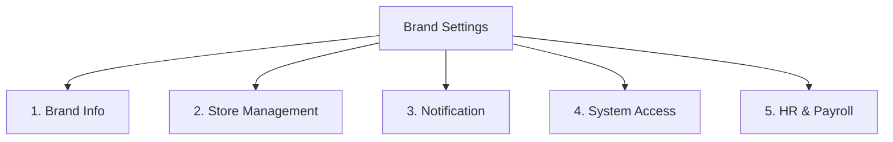

# PRD: Brand Settings Configuration

## Mục lục

1. [Tổng Quan Cài Đặt Thương Hiệu (Brand Settings Overview)](#1-tổng-quan-cài-đặt-thương-hiệu-brand-settings-overview)
2. [Thông Tin Chi Tiết Các Tab Cài Đặt (Detailed Brand Settings Tabs)](#2-thông-tin-chi-tiết-các-tab-cài-đặt-detailed-brand-settings-tabs)
   - [2.1 Tab: Brand Info (Thông tin thương hiệu)](#21-tab-brand-info-thông-tin-thương-hiệu)
   - [2.2 Tab: Store Management (Quản lý chi nhánh)](#22-tab-store-management-quản-lý-chi-nhánh)
   - [2.3 Tab: Notification (Cài đặt thông báo)](#23-tab-notification-cài-đặt-thông-báo)
   - [2.4 Tab: System Access (Phân quyền hệ thống)](#24-tab-system-access-phân-quyền-hệ-thống)
   - [2.5 Tab: HR & Payroll (Nhân sự & Lương - Tuân thủ Địa phương)](#25-tab-hr--payroll-nhân-sự--lương---tuân-thủ-địa-phương)
3. [Quy Tắc Nghiệp Vụ &amp; Ràng Buộc (Business Rules &amp; Constraints)](#3-quy-tắc-nghiệp-vụ--ràng-buộc-business-rules--constraints)
4. [Quy Tắc Hoạt Động Độc Lập &amp; Tích Hợp (Standalone &amp; Integrated Rules)](#4-quy-tắc-hoạt-động-độc-lập--tích-hợp-standalone--integrated-rules)
5. [Kịch Bản Chức Năng Chi Tiết (Given-When-Then Scenarios)](#5-kịch-bản-chức-năng-chi-tiết-given-when-then-scenarios)
6. [Tiêu Chí Nghiệm Thu (Acceptance Criteria)](#6-tiêu-chí-nghiệm-thu-acceptance-criteria)

---

## 1. Tổng Quan Cài Đặt Thương Hiệu (Brand Settings Overview)

Giao diện cài đặt Thương hiệu (Brand Settings) là trung tâm cấu hình toàn bộ hệ thống hoạt động của Gastro Hub thuộc quyền sở hữu của một Brand.

* **Đối tượng truy cập:** Chỉ người dùng có quyền `Admin` của Brand mới được phép truy cập và thực hiện thay đổi cấu hình.
* **Cơ chế lưu trữ:** Mọi thay đổi cấu hình trong các tab sẽ áp dụng tức thì hoặc đồng bộ theo chu kỳ nghiệp vụ được định nghĩa sẵn tới các chi nhánh trực thuộc.

---

## 2. Thông Tin Chi Tiết Các Tab Cài Đặt (Detailed Brand Settings Tabs)

Giao diện Brand Settings bao gồm 5 Tab chức năng chính:

### 2.1 Tab: Brand Info (Thông tin thương hiệu)

Ghi nhận và hiển thị các thông tin pháp lý và thông tin liên hệ cấp tổng công ty/thương hiệu.

* **Thông tin cơ bản:**
  * Tên thương hiệu (`brandName` - Bắt buộc, **không bắt buộc là duy nhất**; nhiều khách hàng/thương hiệu có thể đặt tên giống nhau).
  * **Định danh duy nhất hệ thống (`brandId` - UUID):** Hệ thống tự động tạo mã UUID duy nhất khi khởi tạo Brand. Hệ thống chạy tập trung trên một domain duy nhất và phân quyền truy cập theo mô hình Workspace (tương tự như ClickUp). Người dùng sau khi đăng nhập sẽ lựa chọn Brand/Workspace mình được cấp quyền truy cập để làm việc.
  * Logo/Ảnh đại diện thương hiệu (Upload file hình ảnh dạng PNG/JPG, tối đa 2MB).
  * Họ tên chủ sở hữu (`ownerName` - Bắt buộc).
* **Thông tin liên hệ & Pháp lý:**
  * Email liên hệ chung (`contactEmail` - Định dạng email hợp lệ).
  * Số điện thoại liên hệ (`contactPhone` - Chuẩn số điện thoại quốc tế).
  * Địa chỉ trụ sở chính (`mainOfficeAddress` - Bắt buộc).
  * Quốc gia hoạt động chính của Thương hiệu (`brandCountry` - Bắt buộc, mặc định: `DE` - Đức. Hệ thống hỗ trợ mở rộng chọn bất kỳ quốc gia nào trong Liên minh Châu Âu EU để xác định ngữ cảnh pháp lý và tính thuế liên quan).
  * Mã số thuế nội địa (`localTaxId` - Định dạng thay đổi động và được xác thực tự động theo quốc gia được chọn tại `brandCountry`; ví dụ: nếu chọn Đức, sẽ áp dụng định dạng `Steuernummer` chuẩn Đức là 13/XXX/XXXXX hoặc 21/XXX/XXXXX; nếu chọn các quốc gia khác sẽ áp dụng định dạng Local Tax ID tương ứng).
  * Mã số thuế GTGT Châu Âu (`vatId` - Bắt buộc đối với các doanh nghiệp thuộc Liên minh Châu Âu EU có đăng ký thuế GTGT. Định dạng linh hoạt bắt đầu bằng mã quốc gia 2 ký tự tương ứng với `brandCountry` (ví dụ: `DE` đối với Đức, `FR` đối với Pháp, `AT` đối với Áo...) và theo sau là chuỗi từ 2 đến 12 ký tự chữ và số. Cho phép liên kết API VIES của EU để xác thực trực tuyến tính hợp lệ của mã số thuế).
* **Thiết lập chung:**
  * Đơn vị tiền tệ mặc định (`currency` - Cố định là `EUR`).

---

### 2.2 Tab: Store Management (Quản lý chi nhánh)

Quản lý danh sách các chi nhánh cửa hàng thực tế thuộc quyền quản lý của Brand.

* **Danh sách Store:** Hiển thị Grid danh sách tất cả các chi nhánh bao gồm: Tên chi nhánh, Địa chỉ, Số điện thoại, Múi giờ và Trạng thái (`Active` / `Inactive`).
* **Thông tin khi tạo mới hoặc cập nhật một Store:**
  * Tên chi nhánh (`storeName` - Bắt buộc).
  * Địa chỉ chi nhánh (`storeAddress` - Bắt buộc).
  * Múi giờ hoạt động (`timezone` - Bắt buộc, người dùng chọn từ danh sách múi giờ chuẩn, ví dụ: `Europe/Berlin`).
  * Số điện thoại chi nhánh (`storePhone` - Bắt buộc).
  * Giờ mở cửa/đóng cửa hàng ngày (`operatingHours` - Cấu hình khoảng giờ làm việc trong ngày của chi nhánh, ví dụ: 08:00 - 22:00).
  * Trạng thái hoạt động (`status` - `Active` (Hoạt động) hoặc `Inactive` (Tạm ngưng)).
  * **Cài đặt xử lý quên check-in/out (`forgetCheckinBehavior`):** Quyền thiết lập của từng Chi nhánh (Store-level setting) để các ca trưởng chủ động quản lý theo thực tế:
    1. `Snap to Shift`: Tính giờ làm việc khớp chuẩn theo thời gian ca trực được lập lịch sẵn trong tuần.
    2. `Snap to Actual`: Tính giờ làm việc dựa trên giờ thực tế do người có thẩm quyền (Shift Leader / Admin) của chi nhánh phê duyệt và xác nhận điều chỉnh thủ công.

---

### 2.3 Tab: Notification (Cài đặt thông báo)

Cấu hình bật/tắt các kênh nhận thông báo và phân loại đối tượng nhận tin theo các sự kiện vận hành.

* **Kênh truyền thông hỗ trợ:** Email, Web Push, Mobile Notification.
* **Cấu hình sự kiện nhận thông báo:**

| Loại Sự Kiện | Đối Tượng Nhận | Kênh Mặc Định | Mô Tả Hành Vi |
| :--- | :--- | :--- | :--- |
| **Đơn xin nghỉ phép mới (Leave Request Created)** | Admin / Employee có quyền duyệt phép (Leave Approval) | Email, Web Push | Gửi thông báo ngay khi nhân viên tạo đơn phép chờ duyệt. |
| **Yêu cầu đổi ca trực (Shift Swap Request)** | Admin / Employee có quyền lập lịch (Shift Planner) | Web Push | Gửi thông báo khi nhân viên yêu cầu đổi ca trực chéo. |
| **Lịch trực tuần được công bố (Roster Published)** | Employee thuộc danh sách ca trực | Email, Mobile Push | Thông báo cho toàn bộ nhân sự có ca làm việc trong tuần. |
| **Đơn phép/Đổi ca được duyệt/từ chối** | Employee tạo yêu cầu ban đầu | Mobile Notification | Cập nhật kết quả phê duyệt từ người có thẩm quyền đến nhân viên. |

---

### 2.4 Tab: System Access (Phân quyền hệ thống)

Quản lý các Nhóm quyền/Vai trò (Permission Groups / Roles) truy cập hệ thống theo đúng phân hệ.

* **Nguyên tắc phân quyền:**
  * Chỉ tài khoản có vai trò `Admin` mới được phép truy cập màn hình cấu hình này. Nhân viên hoặc các nhóm quyền thường không được phép xem hay truy cập trang cấu hình này để ngăn ngừa rủi ro tự nâng quyền hạn (Privilege Escalation).
  * Mọi tên nhóm quyền (vai trò) đều do Admin tự định nghĩa khi tạo cấu hình, hệ thống không cứng hóa cấu trúc vai trò ở mức mã nguồn.
  * Hệ thống không cho phép xóa nhóm quyền nếu nhóm đó đang được gán cho ít nhất một nhân viên ở trạng thái `Active`. Admin bắt buộc phải gỡ bỏ nhóm quyền này khỏi toàn bộ hồ sơ của các nhân viên liên quan trước khi xóa.

* **Cấu hình chi tiết của Nhóm quyền:**
  * **Thông tin cơ bản:** Tên nhóm quyền (ví dụ: `Store Manager`, `Chef`, `Shift Leader`, `Accountant`) và Mô tả chi tiết.
  * **Phạm vi Dữ liệu (Data Scope):** Chọn một trong hai tùy chọn:
    1. `Brand-wide` (Toàn thương hiệu): Cho phép xem/thao tác dữ liệu của tất cả chi nhánh thuộc Brand.
    2. `Assigned Stores` (Theo chi nhánh gán): Chỉ cho phép xem/thao tác dữ liệu của các chi nhánh mà nhân sự đó được chỉ định trong hồ sơ công việc.
  * **Quyền truy cập Sidebar (Sidebar Menu Permissions):** Tích chọn các công cụ Sidebar được cấp phép, bao gồm các phân hệ sau:
    * **HR & Operations:** `Shift Planner` (Lập lịch ca trực), `Staff` (Danh sách nhân viên), `Checkin` (Lịch sử chấm công), `Leave & Flec Calc` (Duyệt đơn phép & bù ca), `Payroll` (Bảng lương).
    * **Application & Plug-in:** `Book a Table`.
    * **Smart Menu Solutions:** `Menu Translator`, `AI Food Images`, `Menu Price Update`, `QR For Menu`, `Allergen Intelligence`.
    * **Marketing & Brand Growth:** `Social Auto Post`, `SEO Check & Opt`, `Review Responder`, `Campaign Setting`.
    * **Settings:** `Brand setting` (Thiết lập chung thương hiệu), `Social account` (Tài khoản mạng xã hội), `Admin approval` (Phê duyệt yêu cầu đặc biệt).

* **Cơ chế thừa hưởng và hiển thị Sidebar (Sidebar Rendering):**
  * Nếu nhân viên không được gán bất kỳ nhóm quyền nào, hệ thống chỉ hiển thị Dashboard cá nhân (Self-Service Dashboard) mặc định và ẩn toàn bộ các menu quản lý khác.
  * Nếu được gán một nhóm quyền, hiển thị các công cụ Sidebar tương ứng với cấu hình của nhóm đó.
  * Nếu được gán nhiều nhóm quyền cùng lúc, hệ thống tự động gộp tất cả các công cụ được cấp quyền của các nhóm đó (phép hợp logic).
  * **Chặn truy cập URL bất hợp pháp:** Nếu nhân viên cố tinh truy cập thủ công bằng cách gõ URL của các công cụ không có trong danh mục được phân quyền, hệ thống bắt buộc phải chặn truy cập và hiển thị trang lỗi "Bạn không có quyền truy cập chức năng này".
  * **Áp dụng phạm vi dữ liệu cấp API:** Khi người dùng truy cập bất kỳ tài nguyên nào thuộc các công cụ Sidebar được phân quyền, hệ thống tự động áp dụng bộ lọc dữ liệu tương ứng với Phạm vi Dữ liệu được gán.

---

### 2.5 Tab: HR & Payroll (Nhân sự & Lương - Tuân thủ Địa phương)

Cấu hình tuân thủ luật lao động và các tham số tính lương được tải động dựa theo quốc gia được chọn (`brandCountry` tại Tab Brand Info) nhằm đảm bảo khả năng mở rộng trên toàn Châu Âu.

#### 2.5.1 Cài đặt Tuân thủ Luật Lao động theo Quốc gia (Local Labor Compliance)

Hệ thống tự động kích hoạt gói quy định pháp lý tương ứng của quốc gia hoạt động:

* **Vùng/Tỉnh bang tính thuế (`payrollRegion`):** Chọn vùng/bang/tỉnh tương ứng của quốc gia hoạt động (ví dụ: bang `Bayern` của Đức, bang `Tirol` của Áo, vùng `Île-de-France` của Pháp...).
  * *Mục đích:* Dùng để tự động đồng bộ lịch các ngày nghỉ lễ chính thức (Public Holidays) của địa phương đó vào hệ thống lập lịch ca trực (`PRD-Shift-Planner`) và tính lương làm ngày lễ (`PRD-Payroll`).
* **Hạn mức thu nhập miễn thuế / Hợp đồng đặc biệt (`lowIncomeThreshold`):** Mức trần thu nhập tháng tối đa được miễn thuế hoặc áp dụng bảo hiểm đặc biệt đối với các loại hợp đồng ngắn hạn/thu nhập thấp.
  * *Hành vi:* Hệ thống tự động gợi ý giá trị mặc định của quốc gia sở tại (ví dụ: đối với Đức mặc định là `603.00` EUR cho hợp đồng Minijob; đối với Áo gợi ý mức `Geringfügigkeitsgrenze` tương ứng) và cho phép Admin điều chỉnh thủ công.
* **Quy tắc khấu trừ giờ nghỉ giải lao tự động (`autoBreakDeduction`):** Lựa chọn Bật/Tắt.
  * *Hành vi:* Khi Bật, hệ thống tự động trừ giờ nghỉ khi tính giờ công thực tế dựa trên độ dài ca làm việc liên tục. Các mốc giờ và thời gian nghỉ sẽ tự động điền sẵn theo luật định của quốc gia sở tại, nhưng cho phép sửa đổi linh hoạt:
    * *Mốc 1 (Threshold 1):* Ca làm việc đạt từ `X` giờ đến dưới `Y` giờ -> Tự động trừ `A` phút (ví dụ đối với Đức: từ 6.0 giờ đến dưới 9.0 giờ -> tự động trừ 30 phút).
    * *Mốc 2 (Threshold 2):* Ca làm việc đạt từ `Z` giờ trở lên -> Tự động trừ `B` phút (ví dụ đối với Đức: từ 9.0 giờ trở lên -> tự động trừ 45 phút).

#### 2.5.2 Cấu hình Tài khoản giờ tích lũy (Flexible Working Hours Account - FWHA)

FWHA là tài khoản quản lý giờ tích lũy làm thêm (OT) phục vụ cho việc bù giờ làm việc linh hoạt, áp dụng theo chuẩn quy định giờ làm việc linh động tại các nước Châu Âu (như *Gleitzeitkonto* tại Đức/Áo, *Heures supplémentaires* tại Pháp):

* **Trần tích lũy giờ làm thêm (OT Cap - `fwMaxPositive`):** Số giờ tối đa được tích lũy dương (mặc định: `+40.0` giờ).
* **Trần tích lũy thiếu giờ (Undertime Floor - `fwMaxNegative`):** Số giờ tối đa được tích lũy âm (mặc định: `-20.0` giờ).
* **Quy đổi phép năm thừa cuối năm (`annualLeaveRollover`):** Bật/Tắt tự động chuyển đổi ngày phép năm còn dư cuối chu kỳ năm dương lịch sang tài khoản FWHA của nhân viên.
  * *Tỷ lệ quy đổi:* `1 ngày phép dư = 8.0 giờ công` (hoặc cấu hình tùy chỉnh).
* **Chu kỳ thanh toán giờ OT vượt trần (`overtimePayoutCycle`):** Lựa chọn chu kỳ tự động kết xuất tiền mặt chi trả cho số giờ làm thêm vượt trần tích lũy: `Monthly` (Hàng tháng) / `Quarterly` (Hàng quý) / `Yearly` (Hàng năm) / `Resignation` (Thanh toán khi thôi việc).

#### 2.5.3 Cấu hình Phụ cấp Đặc biệt & Hình thức Tính lương (Special Premiums & Wage Mapping)

* **Hình thức tính lương toàn hệ thống (`brandSalaryType`):** Mặc định là `Hourly Rate` (Tính lương theo giờ công thực tế) áp dụng cho toàn bộ nhân sự. Đối với các hợp đồng thỏa thuận lương cứng theo tháng (`Monthly Salaried`), hệ thống vẫn hỗ trợ quy đổi về số giờ làm việc chuẩn để phục vụ việc tích lũy/khấu trừ giờ vào tài khoản FWHA / Gleitzeitkonto.
* **Cài đặt Phụ cấp Đặc biệt (Special Premiums):** Cho phép cấu hình các loại phụ cấp làm việc ngoài giờ đặc biệt theo luật lao động của quốc gia sở tại:
  * **Phụ cấp làm ca tối (`eveningShiftPremiumRate` & `eveningShiftStartTime`):** Tỷ lệ phần trăm cộng thêm (ví dụ: `10%` lương giờ) và khoảng giờ bắt đầu tính ca tối (ví dụ: từ `18:00` hoặc `20:00` đến trước ca đêm).
  * **Phụ cấp làm ca đêm (`nightShiftPremiumRate` & `nightShiftStartTime`):** Tỷ lệ phần trăm cộng thêm (ví dụ: `25%` lương giờ) và khoảng giờ bắt đầu tính phụ cấp đêm (ví dụ: từ `22:00` hoặc `23:00` đến `06:00` sáng hôm sau).
  * **Phụ cấp làm Chủ nhật (`sundayPremiumRate`):** Tỷ lệ phần trăm phụ cấp làm ngày Chủ nhật (ví dụ: `50%`).
  * **Phụ cấp làm ngày Lễ (`holidayPremiumRate`):** Tỷ lệ phần trăm phụ cấp làm ngày Lễ chính thức (ví dụ: `125%`).
* **Cấu hình chia tiền Tips động (Dynamic Tip Distribution Settings):**
  * **Bật/Tắt hệ thống chia tips tự động (`enableTipDistribution`):** Cho phép hệ thống tính toán phân bổ tips tự động cuối kỳ lương.
  * **Cấu hình trọng số chia tips theo bộ phận (Departmental Tip Weights):**
    * Trọng số tips Bếp (`tipWeightKitchen` - mặc định: `0.8`).
    * Trọng số tips Phục vụ (`tipWeightService` - mặc định: `1.0`).
    * Trọng số tips Quầy bar (`tipWeightBar` - mặc định: `0.9`).
  * Các tham số trọng số này cho phép Admin điều chỉnh linh hoạt trực tiếp trên giao diện để áp dụng cho thuật toán phân bổ.
* **Cài đặt chính sách chuyển phép năm cũ (Vacation Rollover Policy Settings):**
  * **Cho phép chuyển phép năm cũ (`allowVacationRollover`):** Chọn `Yes` (Cho phép chuyển số dư ngày phép chưa dùng sang năm tiếp theo) hoặc `No` (Triệt tiêu toàn bộ ngày phép dư vào ngày 31/12 cuối năm).
  * **Ngày hết hạn phép cũ chuyển sang (`vacationRolloverExpiryDate`):** Chọn thời điểm hết hạn (mặc định: `31/03` của năm sau) hoặc chọn `Never` (Không bao giờ hết hạn).
  * **Hành vi xử lý phần phép cũ hết hạn chưa dùng (`vacationRolloverRemainderAction`):** Chọn `Expire` (Triệt tiêu về 0) hoặc `Convert to Flextime` (Tự động quy đổi sang giờ tích lũy FWHA / Gleitzeitkonto theo tỷ lệ 1 ngày phép = 8.0 giờ công).
* **Bản đồ mã khoản lương kế toán (`accountingWageCodes`):**
  * Admin thiết lập mã số hạch toán kế toán tương ứng với từng loại thu nhập để xuất file kế toán lương tương thích với DATEV:
  * Các loại mã cần thiết lập: Mã lương giờ cơ bản (ví dụ: `1000`), mã phụ cấp ca tối, mã phụ cấp ca đêm (ví dụ: `2500`), mã phụ cấp Chủ nhật (ví dụ: `2600`), mã phụ cấp ngày Lễ (ví dụ: `2700`), mã phân bổ tiền tips, mã thanh toán OT vượt trần.
  * **Mẫu xuất file kế toán (Export Template):** Hỗ trợ lựa chọn định dạng file xuất tương thích theo từng hệ thống phần mềm kế toán của quốc gia sở tại (ví dụ: chọn xuất file chuẩn `DATEV` đối với Đức, chuẩn `BMD` đối với Áo, hoặc định dạng CSV chuẩn hóa quốc tế đối với các quốc gia khác).

---

## 3. Quy Tắc Nghiệp Vụ & Ràng Buộc (Business Rules & Constraints)

* **Xác thực Brand Info:** Tên thương hiệu (`brandName`) bắt buộc phải là duy nhất. Khi đổi tên thương hiệu trùng tên đã có, hệ thống báo lỗi và chặn lưu.
* **Địa chỉ Store và Múi giờ:** Địa chỉ chi nhánh (`storeAddress`) và Múi giờ (`timezone`) là các trường bắt buộc khai báo chính xác để đảm bảo các logic lập lịch ca trực và tính công được đồng bộ.
* **Quyền truy cập độc quyền System Access:** Chỉ tài khoản có vai trò `Admin` mới được phép truy cập màn hình cấu hình phân quyền truy cập hệ thống.
* **Không cứng hóa cấu trúc vai trò:** Hệ thống không được phép định nghĩa sẵn các vai trò ở mức mã nguồn. Mọi vai trò/nhóm quyền đều được định cấu hình động bởi Admin.
* **Độ trễ cập nhật phân quyền (System Access):** Khi Admin thay đổi Sidebar Permissions hoặc Data Scope của một nhóm quyền, thay đổi sẽ được áp dụng trực tiếp cho tất cả tài khoản thuộc nhóm quyền đó ở lần tải trang hoặc gọi API tiếp theo (không yêu cầu người dùng đăng xuất).
* **Ràng buộc xóa Nhóm quyền:** Không được phép xóa bất kỳ nhóm quyền nào nếu nhóm quyền đó đang được gán cho ít nhất một nhân viên ở trạng thái hoạt động (`Active`).
* **Chặn truy cập URL bất hợp pháp:** Nếu nhân viên cố tình truy cập thủ công bằng cách gõ URL của các công cụ không có trong danh mục được phân quyền, hệ thống bắt buộc phải chặn truy cập ngay lập tức và hiển thị trang thông báo lỗi "Bạn không có quyền truy cập chức năng này".
* **Áp dụng phạm vi dữ liệu cấp API:** Khi người dùng truy cập bất kỳ tài nguyên dữ liệu nào (API calls hoặc giao diện hiển thị) thuộc các công cụ Sidebar được phân quyền, hệ thống bắt buộc phải tự động áp dụng bộ lọc dữ liệu tương ứng với Phạm vi Dữ liệu được gán của nhóm quyền đó.
* **Cập nhật Vùng hoạt động (HR & Payroll):** Khi Admin thay đổi `payrollRegion`, lịch ngày lễ công cộng (Public Holidays) của tất cả các Store thuộc Brand sẽ được tự động cập nhật lại kể từ kỳ lập lịch tiếp theo. Hệ thống sẽ hiển thị cảnh báo cho Admin nếu thay đổi này ảnh hưởng tới các kỳ lương chưa chốt.

---

## 4. Quy Tắc Hoạt Động Độc Lập & Tích Hợp (Standalone & Integrated Rules)

* **Chế độ Độc lập (Standalone Mode):**
  * Màn hình cấu hình lưu trữ dữ liệu tĩnh vào cơ sở dữ liệu.
  * System Access hoạt động như bộ lọc menu cục bộ.
* **Chế độ Tích hợp (Integrated Mode):**
  * *Tích hợp với [[PRD-Staff-Roles]]:* Gán vai trò đã tạo tại Tab System Access vào Staff Profile.
  * *Tích hợp với [[PRD-Shift-Planner]]:* Đồng bộ lịch lễ dựa trên vùng hoạt động `payrollRegion` được cấu hình.
  * *Tích hợp với [[PRD-Checkin-Management]]:* Áp dụng luật khấu trừ giờ nghỉ tự động theo quy tắc cấu hình của từng quốc gia.
  * *Tích hợp với [[PRD-Payroll]]:* Sử dụng cấu hình `brandSalaryType`, `lowIncomeThreshold` và Accounting Wage Code Mapping để tính toán bảng lương và xuất mẫu báo cáo kế toán (Export Template) tương thích theo quốc gia.
  * *Tích hợp với [[PRD-Tenant-Workspace-Auth]]:* Áp dụng quyền truy cập vào Workspace dựa trên cấu hình System Access.

---

## 5. Kịch Bản Chức Năng Chi Tiết (Given-When-Then Scenarios)

### Kịch bản 1: Thêm mới chi nhánh thành công (Tab Store Management - Happy Path)

* **GIVEN** Admin đang ở Tab Store Management của màn hình Brand Settings.
* **WHEN** Admin bấm "Thêm chi nhánh mới", nhập tên `"Gastro Hub Munich"`, địa chỉ `"Karlsplatz 1, 80335 München, Germany"`, số điện thoại, chọn múi giờ `"Europe/Berlin"` và bấm Lưu.
* **THEN** Hệ thống lưu Store mới thành công vào database và hiển thị trong Grid danh sách.

### Kịch bản 2: Thay đổi cấu hình trừ giờ nghỉ giải lao (Tab HR & Payroll - Happy Path)

* **GIVEN** Hệ thống đang cấu hình `autoBreakDeduction` là `Disabled`.
* **AND** Admin thiết lập quy tắc tự động trừ giờ nghỉ: Ca làm việc liên tục từ 6.0 giờ đến dưới 9.0 giờ sẽ tự động trừ `30 phút` (0.5 giờ).
* **AND** Dữ liệu chấm công của nhân sự A làm việc ca trực 8.0 giờ thực tế không có check-in nghỉ giữa ca.
* **WHEN** Admin chuyển trạng thái `autoBreakDeduction` sang `Enabled` và bấm Lưu.
* **THEN** Hệ thống lưu cài đặt thành công.
* **AND** Kể từ thời điểm lưu, dữ liệu chấm công mới hoặc dữ liệu ca làm việc chưa chốt của nhân sự A sẽ tự động áp dụng quy tắc trên, khấu trừ 30 phút, tổng giờ công thực tế tính lương được ghi nhận là `7.5 giờ`.

### Kịch bản 3: Sửa đổi phân quyền Roles cập nhật trực tiếp Sidebar (Tab System Access - Happy Path)

* **GIVEN** Nhân viên A đang được gán nhóm quyền `"Chef"`. Nhóm quyền `"Chef"` không có quyền xem mục `Payroll` trên Sidebar.
* **WHEN** Admin vào Tab System Access, chỉnh sửa nhóm quyền `"Chef"`, tích chọn thêm công cụ `Payroll` và bấm Lưu.
* **THEN** Hệ thống cập nhật bảng quyền hạn của vai trò `"Chef"`.
* **AND** Ở lần gọi API hoặc tải trang tiếp theo của Nhân viên A, thanh điều hướng Sidebar của họ hiển thị thêm mục `Payroll`.

### Kịch bản 4: Nhân viên truy cập trái phép trang cấu hình System Access (Security Check)

* **GIVEN** Nhân viên `Nguyen An` không có quyền `Admin`.
* **WHEN** Nhân viên cố gắng truy cập thủ công vào địa chỉ URL của trang cấu hình `/w/{brand_id}/settings/system-access` (Tab System Access).
* **THEN** Hệ thống bắt buộc phải chặn truy cập và chuyển hướng nhân sự về trang thông báo lỗi hiển thị `"Bạn không có quyền truy cập chức năng này"`.

### Kịch bản 5: Xóa nhóm quyền đang gán cho nhân viên (Unhappy Path)

* **GIVEN** Nhóm quyền `"Store Manager"` đang được gán cho nhân viên `Nguyen An` (trạng thái `Active`).
* **WHEN** Admin thực hiện yêu cầu xóa nhóm quyền `"Store Manager"`.
* **THEN** Hệ thống bắt buộc phải từ chối yêu cầu và không được phép xóa nhóm quyền này.
* **AND** Hiển thị thông báo cảnh báo: `"Không thể xóa nhóm quyền đang được gán cho nhân sự hoạt động. Vui lòng gỡ bỏ quyền này khỏi hồ sơ nhân sự trước khi xóa."`

---

## 6. Tiêu Chí Nghiệm Thu (Acceptance Criteria)

* - [ ] Admin có thể cập nhật thành công các thông tin cơ bản, quốc gia hoạt động chính (`brandCountry`), và thông tin pháp lý (`localTaxId`, `vatId`) của thương hiệu tại Tab Brand Info.
* - [ ] Hệ thống tự động xác thực định dạng của `localTaxId` và `vatId` dựa trên quốc gia đã chọn (`brandCountry`) theo các quy tắc và định dạng tiêu chuẩn của từng quốc gia Châu Âu (bao gồm cấu trúc tiền tố mã quốc gia và độ dài của VAT ID theo chuẩn VIES).
* - [ ] Thay đổi thông tin Brand Info với tên thương hiệu trùng lặp sẽ bị hệ thống chặn và báo lỗi nghiệp vụ rõ ràng.
* - [ ] Hệ thống cho phép chọn và lưu trữ chính xác múi giờ (`timezone`) tương ứng của chi nhánh khi tạo mới hoặc cập nhật Store.
* - [ ] Đổi trạng thái Store sang `Inactive` sẽ vô hiệu hóa việc lập lịch làm việc và chấm công tại chi nhánh đó.
* - [ ] Bật/Tắt cài đặt sự kiện thông báo tại Tab Notification hoạt động chính xác cho các vai trò tương ứng qua các kênh (Email, Push, Mobile).
* - [ ] Chỉ tài khoản có vai trò `Admin` mới hiển thị menu và truy cập được cấu hình `System Access`.
* - [ ] Admin có thể thực hiện đầy đủ các thao tác Thêm, Sửa, Xóa (CRUD) các nhóm vai trò/quyền tự định nghĩa tại Tab System Access.
* - [ ] Việc gán nhóm quyền cho nhân viên được thực hiện trực tiếp tại màn hình hồ sơ nhân viên (Staff Profile).
* - [ ] Hệ thống chặn hành vi xóa nhóm quyền nếu có bất kỳ nhân viên `Active` nào đang được gán nhóm quyền đó.
* - [ ] Khi nhân viên được gán một hoặc nhiều nhóm quyền, thanh Sidebar hiển thị chính xác và đầy đủ các công cụ tương ứng (phép hợp logic gộp các quyền).
* - [ ] Nhóm quyền hỗ trợ cấu hình và lưu thành công thuộc tính Phạm vi Dữ liệu (Data Scope) ở dạng `Brand-wide` hoặc `Assigned Stores`.
* - [ ] Hệ thống thực thi lọc dữ liệu chính xác ở tầng API khi người dùng có nhóm quyền `Assigned Stores` thực hiện truy xuất thông tin của bất kỳ phân hệ nào.
* - [ ] Hệ thống chặn thành công truy cập qua URL đối với các công cụ không thuộc danh mục quyền tự phục vụ mặc định và không có trong các nhóm quyền được gán của nhân viên đó.
* - [ ] Thay đổi vùng/bang hoạt động (`payrollRegion`) tự động cập nhật lịch ngày nghỉ lễ tương ứng cho các chi nhánh thuộc quốc gia hoạt động chính của Brand.
* - [ ] Cấu hình hạn mức đặc biệt (`lowIncomeThreshold`) và các tỷ lệ phụ cấp đặc biệt (làm đêm, Chủ nhật, lễ) được lưu đúng định dạng và được áp dụng chính xác cho các công thức tính toán lương của PRD-Payroll.
* - [ ] Form cấu hình bản đồ mã khoản lương hỗ trợ lưu trữ đầy đủ các mã số hạch toán kế toán và xuất chính xác file kế toán lương theo mẫu xuất (Export Template) được chọn.
