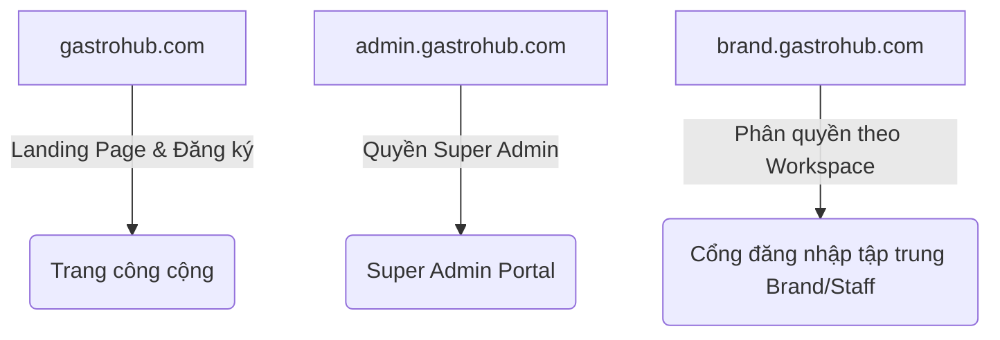
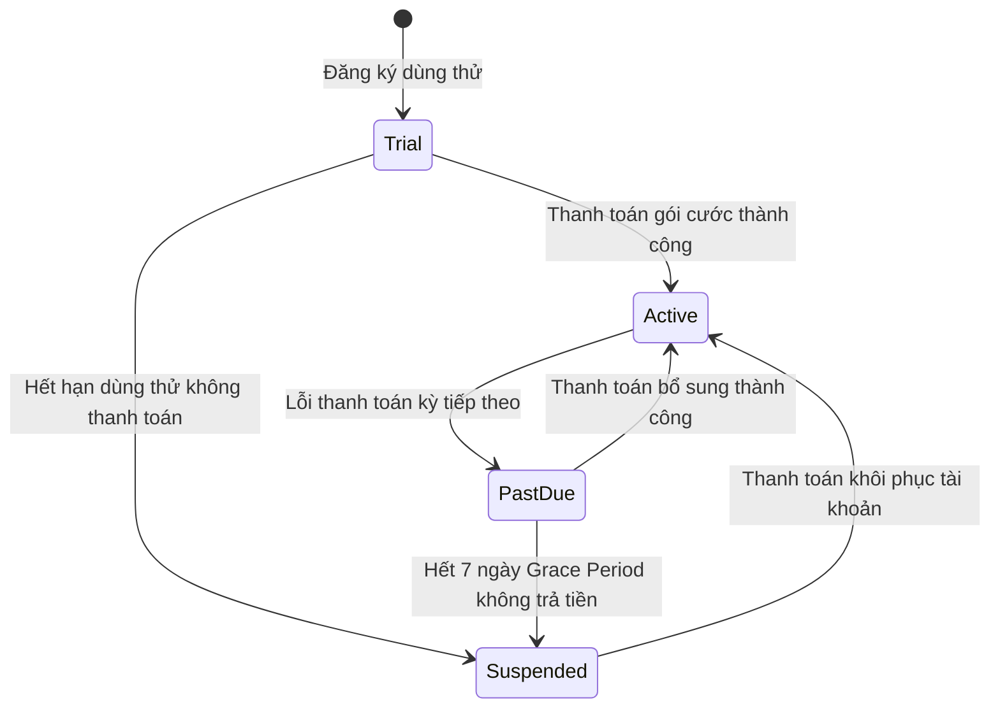

# PRD: Super Admin Management Portal

## Mục lục

1. [Tổng Quan & Cấu Trúc Domain (Overview & Domain Architecture)](#1-tổng-quan--cấu-trúc-domain-overview--domain-architecture)
2. [Quản Lý Thương Hiệu (Brand/Tenant Management)](#2-quản-lý-thương-hiệu-brandtenant-management)
3. [Quản Lý Gói Dịch Vụ (Subscription Plan Management)](#3-quản-lý-gói-dịch-vụ-subscription-plan-management)
4. [Phân Hệ Thanh Toán & Hóa Đơn (Billing & Invoicing)](#4-phân-hệ-thanh-toán--hóa-đơn-billing--invoicing)
5. [Quản Lý Vai Trò & Phân Quyền (Roles & Permission Management)](#5-quản-lý-vai-trò--phân-quuyền-roles--permission-management)
6. [Kịch Bản Chức Năng Chi Tiết (Given-When-Then Scenarios)](#6-kịch-bản-chức-năng-chi-tiết-given-when-then-scenarios)
7. [Tiêu Chí Nghiệm Thu (Acceptance Criteria)](#7-tiêu-chí-nghiệm-thu-acceptance-criteria)

---

## 1. Tổng Quan & Cấu Trúc Domain (Overview & Domain Architecture)

Phân hệ Super Admin Portal là trung tâm quản trị tối cao của toàn bộ nền tảng phần mềm SaaS Gastro Hub. Phân hệ này cho phép đội ngũ vận hành hệ thống kiểm soát quyền truy cập, giám sát trạng thái tài khoản của các Brand, quản lý doanh thu, và cấu hình các thông số tuân thủ pháp luật địa phương.

### 1.1 Phân bổ Domain & Routing hệ thống

Hệ thống Gastro Hub được phân chia độc lập thành 3 phân vùng Domain chính:

1. **Cổng Landing Page (`gastrohub.com`):** 
   * Cổng thông tin công cộng giới thiệu giải pháp, tính năng, bảng giá.
   * Cung cấp luồng Đăng ký tài khoản dùng thử (Free Trial) cho các khách hàng doanh nghiệp mới (tạo Brand mới).
2. **Cổng Super Admin (`admin.gastrohub.com`):** 
   * Cổng truy cập bảo mật cao dành riêng cho nhân viên vận hành của Gastro Hub.
   * Chỉ các tài khoản được xác thực từ bảng dữ liệu `super_admins` mới được phép đăng nhập và thao tác tại domain này.
3. **Cổng Brand Portal (`brand.gastrohub.com`):** 
   * Cổng đăng nhập tập trung dùng chung cho toàn bộ các đối tượng sử dụng dịch vụ (Brand Admin, Store Manager, Nhân viên).
   * Hệ thống tự động xác định các Workspace (Brand) mà tài khoản đó có quyền truy cập dựa trên thông tin hồ sơ nhân viên (`PRD-Staff-Roles`). 
   * Người dùng sau khi đăng nhập thành công sẽ lựa chọn Workspace muốn truy cập để làm việc (mô hình Single-Domain Workspace tương tự ClickUp).

---

## 2. Quản Lý Thương Hiệu (Brand/Tenant Management)

Super Admin có quyền kiểm soát toàn bộ vòng đời của các tài khoản Brand (Tenant) trên hệ thống. Dữ liệu của mỗi Brand ghi nhận các thông tin nghiệp vụ bao gồm:

* `brandId` (UUID tự động sinh duy nhất để định danh Brand).
* `brandName` (Tên thương hiệu - không bắt buộc duy nhất).
* `vatId` (Mã số thuế GTGT Châu Âu) & `localTaxId` (Mã số thuế nội địa).
* `subscriptionPlanId` (Gói dịch vụ đang áp dụng).
* `subscriptionStatus` (Trạng thái thuê bao: `Trial`, `Active`, `Past Due`, `Suspended`).
* `ownerEmail` (Email của chủ tài khoản Brand).
* `creationDate` (Ngày khởi tạo Brand).
* `billingAddress` (Địa chỉ xuất hóa đơn).

### 2.1 Các trạng thái hoạt động của Brand (Tenant States)

* **Trial:** Trạng thái dùng thử (mặc định 14 ngày khi tạo mới tài khoản). Hệ thống kích hoạt toàn bộ tính năng cao nhất để khách hàng trải nghiệm.
* **Active:** Thuê bao hợp lệ, đã thanh toán gói cước đầy đủ. Toàn bộ các chi nhánh và nhân sự thuộc Brand truy cập và chấm công bình thường.
* **Past Due:** Quá hạn thanh toán (xảy ra khi thẻ của khách hàng bị từ chối hoặc giao dịch SEPA Direct Debit bị lỗi). Hệ thống tự động kích hoạt **Thời gian ân hạn (Grace Period) là 7 ngày** để tiếp tục cho phép hoạt động và cảnh báo Admin nạp tiền.
* **Suspended:** Trạng thái khóa tài khoản. Xảy ra khi hết thời gian ân hạn hoặc hết hạn dùng thử mà không thanh toán.
  * *Hành vi của hệ thống:* Khóa quyền truy cập của toàn bộ nhân viên và quản lý thuộc Brand vào cổng `brand.gastrohub.com` (hiển thị màn hình khóa tài khoản quá hạn). Chặn hoàn toàn hoạt động chấm công check-in/out thực tế tại các chi nhánh. Dữ liệu của Brand vẫn được giữ nguyên dưới DB và mở khóa ngay khi thanh toán thành công.

---

## 3. Quản Lý Gói Dịch Vụ (Subscription Plan Management)

Hệ thống hỗ trợ Super Admin thiết lập và thay đổi cấu hình tham số của các Gói dịch vụ (Subscription Plans) bán cho khách hàng. Các tham số cấu hình bao gồm:

### 3.1 Tham số cấu hình gói cước

| Tên gói cước | Module được kích hoạt (`enabledModules`) | Tín dụng tặng kèm khi đăng ký (`signupGiftCredits`) | Giá tiền mặc định / tháng |
| :--- | :--- | :---: | :---: |
| **Free** | `Staff & Roles`, `Shift Planner` (HR & Operations) `Role & Permission`, `Social account`, `Admin approval` (Settings) `Menu Translator`, `AI Food Images`, `Menu Price Update`, `QR For Menu`, `Allergen Intelligence` (Smart Menu Solutions) | 300 credits | 0,00 € |
| **Gold** | Tất cả tính năng gói **Free**, cộng thêm: `Checkin`, `Leave & Flec Calc`, `Payroll` (Bảng lương nội bộ) | 1000 credits | 99,00 € |
| **Diamond** | Tất cả tính năng gói **Gold**, cộng thêm: Tính năng xuất báo cáo thuế lương (DATEV Export / Bảng lương gửi thuế) | 3000 credits | 199,00 € |

* **Quyền cấu hình gói cước của Super Admin (Dynamic Package Settings):**
  * Super Admin có toàn quyền chỉnh sửa và cấu hình linh hoạt các thông số của các gói cước trên giao diện quản trị (`admin.gastrohub.com`):
    * **Chọn Module kích hoạt:** Bật/Tắt (Check/Uncheck) danh sách các module gán cho từng gói cước. Khi lưu thay đổi, hệ thống sẽ tự động cập nhật phân quyền truy cập cho toàn bộ các Brand đang sử dụng gói cước đó.
    * **Thay đổi Tín dụng tặng kèm:** Điều chỉnh số lượng tín dụng tặng kèm ban đầu khi đăng ký tài khoản mới (`signupGiftCredits`) cho mỗi gói cước.
    * **Thay đổi Giá tiền mặc định:** Cập nhật giá thuê bao hằng tháng (`defaultPriceMonthly`) hoặc hằng năm (`defaultPriceYearly`). Hệ thống tự động đồng bộ giá mới lên cổng thanh toán Stripe.
* **Hành vi kiểm soát chức năng theo gói cước (Feature Lock Enforcement):**
  * Khi hiển thị thanh menu chức năng của Brand tại `brand.gastrohub.com`: Hệ thống tự động ẩn hoặc khóa (hiển thị biểu tượng nâng cấp) đối với các Module không nằm trong cấu hình `enabledModules` của gói cước đang sử dụng (ví dụ: gói Free cố tình click vào tab Checkin hay Payroll sẽ hiện popup yêu cầu nâng cấp lên gói Gold).
  * Đối với tính năng xuất tệp tin kế toán thuế DATEV (Bảng lương gửi thuế), hệ thống kiểm tra nếu không phải gói Diamond thì khi click vào nút Export DATEV sẽ hiển thị popup yêu cầu nâng cấp lên gói Diamond.
* **Cơ chế nạp tiền mua thêm Tín dụng (Top-up Credits):**
  * Hệ thống hỗ trợ tính năng cho phép các Brand chủ động mua thêm điểm tín dụng thông qua ví thanh toán thẻ Stripe. Super Admin cấu hình danh sách gói nạp điểm (Ví dụ: Gói 100 credits giá €10, Gói 1000 credits giá €80).
  * Điểm tín dụng mua thêm được cộng dồn trực tiếp vào số dư ví của Brand (`Credit Wallet`) và không có thời hạn hết hạn.

---

## 4. Phân Hệ Thanh Toán & Hóa Đơn (Billing & Invoicing)

Hệ thống tích hợp cổng thanh toán trực tuyến để tự động hóa hoạt động thu phí.

### 4.1 Phương thức thanh toán hỗ trợ
* **Stripe Credit Card:** Thanh toán qua thẻ tín dụng quốc tế (Visa, Mastercard).
* **SEPA Direct Debit (Đức/EU):** Thanh toán ủy nhiệm chi tự động trực tiếp từ tài khoản ngân hàng của Brand. Đây là phương thức bắt buộc phải hỗ trợ cho thị trường doanh nghiệp Đức.

### 4.2 Chu kỳ thanh toán & Tạo hóa đơn tự động
* Hệ thống hỗ trợ 2 chu kỳ: Thanh toán hàng tháng (Monthly) hoặc hàng năm (Yearly - giảm giá 20%).
* Vào ngày đầu tiên của chu kỳ tính phí, hệ thống tự động thực hiện lệnh trừ tiền qua Stripe/SEPA.
* Khi thanh toán thành công, hệ thống **bắt buộc phải** tự động tạo tệp Hóa đơn điện tử PDF (Invoice) chuẩn Châu Âu (bao gồm mã số thuế VAT của Gastro Hub, VAT của khách hàng, số tiền chưa thuế, thuế GTGT 19% tiêu chuẩn của Đức, và số tiền thực thanh toán) và gửi tự động vào email của Brand Owner, đồng thời lưu trữ lịch sử hóa đơn tại tab Billing của Brand Settings (`PRD-Brand-Settings`).

---

## 5. Quản Lý Vai Trò & Phân Quyền (Roles & Permission Management)

Phân hệ Super Admin cung cấp màn hình quản lý vai trò và phân quyền (dựa theo layout và chức năng cơ bản của mẫu giao diện Vuexy) dành riêng cho nội bộ nhân viên vận hành hệ thống Gastro Hub.

### 5.1 Giao diện Grid Danh sách Vai trò (Roles Cards Grid)
* Hiển thị danh sách các vai trò Super Admin dưới dạng các thẻ (Cards). Mỗi card hiển thị:
  * Tên vai trò (Ví dụ: `Administrator`, `Billing Manager`, `Support Staff`, `Read-only Operator`).
  * Tổng số tài khoản Super Admin đang gán vai trò này.
  * Nút "Edit Role" (Chỉnh sửa) và "Delete" (Xóa).
  * Tùy chọn "Add New Role" (Thêm vai trò mới) dạng thẻ trống cuối Grid.

### 5.2 Bảng Phân quyền Chi tiết (Permissions Matrix Table)
Khi tạo mới hoặc chỉnh sửa vai trò, hệ thống hiển thị bảng phân quyền dạng ma trận lưới cho phép chọn phân quyền cụ thể:

| Phân hệ / Tài nguyên | Xem (Read) | Thêm mới (Create) | Chỉnh sửa (Write) | Xóa (Delete) |
| :--- | :---: | :---: | :---: | :---: |
| **Brands (Thương hiệu)** | [ ] | [ ] | [ ] | [ ] |
| **Subscription Plans (Gói cước)**| [ ] | [ ] | [ ] | [ ] |
| **Super Admin Accounts (Tài khoản vận hành)** | [ ] | [ ] | [ ] | [ ] |
| **Billing & Payments (Thanh toán)** | [ ] | - | [ ] | - |

* **Quy tắc thừa kế & Thực thi (Enforcement Rules):**
  * Quyền truy cập các API thuộc cổng `admin.gastrohub.com` **bắt buộc phải** đối chiếu với vai trò và quyền hạn được lưu của tài khoản Super Admin thực hiện request. Nếu tài khoản không có quyền tương ứng (ví dụ: vai trò `Support Staff` cố tình gửi API xóa Brand), hệ thống trả về mã lỗi `403 Forbidden` và ghi nhật ký cảnh báo bảo mật.

---

## 6. Kịch Bản Chức Năng Chi Tiết (Given-When-Then Scenarios)

### Kịch bản 1: Tự động chuyển trạng thái Suspended và khóa tài khoản khi hết hạn Grace Period

* **GIVEN** Brand `Sabai Dee Frankfurt` đang ở trạng thái `Past Due` do thẻ thanh toán bị từ chối vào ngày `2026-06-01`.
* **AND** Thời gian ân hạn gia hạn (Grace Period) là 7 ngày (kéo dài đến hết ngày `2026-06-08`).
* **WHEN** Đến ngày `2026-06-09` mà hệ thống vẫn không thực hiện trừ tiền thành công (không nhận được webhook thanh toán thành công từ Stripe/SEPA).
* **THEN** Hệ thống **bắt buộc phải** tự động chuyển trạng thái của Brand sang `Suspended`.
* **AND** Khi nhân viên hoặc quản lý của Brand này cố gắng truy cập vào `brand.gastrohub.com` hoặc thực hiện check-in tại cửa hàng.
* **AND** Hệ thống **bắt buộc phải** chặn truy cập và hiển thị màn hình thông báo: `"Tài khoản thương hiệu đã bị tạm ngưng do quá hạn thanh toán. Vui lòng liên hệ Admin để thanh toán số dư."`.

### Kịch bản 2: Chặn kích hoạt tính năng AI khi số dư ví tín dụng bằng không (Credit Limit Block)

* **GIVEN** Brand `Sabai Dee Mainz` đang đăng ký gói dịch vụ `Free` và có số dư ví tín dụng là `0 credits`.
* **WHEN** Người dùng của Brand cố gắng thực hiện chạy tính năng tự động dịch thực đơn bằng AI (`Menu Translator`).
* **THEN** Hệ thống **bắt buộc phải** chặn hành động và hiển thị popup yêu cầu nạp thêm credit: `"Số dư ví tín dụng của bạn đã hết. Vui lòng nạp thêm credit để tiếp tục sử dụng các tính năng thông minh bằng AI."`.

---

## 7. Tiêu Chí Nghiệm Thu (Acceptance Criteria)

* - [ ] Chỉ tài khoản thuộc bảng dữ liệu `super_admins` mới có quyền truy cập vào cổng `admin.gastrohub.com`. Các quyền truy cập trái phép khác phải trả về trang lỗi 403.
* - [ ] Khi Brand bị chuyển sang trạng thái `Suspended`, tất cả token truy cập của nhân viên thuộc Brand đó phải bị vô hiệu hóa (logout) lập tức và chặn hoàn toàn check-in đầu ca.
* - [ ] Hóa đơn thanh toán được sinh tự động dưới dạng PDF, hiển thị đúng các thông số VAT theo mã quốc gia đã đăng ký.
* - [ ] Hệ thống kiểm tra quyền truy cập module dựa trên gói cước hoạt động (Free, Gold, Diamond) của Brand. Các module không được kích hoạt sẽ bị ẩn hoặc vô hiệu hóa trên menu thanh điều hướng.
* - [ ] Khi đăng ký tài khoản (Sign up) thành công, ví tín dụng của Brand được tự động cộng dồn số credit tặng kèm tương ứng của gói đó (ví dụ: Free = 300 credits).
* - [ ] Super Admin chỉnh sửa cấu hình gói cước (module kích hoạt, giá, credits tặng kèm) trên UI của Super Admin sẽ đồng bộ và cập nhật quyền truy cập/thanh toán ngay lập tức cho các Brand tương ứng.
* - [ ] Hệ thống chặn và hiển thị màn hình thông báo lỗi 403 khi tài khoản Super Admin thực hiện thao tác vượt quá quyền được gán trong Roles & Permission Matrix.
* - [ ] Giao diện màn hình Roles & Permission của Super Admin hiển thị chuẩn cấu trúc Grid & Matrix tương đương template Vuexy.
